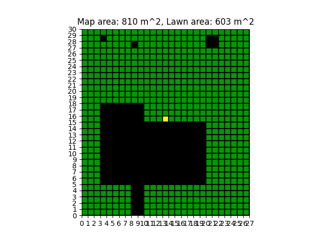
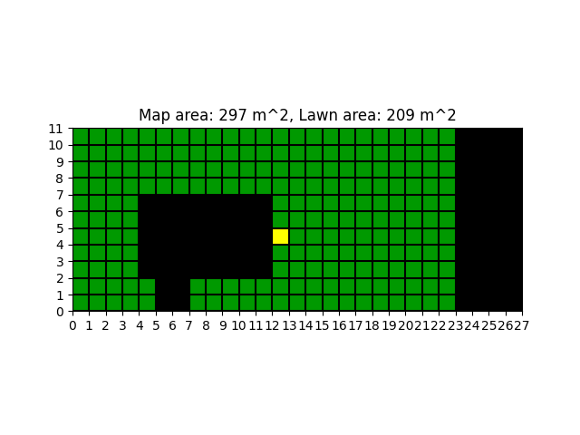
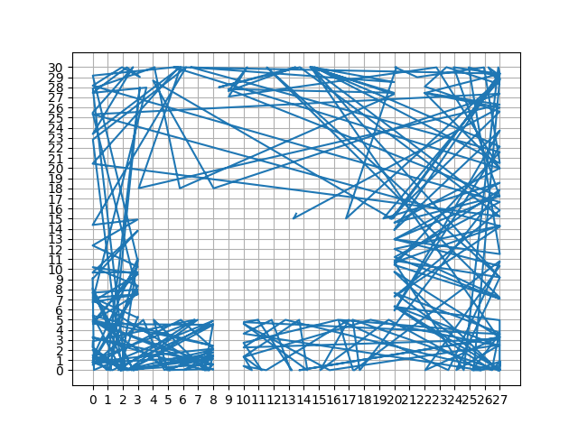
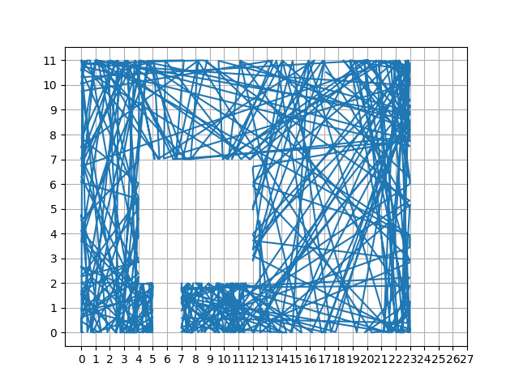
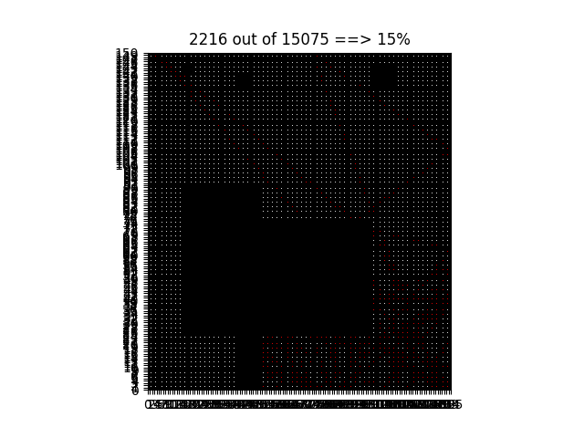
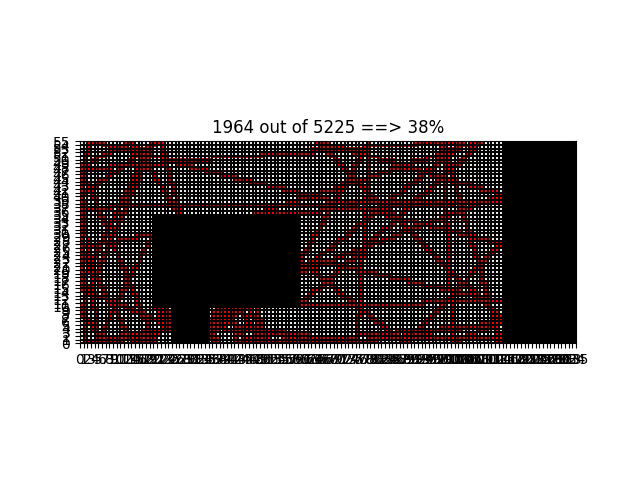

### Report

************************

# Robotic Lawnmower Project Report 
Members: Joakim Nilsson (jn223rk)
Program: Master of software technology
Course: 1DT901  
Date of submission: 2023-11-XX

### Introduction
The purpose of this project is to simulate a behaviour pattern for a robotic lawnmower for the course 1DT901.

### 1. Present Ground Maps

#### small.csv
Total map area: 810 m^2
Total lawn area: 603 m^2
#


#### my_map.csv
Total map area: 30 m^2
Total lawn area: 25 m^2
#


### 2. Coordinate Map

- The ground map was first read through python's csv module with the below code
```python
def read_csv_file_content_to_lst(csv_file_path):
    with open(csv_file_path, "r") as file:
        content = csv.reader(file)
        ground_map = list(content)
        return ground_map
```

- Where we convert a CSV (Comma Seperated Value) file into a two dimensional list in Python. Then each character ``O, L, S`` was translated to an integer such that ``O = 2, L = 1, S = 0`` with the code below

```python
def ground_map_to_num_array(ground_map):
    """
    Reads a ground map consisting of letters such that
    S is the starting point,
    O is an obstacle,
    L is an area of lawn to be mowed.

    Then converts it to a two-dimensional array/list (or matrix).
    """
    number_array = []
    for i in ground_map:
        ii = []
        for j in i:
            num = 0
            if j == "O":
                num = 2
            if j == "S":
                num = 1
            ii.append(num)
        number_array.append(ii)
    return number_array
```

- The program determines whether or not a step is outside the ground map or inside an obstacle with the code below.

```python
def is_outside(self, x, y):
    """
    Checks if the provided coordinates x and y are outside the ground map
    or inside an obstacle and if it is then returns True
    """
    # Checks if the x coordinate is outside the map
    if (x > self.x_len or x < 0):
        return True
    # Checks if the y coordinate is outside the map
    elif (y > self.y_len or y < 0):
        return True
    else:
        # Checks if the mathematical floor of the x and y coordinates are
        # within any obstacles
        if (self.adjusted_number_array[int(y)][int(x)] == 2):
            return True
    return False
```

```python
def one_step(self, x, y, vx, vy):
    x_i = x + vx * self.delta_t
    y_i = y + vy * self.delta_t
    if self.is_outside(x_i, y_i):
        angle = 2 * math.pi * random.random()
        vx_i = self.v * math.cos(angle)
        vy_i = self.v * math.sin(angle)
        return self.one_step(x, y, vx_i, vy_i)
    else:
        return x_i, y_i, vx, vy
```

The coordinate map ``coord[X][Y]`` is a mapping from integer coordinates ``X,Y`` to what type of ground (Obstacle, Lawn, Start) we have at this point. 

- Explain how you computed this map starting from the ground map. Feel free to provide short code fragments as a part of your explanation.
- During the trace calculation, the coordinate map is used to decide whether we are outside the lawn or not. Show and explain the Python code used to decide if a certain trace position ``x,y`` (floats) is outside the lawn or not.

### 3. Trace (Grade E requirement)

- The trace is a sequence of steps ``x,y``. Explain how we go from one step to another. The explanation should include how we handle obstacle bounces. 

- For the first step the program starts at the ground map's starting coordinates and generates a random angle in the interval
 0 <= angle >= 2 * pi, Then calculate the ``x,y`` components for the velocity such that the ``x`` component equals ``v_x`` = ``v`` * cos(angle) and the ``y`` component equals ``v_y`` = ``v`` * sin(angle) then we calculate a new ``x,y`` pair such that x = x_prev + v_x * ∆t and y = y_prev + v_y * ∆t, where x_prev and y_prev is the previous step. If the step is outside the map or inside an obstacle the program choses a new random angle in the same interval as before and repeat the same steps until a valid step is located.

- The following images are traces for when the simulation has run for 2 hours

##

####


####


### 4. Coverage (Grade C requirement)

# small.csv
#


# my_map.csv
#


+ ∆t denotes the amount of time with each step and directly influences the total amount of steps.
+ N is the size factor such that each square's sides are increased by a factor of N.

## Project conclusions and lessons learned
### Technical issues
- The calculations of the trace was the most time consuming and the initial plot of the ground maps was the most difficult to tackle.
- I (Joakim Nilsson) learned how to properly utilize matplotlib and classes in Python. I would probably utilize a more modular version and more functional programming instead of object oriented programming.
- The result could probably be made better by implementing reflection bounce instead of a random bounce when hitting the border or an obstacle.

### Project issues
- Only one person was responsible for the entire project, therefore no coordination between team members was necessary. Estimated 30 hours per week was average time on the project
- I (Joakim Nilsson) should not have switched modules to use more than once, because it consumed an unnecessary amount of time. Therefore I (Joakim Nilsson) would probably use
some type of standard to abide by.
