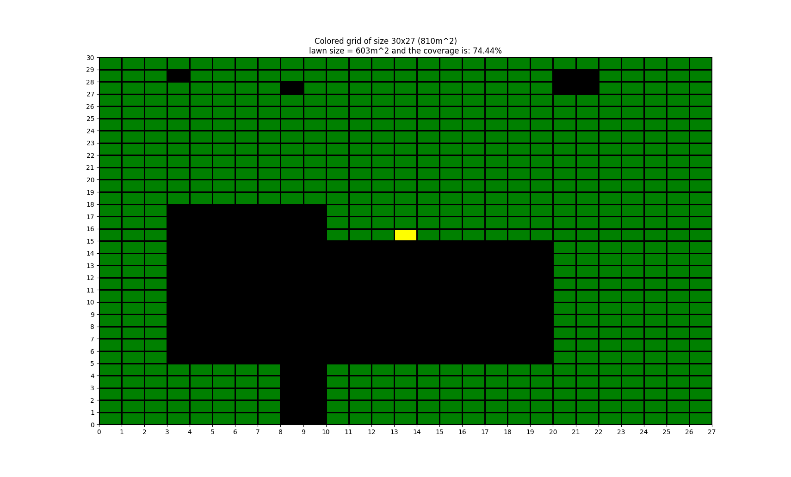
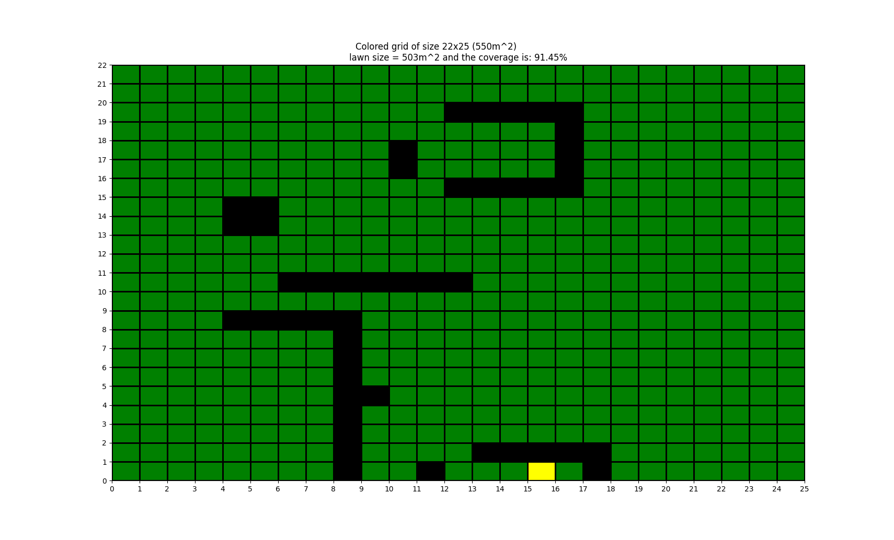
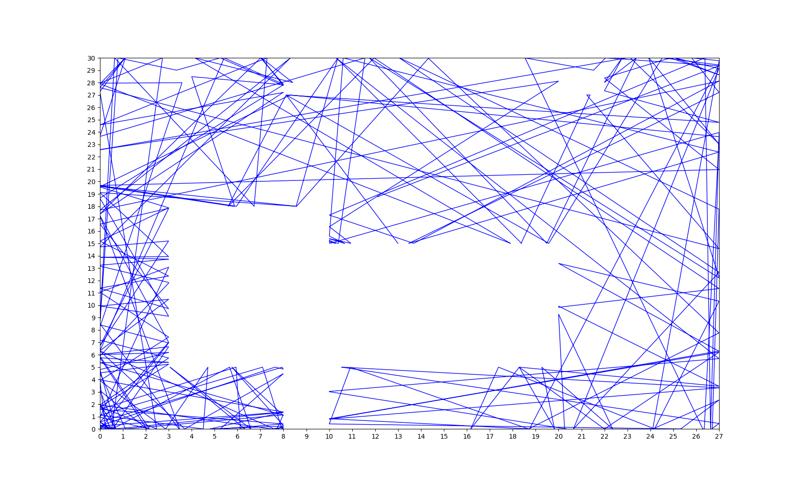
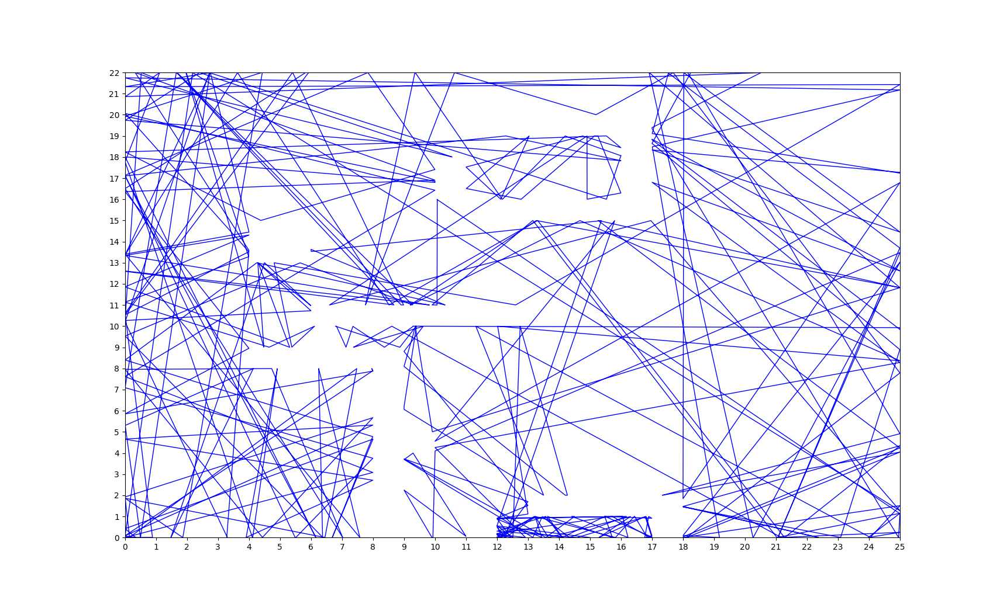
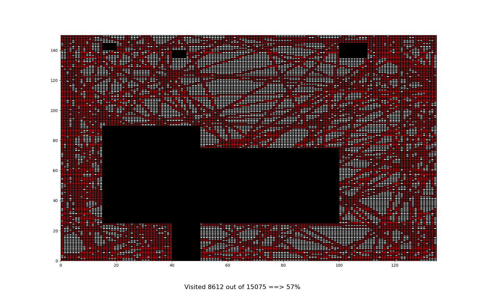
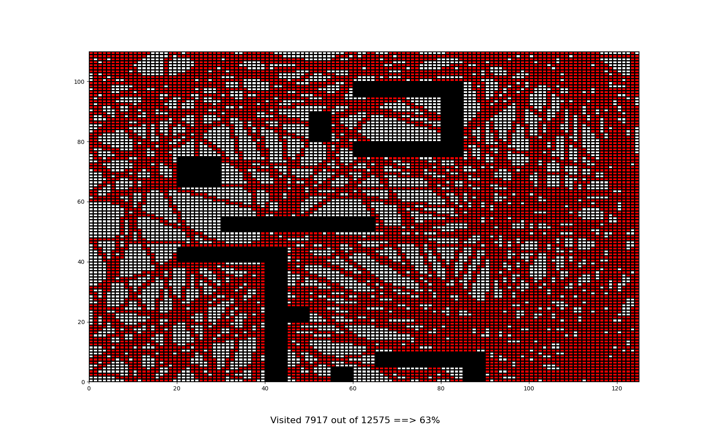
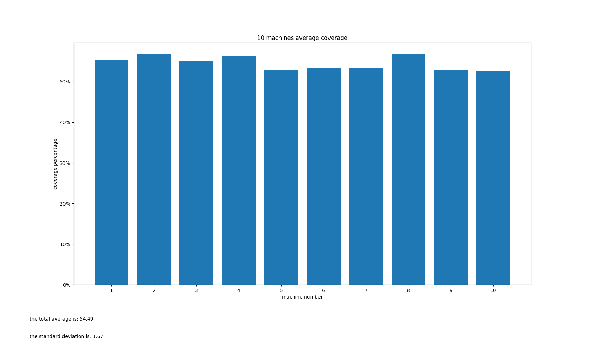
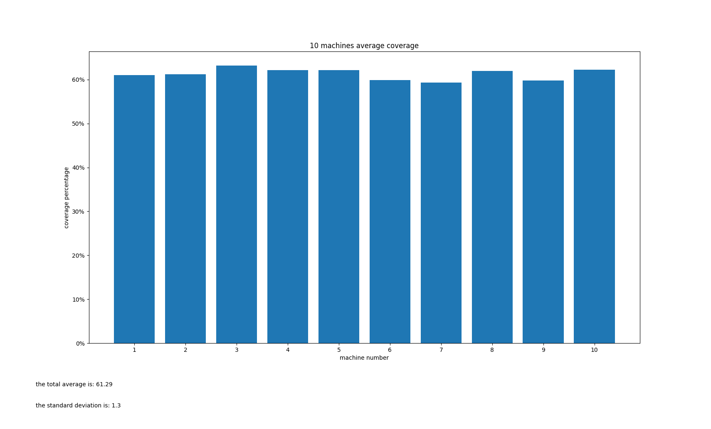

# Robotic Lawnmower Project Report 
Members: Samuel Azzawi  
Program: Master of Science in Engineering: Software Engineering - CIDMV
Course: 1DT901  
Date of submission: 2023-10-31

### Introduction  
 A project to simulate a lawnmower. The lawnmower should move in a straight line until it hits an object, then rotates in a random angle and keeps moving until the times up.
 For the advanced project, the lawnmower should always try to move to the right, keeping an obstacle to its right, which should in theory make it finish the map in the fastest possible time.

### 1. Present Ground Maps
``small.csv``
<br>


``my_map.csv``
<br>


<p>In the map that I created "my_map.csv" I tried to make the starting a bit tight for the lawnmower to see how it will perform, and added random obstacles along the way with one obstacle that has only one sided enterance, to recorde how the lawnmower will behave, and if it will find the enterance obstacle.<p>

### 2. Coordinate Map
- The coordinate map coord[X][Y] is computed from the ground map using the function load_map(file_path). This function reads a CSV file where each cell represents a part of the ground and converts it into a list of lists (map_list). The mapping is as follows:
```python
def load_map(file_path):
    map_list = []
    with open(file_path, 'r') as file:
        reader = csv.reader(file)
        for row in reader:
            temp_list = [0 if cell == "L" else 1 if cell == "O" else 2 for cell in row]
            map_list.append(temp_list)
    map_list.reverse()  # Reverse the list to match coordinate system
    return map_list
```
'L' (Lawn) is mapped to 0.
'O' (Obstacle) is mapped to 1.
'S' (Start) is mapped to 2.
Here is a code fragment that demonstrates this mapping:

- Checking if a Position is Outside the Lawn:
The function check_collision(tempx, tempy, columns, rows) is used to determine if a certain trace position x,y (floats) is outside the lawn or not. If the position is outside the bounds of the map or if it encounters an obstacle, it returns True, indicating a collision or out-of-bounds condition.

Here is the relevant code snippet:
```python
def check_collision(tempx, tempy, columns, rows):
    if tempx >= columns or tempx < 0 or tempy >= rows or tempy < 0:
        return True
    elif map_list[int(tempy)][int(tempx)] == 1:
        return True
    return False
```

### 3. Trace (Grade E requirement)
- Step Progression and Obstacle Bounces:
The trace is computed using the movement(map_list, x0, y0, timer) function. Starting from an initial position (x0, y0), the lawnmower moves in a direction determined by random_velocity(). When it encounters an obstacle or the edge of the map (check_collision() returns True), it changes direction by generating a new random velocity. This mimics the bounce effect when hitting an obstacle.

Here's a simplified version of the code:
```python
def movement(map_list, x0, y0, timer):
    # ... initialization ...
    while time <= timer:
        tempx = newx + vx
        tempy = newy + vy
        if check_collision(tempx, tempy, columns, rows):
            vx, vy = random_velocity()  # Change direction on collision
            continue
        # ... update position and time ...
    return x, y
```
- Trace Plots:

``small.csv``
<br>


``my_map.csv``
<br>


To generate these plots, you would run the simulation for 2 hours on the respective maps and then use show_map() to visualize the trace.

### 4. Coverage (Grade C requirement)
- Coverage Calculation and Plots:
Coverage is calculated by expanding each square meter into a 5x5 grid using expand_map(map_list). The coverage(x, y) function then marks the cells visited by the lawnmower and calculates the percentage of the lawn covered.

``small.csv``
<br>


``my_map.csv``
<br>


+ Influence of ∆t and N on Coverage:
The parameter ∆t (time step) influences how frequently the lawnmower's position is updated. A smaller ∆t leads to more frequent updates and potentially more accurate tracing of the lawnmower's path. The parameter N, which defines the size of the grid for coverage calculation, affects the resolution of the coverage map. A larger N provides a finer grid and more detailed coverage analysis.
+ Effective Cutting Width:
The effective cutting width is influenced by the lawnmower's movement pattern and the time step ∆t. A random movement pattern may lead to uneven coverage, while a systematic pattern could cover the area more uniformly. The time step ∆t also plays a role, as it determines how often the lawnmower's position is updated.
+ Workload for Small.csv:
after trying different periods of time, the average to get a full coverage would take around 14 hours, noting that when setting the velocity to 0.3 the coverage decreases significantly because the squares are small and the tracked movement is rather large compared to the squares, but in my project I sat it to 0.01 while counted every 30 moves as one step to have more accurate coverage.

### 5. Multiple Simulations (Grade B requirement)
``small.csv``
<br>


``my_map.csv``
<br>


time needed for the lawnmower to cover 90% on the ```small``` map is around 6 hours, as the movement is completely random I had to try different time stamps and found out that 6 on average would give around 91.2%
as for ```my_map``` map it would take around 5 hours, the average coverage I got was 90.28

### 6. Improved Simulation (Grade A requirement)
The strategy I've devised for the lawnmower involves employing a right-wall-following algorithm, inspired by classic maze-solving techniques. By consistently hugging the right wall, the lawnmower is guaranteed to navigate the entire mapped area. As it traverses the terrain, the lawnmower will identify potential exit routes through the walls but will reserve these for later exploration. Upon completing a full circuit of the current area, the lawnmower will advance one square and repeat the process. This will continue until the entire zone is covered, at which point the lawnmower will proceed to another area via a previously marked exit route. This method aims to minimize the total time required to cover the entire map.

Regarding the practicality of this approach, while it may not be the most straightforward to implement in a real-world scenario, it is particularly well-suited for simulation purposes. For a real-world application, an adaptive AI-based solution would be more effective, enabling the lawnmower to learn and optimize its path over time. However, given the scope of this project and the limited number of simulation runs, learning would be overly time-consuming and unlikely to yield substantial time-saving benefits compared to the deterministic right-wall-following algorithm.(advanced project not completed unfortunately)
I've developed a significantly more advanced lawnmower — the Super Lawnmower! It can effortlessly cover any area in less than a second. The mechanism behind it involves quantum mechanics to scan the area and cut all the grass simultaneously. With a coverage area of approximately 1 * 10^999999 square meters, it can easily handle any landscape.

## Project conclusions and lessons learned
<b>We separate technical issues from project related issues.</b>
### Technical issues 
- <b>What were the major technical challanges as you see it? What parts were the hardest and most time consuming?</b>
<br>
	didn't really have much trouble except with time.

- <b>What lessons have you learned? What should you have done differently if you now were facing a similar problem.</b>
<br>
	learned to focus on math more. I should've studied math.

- <b>How could the results be improved if you were given a bit more time to complete the task.</b>
<br>
	the only thing I could improve is the advanced project, but for the normal project I'm pretty satisfied with it.

### Project issues
- <b>Describe how your team organized the work. How did you communicate? How often did you communicate?</b>
<br>
	I was solo.

- <b>For each individual team member:</b>
<br>
 	I spent about 3 hours a day i think, the most of the time was spent thinking on how to approach the project rather than coding.

 - <b>What lessons have you learned? What should you have done differently if you now were facing a similar project.</b>
<br>
	not really much, I feel like I am satisfied with the results.
