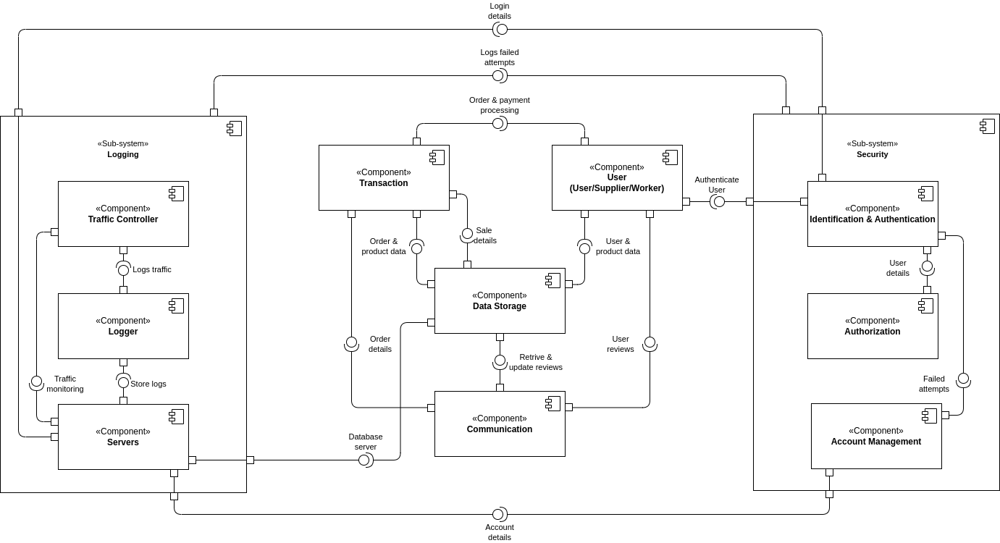

# 2DT902 : Assaignment 2 : [Samuel Berg(sb224sc)](mailto:sb224sc@student.lnu.se)

# WiP TODO: rewrite text according to feedback_U.pdf

## Assumptions

## Uppgift 1.

### OLD

A user can login with different methods, such as email&password, google account or different types of social media accounts which extends from Identifying and Authentication since it is required from the user to be able to login. Logging in with google account or social media accounts realies on a Third-party to Identify and Authenticate the user. To view the profile page the user needs to be logged in, if user isn't logged in they will be prompted to do so when trying to go to profile page and if successful login then there will be an Authorization check. The store page is accessible to any user visiting the store without the need of being logged in, when the user proceeds to the checkout they will be prompted to login or to create an account if they don't have one already, then the user will be asked to provide their billing information if they do not have any stored billing information from previous purcheses with authentication, lastly the payment is provided by a Third-party payment API that supports all the wanted payment methods.

### New

A user can be *identified* by username, email or a third-party service, after a user has been *identified* they can be *authenticated* by providing their password, this is done by matching hashes against the back-end server. When the user has been *authenticated* their user details are checked to provide them with the correct amount of *authorization* according to their privilege-level. When a user wants to complete a order/purchase they will be prompted to authorize it via eID by the third-party payment API that will be used.

## Uppgift 2.

### QAS 1

**Unauthorized Access Attempt**

* **Source**: Unidentified User / User.
* **Stimulus**: Attempts to access restricted resources, (employee dashboard).
* **Artifact**: Access control systems (Authentication & Authorization).
* **Environment**: The system is operational and user only has user-rights.
* **Response**: System detects user-rights, denies the request, logs the attempt for security monitoring.
* **Response Measure**: Unauthorized access is prevented 100% of the time, and an alert is sent to security with the IP-address of the attempt.

### QAS 2

**Multiple Failed Login Attempts**

* **Source**: Unidentified User.
* **Stimulus**: Multiple failed login attempts to an account.
* **Artifact**: Login System (Authentication & Identification, account management, servers and logging).
* **Environment**: The system is operational and fuctioning normally.
* **Response**: After set amount of attempts blocks further login attempts, attempts are logged for security monitoring.
* **Response Measure**: Locks the account, sends security alert to user email to be able to unlock account, this with a 100% prevention rate of unauthorized access to a users account. 

### QAS 3

**Denial of Service Protection**

* **Source**: Malicious actor(s).
* **Stimulus**: X amount of requests per second, overloading the system (X >= 1000).
* **Artifact**: Servers, traffic controller and logging.
* **Environment**: The system is operational but slow (under a (D)DoS attack).
* **Response**: System detects abnormal traffic pattern, limits requests, diverts the abnormal traffic to backup server.
* **Response Measure**: System maintains 95% availablity for regular users by limiting the abnormal traffic to 5% of the systems resources, logs attack and notifies security and administrators within seconds of recognizing the attack.

## Uppgift 3.

### OLD

When an unidentified user attempts to access restricted resources they require the unidentified user to login with employee/administrator privileged account if they fail todo so the attempt is logged, if a logged in user tries to access a restricted resource their user-rights would be checked to see if they have the rights to access the resource in question if not it will be logged. In both cases the administrators will be notified and the IP-addresses of the attempts will be logged for review. This will be handled by **Identification & Authentication**, **Authorization** and **Logging** components.

When an unidentified user tries to login to an account serveral times but fails it will be logged and the account will be locked till the user reviews the security email to restore their account has been handle correctly, the IP-address of the failed attempts will be logged for review and blocked till further review by administrators or user handles their security email correctly, saying that it was them attempting to login. This will be handled by the **Identification & Authentication**, **Account management**, **Servers** and **Logging** components.

When an malicious actor(s) preforms an Denial of Service by sending an large amount of requests per second the traffic controller will pick up on the abnormal request pattern and limit the requests and divert the abnormal traffic to an backup server which will make it so it doesn't affect the main server in a major way by also limiting the abnormal traffic to only allowed to use/occupy more then 5% of the systems resources, all of this will be logged and administrators will be notified within seconds of the attack has been recognized for swift prevention. This will be handled by **Traffic Controller**, **Logging** and **Servers** components.

### New

### Logging

#### Servers

#### Logger

#### Traffic Controller

### Security

#### Identification & Authentication

#### Authorization

#### Account Management

## Uppgift 4.

### Discussion

#### OLD

Possible optimizations for the system could be to move away from third-party dependecies to be able to avoid possible limitations and risks that might come with them, there are also possible bottlenecks regarding the handling of possible DoS attacks and for user experience vs security of the system there will be a trade-off when it comes to user convinience when locking accounts after failed login attempts one maybe should look for an more optimized solution like possibly using something like a CAPTCHA after a failed login attempt before locking the user accounts. These are just some of the possible optimizations that could be done to this system, there are most likly serveral more optimizations that I could not think of at the moment that would be relevant to improve the systems overall functionallity and user experience.

#### New
