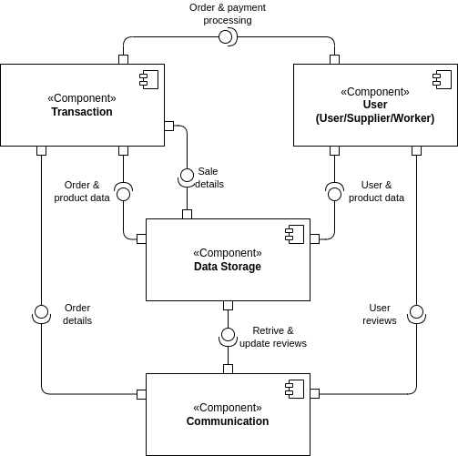
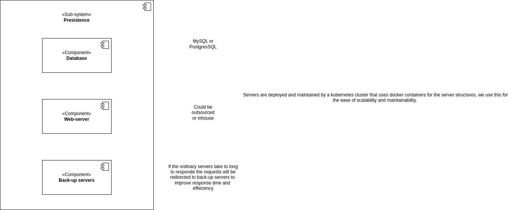
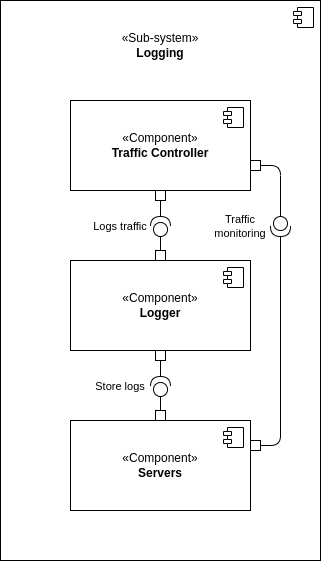
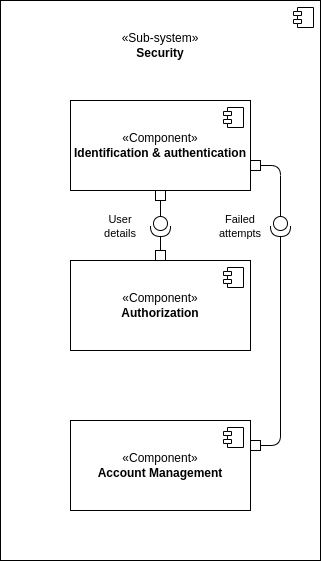
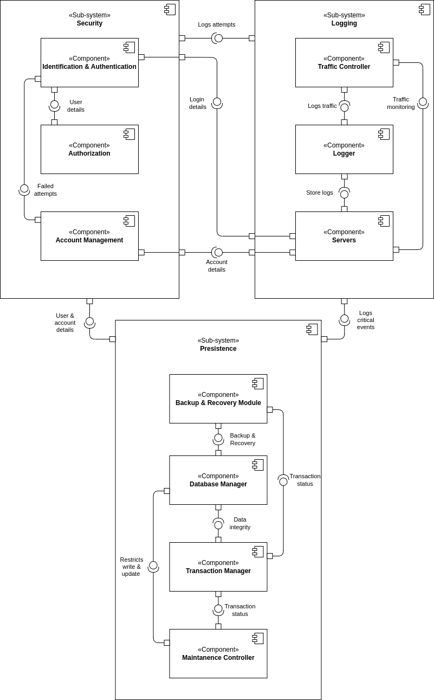

# 2DT902 : Project : [Group 2)](mailto:sb224sc@student.lnu.se)

[link to document on gdrive](https://docs.google.com/document/d/1H6UAzhqQBWQc88c6wg2Y2SLOo98k4P8d5MFhyZ5edHs/edit?pli=1&tab=t.0)

## Report

## Table of Contents
- [Persistence](#persistence)
  - [Requirements](#requirements)
  - [Solutions](#solutions)
  - [Security Components](#security-components)
- [Logging](#logging)
  - [Requirements](#requirements-1)
  - [Solutions](#solutions-1)
  - [Security Components](#security-components-1)
- [Security](#security)
  - [Requirements](#requirements-2)
  - [Solutions](#solutions-2)
  - [Security Components](#security-components-2)
- [Overview](#overview)
- [Images](#images)

### Persistence

### Requirements TODO

#### QAS 1 : Data Availability 

***TODO Description***

**Source**: Unexpected power outage.

**Stimulus**: The system is restarted after an unexpected power outage.

**Artifact**: Web-server.

**Environment**: System has just recovered from an unexpected shutdown.

**Response**: The system should restore all the data exactly as it was before the outage, with no data loss or corruption.

**Response Measure**: All data is accessible and system is fully operational within x minutes.

#### QAS 2 : Data Integrity

***TODO Description***

**Source**: An Employee.

**Stimulus**: An employee updates the price of a product in the inventory.

**Artifact**: Web-server.

**Environment**: System is fully operational.

**Response**: The system ensures that the price update is reflected across all orders, reports, and inventory views. The old price is archived (logs).

**Response Measure**: The update is applied across the system within 2 seconds (MySQL/PostgresSQL).

#### QAS 3 : System Maintenance

***TODO Description***

**Source**: System Administrator.

**Stimulus**: Administrator initiates a system upgrade during off-peak hours.

**Artifact**: Database and web-server.

**Environment**: System is partially operational (only administrator access is allowed).

**Response**: The system should allow data migration, backup, or configuration changes with minimal downtime, while ensuring no data loss.

**Response Measure**: Maintenance tasks are completed and system is back online within 15 minutes.

### Solutions

#### QAS 1 : Data Availability 

##### **Alternative 1 : Database Replication with Automatic Failover**

**Pros:**

- Ensures high availability and rapid recovery.
- Protects against hardware failures by distributing data copies.

**Cons:**

- Additional server costs for replication.
- May require complex setup and monitoring.

##### **Alternative 2 : Regular Backups with Manual Recovery**

**Pros:**

- Lower cost than replication.
- Simpler to implement and manage.

**Cons:**

- Longer recovery time in case of an outage.
- Risk of some data loss between backup intervals.

##### **Our choice: 

***TODO Motivation***
Alternative 1, as high availability is critical for minimizing downtime in an e-commerce environment.**

#### QAS 2 : Data Integrity

##### **Alternative 1 : Database Transactions with Versioning**

**Pros:**

- Ensures atomicity and prevents data corruption during updates.
- Maintains history for rollback or auditing.

**Cons:**

- Higher storage requirements due to versioning.
- Potentially slower for frequent updates.

##### **Alternative 2 : Event Sourcing for Data Changes**

**Pros:**

- Allows rollback and auditing by preserving events.
- Effective for tracking data changes over time.

**Cons:**

- Adds complexity in data retrieval.
- More challenging to query current state.

##### **Our choice: 

***TODO Motivation***
Alternative 1, as database transactions with versioning provide a reliable and simpler solution for ensuring data integrity across the system.**

#### QAS 3 : System Maintenance

##### **Alternative 1 : Rolling Updates**

**Pros:**

- Minimizes downtime by updating components sequentially.
- Allows system to remain accessible to users during updates.

**Cons:**

- Requires support for backward-compatible updates.
- More complex deployment process.

##### **Alternative 2 : Scheduled Downtime for Maintenance**

**Pros:**

- Easier to implement with fewer compatibility concerns.
- Lower infrastructure demands as it doesn’t require redundant setups.

**Cons:**

- System is completely inaccessible during updates.
- Might impact user experience if not scheduled during low traffic.

##### **Our choice: 

***TODO Motivation***
Alternative 1, to ensure maximum uptime for users and avoid disrupting the shopping experience.**

#### Security Components

##### **Authentication component**

###### **Responsibilities:**

- Manages user login, logout, and session handling.

###### **Provides:**

- Secure access control for employees and customers.

###### **Requires:**

- Secure storage for user credentials, preferably with encryption.

###### **Choice of technology/software:** 

OAuth 2.0 or OpenID Connect.

##### **Access Control Component**

###### **Responsibilities:**

- Defines and enforces permissions for different user roles.

###### **Provides:**

- Role-based access management for employee actions and customer data.

###### **Requires:**

- Integration with the Authentication Component and database for user roles.

###### **Choice of technology/software:**

Role-based access control (RBAC) using Access Control Lists (ACLs).

### Logging

### Requirements TODO

#### QAS 1 : System Error 

***TODO Description***

**Source**: System (hardware or software failure).

**Stimulus**: A system error occurs (database connection failure or server crash).

**Artifact**: Error logs stored in a centralized logging service (e.g., ELK stack, Cloud logging).

**Environment**: The system encounters an error while processing requests.

**Response**: The system logs the error, including a description of the affected service, the severity level and the time-stamp. Alerts may be sent to administrators.

**Response Measure**: The error is logged instantly, and the administrators are notified for immediate troubleshooting.

#### QAS 2 : Data Modification

***TODO Description***

**Source**: Authorized user (admin or employee).

**Stimulus**: A user modifies critical data (product price or inventory details).

**Artifact**: Database/API.

**Environment**: The system is fully operational.

**Response**: The system logs the modification, capturing the user's identifier, the data before and after the change, the resource affected and the time-stamp.

**Response Measure**: Modifications are logged in real-time, ensuring an audit trail of changes to critical system data.

 #### QAS 3 : Transaction

 ***TODO Description***

**Source**: User (customer).

**Stimulus**: The customer initiates a payment for an order (whether success/failure).

**Artifact**: Web Server (payment authorization/payment gateway).

**Environment**: The system is operational.

**Response**: The system logs the transaction details, including payment method, order number/id, time-stamp and the result (success/failure), along with any relevant error messages if the transaction fails.

**Response Measure**: The transaction is logged immediately after the attempt whether successful or failed, and stored securely for audit and monitoring purposes.

### Solutions

#### QAS 1 : System Error 

##### **Alternative 1 : Log errors locally with periodic batch uploads to centralized storage**

**Pros:**

- Reduces immediate strain on network and server resources during high load.
- Allows for error data to persist locally in case of temporary network outages.

**Cons:**

- Potential delay in error visibility, slowing response time for admins.
- Higher risk of data loss if local logs are compromised before upload.

##### **Alternative 2 : Real-time error logging to a centralized monitoring and alert system**

**Pros:**

- Immediate log capture and alert, enabling rapid troubleshooting.
- Allows for pattern detection (e.g., multiple errors in a short time) which can help prevent cascading failures.

**Cons:**

- Increased bandwidth and processing resources for real-time logging, especially during high-error periods.
- Potential risk if centralized logging becomes unavailable during critical failures.

##### **Our choice: 

***TODO Motivation***
Real-time error logging to a centralized monitoring and alert system for better response times and visibility into system health.**

#### QAS 2 : Data Modification

##### **Alternative 1 : Log modifications in a dedicated audit log database**

**Pros:**

- Provides structured, searchable records for efficient audit tracking.
- Can be optimized for logging and retrieval without affecting main application performance.

**Cons:**

- Requires additional maintenance and storage costs for a separate audit database.
- Introduces some additional latency in the modification process.

##### **Alternative 2 : In-line logging within the main database using triggers**

**Pros:**

- No need for an additional database; simplifies data management.
- Logging is tied directly to the modification transaction, ensuring atomicity.

**Cons:**

- Potential performance degradation of main database operations.
- Can complicate database schema and require more careful backup strategies.

##### **Our choice: 

***TODO Motivation***
Dedicated audit log database to minimize performance impact on the primary database and streamline compliance with data logging standards.**

#### QAS 3 : Transaction

##### **Alternative 1 : Log all transactions in the main application server logs**

**Pros:**

- Easier to implement with fewer moving parts.
- Maintains transaction data close to the application logic, simplifying troubleshooting.

**Cons:**

- Log file growth can be high, increasing storage costs.
- Parsing and analysis of logs can be less efficient compared to structured storage.

##### **Alternative 2 : Use a specialized transaction log system or service (e.g., transaction log database or third-party payment logging)**

**Pros:**

- Dedicated system for transaction data, optimized for retrieval and analysis.
- Provides secure, tamper-proof records which are essential for financial data.

**Cons:**

- Requires integration with external systems, which may add complexity.
- Additional costs for setup, maintenance, or third-party service fees.

##### **Our choice: 

***TODO Motivation***
Specialized transaction log system to ensure secure and scalable logging, compliant with financial data handling requirements.**

#### Security components

##### **Authentication Component**

###### **Responsibilities:**

- Validates and manages user identities.
- Enforces access controls for different user roles (e.g., customer, admin).

###### **Provides:**

- Secure user login and logout.
- Session management to prevent unauthorized access.

###### **Requires:**

- Connection to user database for identity verification.
- Secure channel for credential transmission (e.g., SSL/TLS).

###### **Choice of technology/software:**

OAuth 2.0 for secure token-based authentication, possibly with an identity provider like Auth0 or Firebase Authentication.

##### **Logging and Monitoring Component**

###### **Responsibilities:**

- Captures, stores, and provides access to system logs and alerts.
- Ensures that logs are retained securely for auditing and troubleshooting.

###### **Provides:**

- Real-time monitoring and alerting for critical system errors.
- Log search and filtering to support issue diagnosis and resolution.

###### **Requires:**

- Access to all application components for log aggregation.
- Integration with alerting and notification systems for administrator alerts.

###### **Choice of technology/software:**

ELK Stack (Elasticsearch, Logstash, Kibana) or CloudWatch for real-time logging and monitoring.

### Security

### Requirements TODO

#### QAS 1 : Unauthorized Access Attempt 

***TODO Description***

**Source**: Unidentified User / User.

**Stimulus**: Attempts to access restricted resources, (employee dashboard).

**Artifact**: Access control systems (Authentication & Authorization).

**Environment**: The system is operational and user only has user-rights.

**Response**: System detects user-rights, denies the request, logs the attempt for security monitoring.

**Response Measure**: Unauthorized access is prevented 100% of the time, and an alert is sent to security with the IP-address of the attempt.

#### QAS 2 : Multiple Failed Login Attempts

***TODO Description***

**Source**: Unidentified User.

**Stimulus**: Multiple failed login attempts to an account.

**Artifact**: Login System (Authentication & Identification, account management, servers and logging).

**Environment**: The system is operational and functioning normally.

**Response**: After set amount of attempts blocks further login attempts, attempts are logged for security monitoring.

**Response Measure**: Locks the account, sends security alert to user email to be able to unlock account, this with a 100% prevention rate of unauthorized access to a users account.

 #### QAS 3 : Denial of Service Protection

 ***TODO Description***

**Source**: Malicious actor(s).

**Stimulus**: X amount of requests per second, overloading the system (X >= 1000).

**Artifact**: Servers, traffic controller and logging.

**Environment**: The system is operational but slow (under a (D)DoS attack).

**Response**: System detects abnormal traffic patterns, limits requests and diverts the abnormal traffic to a backup server with limited resources.

**Response Measure**: System maintains 95% availability for regular users by limiting the abnormal traffic to 5% of the system's resources, logs attacks and notifies security and administrators within seconds of recognizing the attack.

### Solutions

#### QAS 1 : Unauthorized Access Attempt 

##### **Alternative 1 : Role-Based Access Control (RBAC)**

**Pros:**

- Simple to implement and understand.
- Limits access based on predefined roles, reducing risk of unauthorized access.

**Cons:**

- Lacks flexibility for dynamic access needs.
- Requires careful role management to avoid over-privileged access.

##### **Alternative 2 : Multi-Factor Authentication (MFA) + Context-Based Access Control**

**Pros:**

- Provides stronger access control by requiring a second factor.
- Context-based controls (such as IP location checks) can further limit unauthorized attempts.

**Cons:**

- More complex to implement, requiring additional hardware or software.
- Could inconvenience legitimate users, increasing login time.

##### **Our choice: 

***TODO Motivation***
Multi-Factor Authentication + Context-Based Access Control to enhance security and ensure unauthorized access attempts are strictly managed.**

#### QAS 2 : Multiple Failed Login Attempts

##### **Alternative 1 : Temporary Account Lockout**

**Pros:**

- Limits brute-force attack success by locking out after a few failed attempts.
- Simple to implement with most authentication systems.

**Cons:**

- Could result in denial-of-access for legitimate users if they forget their credentials.
- Requires careful lockout time management to avoid frustrating users.

##### **Alternative 2 : CAPTCHA Implementation after X Failed Attempts**

**Pros:**

- Prevents automated brute-force attacks effectively.
- Allows users to attempt to log in without full lockout.

**Cons:**

- CAPTCHA may reduce user-friendliness.
- Limited impact on sophisticated attacks, especially if CAPTCHA is bypassable.

##### **Our choice: 

***TODO Motivation***
CAPTCHA after X failed attempts, followed by temporary lockout if necessary, to balance user experience and security.**

#### QAS 3 : Denial of Service Protection

##### **Alternative 1 : Rate Limiting with Cloudflare / API Gateway**

**Pros:**

- Easy to configure rate limits and monitor traffic patterns.
- Can scale automatically to handle legitimate high-traffic events.

**Cons:**

- Costs can increase with the level of usage and protection.
- Limited protection for complex (D)DoS attacks.

##### **Alternative 2 : Load Balancer with Automated Traffic Analysis and Filtering**

**Pros:**

- Allows real-time monitoring and redirection of abnormal traffic.
- Provides flexibility for adjusting resources to meet normal user demand.

**Cons:**

- Higher infrastructure costs.
- May require complex configuration and maintenance.

##### **Our choice: 

***TODO Motivation***
Load Balancer with automated traffic analysis to filter malicious traffic and maintain service availability during attacks.**

#### Security components

##### **Authentication Component**

###### **Responsibilities:**

- Verifies user identity before granting access.
- Implements RBAC and MFA to secure user sessions.

###### **Provides:**

- User authentication, login monitoring, and account management.

###### **Requires:**

- Integration with user management systems and logging services for security monitoring.

###### **Choice of technology/software:**

OAuth 2.0 (for secure authorization), Google Authenticator (for MFA), and JWT (JSON Web Tokens for session management).

##### **Traffic Controller Component**

###### **Responsibilities:**

- Manages incoming traffic and mitigates DoS attacks by redirecting or rate-limiting requests.

###### **Provides:**

- Real-time traffic analysis and DoS protection, availability monitoring.

###### **Requires:**

- Connectivity with logging and alert systems, communication with backup server resources.

###### **Choice of technology/software:**

Cloudflare or AWS WAF for rate limiting, and HAProxy for load balancing.

#### Logging and Monitoring Component

##### **Responsibilities:**

- Records access attempts, monitors security events, and sends alerts for suspicious activities.

###### **Provides:**

- Log storage, access for security audits, real-time alerts.

###### **Requires:**

- Access to authentication and traffic controller logs, integration with notification services.

###### **Choice of technology/software:**

Elasticsearch and Kibana for logging and monitoring, with PagerDuty for alerting.

## Overview TODO

## Images

*Decomposition diagram*

*Persistence sub-system*

*Logging sub-system*

*Security sub-system*

**Now the sub-systems will be connected to provide a "solution" that showcases how they will work together and dependent on each other.** 

*Connected sub-systems*

<!-- **Motivation**

*Persistence*

Database Manager
- Connection to Security: Collaborates with Identification & Authentication and Authorization to verify access permissions for data interactions.
- Connection to Logging: Sends logs for critical events like data updates and backups to the Logger for auditing purposes.

Backup & Recovery Module
- Connection to Logging: Logs backup and recovery activities, errors, and recovery time to the Logger for operational transparency.
- Connection to Security: Requires secure access to backup data, integrating with Account Management to ensure access restrictions during sensitive operations.

Transaction Manager
- Connection to Security: Works with Authorization to verify that only permitted users (e.g., employees) can make data changes.
- Connection to Logging: Sends transaction records and version control logs to the Logger to support auditing and rollback if needed.

Maintenance Controller
- Connection to Security: Engages Identification & Authentication to restrict access during maintenance to authorized system administrators.
- Connection to Logging: Logs all maintenance activities and updates status to the Traffic Controller for real-time system status monitoring.

*Logging*

*Security*

-->

**Lastly the final component diagram including all the relations between components and sub-systems, including the decomposition diagram**

*Component diagram*
