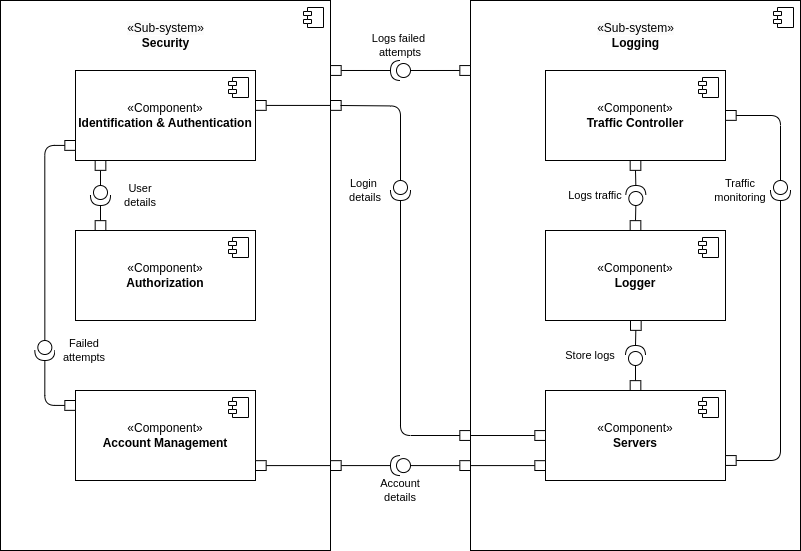

# 2DT902 : Project : [Samuel Berg(sb224sc)](mailto:sb224sc@student.lnu.se)

[link to document on gdrive](https://docs.google.com/document/d/1H6UAzhqQBWQc88c6wg2Y2SLOo98k4P8d5MFhyZ5edHs/edit?pli=1&tab=t.0)

## Report

### Persistence

#### QAS 1 : Data Availability 

**Source**: Unexpected power outage.

**Stimulus**: The system is restarted after an unexpected power outage.

**Artifact**: Web-server.

**Environment**: System has just recovered from an unexpected shutdown.

**Response**: The system should restore all the data exactly as it was before the outage, with no data loss or corruption.

**Response Measure**: All data is accessible and system is fully operational within x minutes.

#### QAS 2 : Data Integrity

**Source**: An Employee.

**Stimulus**: An employee updates the price of a product in the inventory.

**Artifact**: Web-server.

**Environment**: System is fully operational.

**Response**: The system ensures that the price update is reflected across all orders, reports, and inventory views. The old price is archived (logs).

**Response Measure**: The update is applied across the system within 2 seconds (MySQL/PostgresSQL).

#### QAS 3 : System Maintenance

**Source**: System Administrator.

**Stimulus**: Administrator initiates a system upgrade during off-peak hours.

**Artifact**: Database and web-server.

**Environment**: System is partially operational (only administrator access is allowed).

**Response**: The system should allow data migration, backup, or configuration changes with minimal downtime, while ensuring no data loss.

**Response Measure**: Maintenance tasks are completed and system is back online within 15 minutes.

### Solutions

#### QAS 1 : Data Availability 

##### **Alternative 1 : Database Replication with Automatic Failover**

**Pros:**

- Ensures high availability and rapid recovery.
- Protects against hardware failures by distributing data copies.

**Cons:**

- Additional server costs for replication.
- May require complex setup and monitoring.

##### **Alternative 2 : Regular Backups with Manual Recovery**

**Pros:**

- Lower cost than replication.
- Simpler to implement and manage.

**Cons:**

- Longer recovery time in case of an outage.
- Risk of some data loss between backup intervals.

##### **Our choice: Alternative 1, as high availability is critical for minimizing downtime in an e-commerce environment.**

#### QAS 2 : Data Integrity

##### **Alternative 1 : Database Transactions with Versioning**

**Pros:**

- Ensures atomicity and prevents data corruption during updates.
- Maintains history for rollback or auditing.

**Cons:**

- Higher storage requirements due to versioning.
- Potentially slower for frequent updates.

##### **Alternative 2 : Event Sourcing for Data Changes**

**Pros:**

- Allows rollback and auditing by preserving events.
- Effective for tracking data changes over time.

**Cons:**

- Adds complexity in data retrieval.
- More challenging to query current state.

##### **Our choice: Alternative 1, as database transactions with versioning provide a reliable and simpler solution for ensuring data integrity across the system.**

#### QAS 3 : System Maintenance

##### **Alternative 1 : Rolling Updates**

**Pros:**

- Minimizes downtime by updating components sequentially.
- Allows system to remain accessible to users during updates.

**Cons:**

- Requires support for backward-compatible updates.
- More complex deployment process.

##### **Alternative 2 : Scheduled Downtime for Maintenance**

**Pros:**

- Easier to implement with fewer compatibility concerns.
- Lower infrastructure demands as it doesn’t require redundant setups.

**Cons:**

- System is completely inaccessible during updates.
- Might impact user experience if not scheduled during low traffic.

##### **Our choice: Alternative 1, to ensure maximum uptime for users and avoid disrupting the shopping experience.**

#### Security Components

##### **Authentication component**

###### **Responsibilities:**

Manages user login, logout, and session handling.

###### **Provides:**

Secure access control for employees and customers.

###### **Requires:**

Secure storage for user credentials, preferably with encryption.

###### **Choice of technology/software:** 

OAuth 2.0 or OpenID Connect.

##### **Access Control Component**

###### **Responsibilities:**

Defines and enforces permissions for different user roles.

###### **Provides:**

Role-based access management for employee actions and customer data.

###### **Requires:**

Integration with the Authentication Component and database for user roles.

###### **Choice of technology/software:**

Role-based access control (RBAC) using Access Control Lists (ACLs).

### Logging

#### QAS 1 : System Error 

**Source**: System (hardware or software failure).

**Stimulus**: A system error occurs (database connection failure or server crash).

**Artifact**: ??.

**Environment**: The system encounters an error while processing requests.

**Response**: The system logs the error, including a description of the affected service, the severity level and the time-stamp. Alerts may be sent to administrators.

**Response Measure**: The error is logged instantly, and the administrators are notified for immediate troubleshooting.

#### QAS 2 : Data Modification

**Source**: Authorized user (admin or employee).

**Stimulus**: A user modifies critical data (product price or inventory details).

**Artifact**: Database/API.

**Environment**: The system is fully operational.

**Response**: The system logs the modification, capturing the user's identifier, the data before and after the change, the resource affected and the time-stamp.

**Response Measure**: Modifications are logged in real-time, ensuring an audit trail of changes to critical system data.

 #### QAS 3 : Transaction

**Source**: User (customer).

**Stimulus**: The customer initiates a payment for an order (whether success/failure).

**Artifact**: Web Server (payment authorization/payment gateway).

**Environment**: The system is operational.

**Response**: The system logs the transaction details, including payment method, order number/id, time-stamp and the result (success/failure), along with any relevant error messages if the transaction fails.

**Response Measure**: The transaction is logged immediately after the attempt whether successful or failed, and stored securely for audit and monitoring purposes.

### Solutions

#### QAS 1 : System Error 

##### **Alternative 1:**

**Pros:**

-

**Cons:**

-

##### **Alternative 2:**

**Pros:**

-

**Cons:**

-

##### **Our choice:**

#### QAS 2 : Data Modification

##### **Alternative 1:**

**Pros:**

-

**Cons:**

-

##### **Alternative 2:**

**Pros:**

-

**Cons:**

-

##### **Our choice:**

#### QAS 3 : Transaction

##### **Alternative 1:**

**Pros:**

-

**Cons:**

-

##### **Alternative 2:**

**Pros:**

-

**Cons:**

-

##### **Our choice:**

#### Security components

##### **XXX component**

###### **Responsibilities:**

###### **Provides:**

###### **Requires:**

###### **Choice of technology/software:**

##### **XXX component**

###### **Responsibilities:**

###### **Provides:**

###### **Requires:**

###### **Choice of technology/software:**

### Security

#### QAS 1 : Unauthorized Access Attempt 

**Source**: Unidentified User / User.

**Stimulus**: Attempts to access restricted resources, (employee dashboard).

**Artifact**: Access control systems (Authentication & Authorization).

**Environment**: The system is operational and user only has user-rights.

**Response**: System detects user-rights, denies the request, logs the attempt for security monitoring.

**Response Measure**: Unauthorized access is prevented 100% of the time, and an alert is sent to security with the IP-address of the attempt.

#### QAS 2 : Multiple Failed Login Attempts

**Source**: Unidentified User.

**Stimulus**: Multiple failed login attempts to an account.

**Artifact**: Login System (Authentication & Identification, account management, servers and logging).

**Environment**: The system is operational and functioning normally.

**Response**: After set amount of attempts blocks further login attempts, attempts are logged for security monitoring.

**Response Measure**: Locks the account, sends security alert to user email to be able to unlock account, this with a 100% prevention rate of unauthorized access to a users account.

 #### QAS 3 : Denial of Service Protection

**Source**: Malicious actor(s).

**Stimulus**: X amount of requests per second, overloading the system (X >= 1000).

**Artifact**: Servers, traffic controller and logging.

**Environment**: The system is operational but slow (under a (D)DoS attack).

**Response**: System detects abnormal traffic patterns, limits requests and diverts the abnormal traffic to a backup server with limited resources.

**Response Measure**: System maintains 95% availability for regular users by limiting the abnormal traffic to 5% of the system's resources, logs attacks and notifies security and administrators within seconds of recognizing the attack.

### Solutions

#### QAS 1 : Unauthorized Access Attempt 

##### **Alternative 1:**

**Pros:**

-

**Cons:**

-

##### **Alternative 2:**

**Pros:**

-

**Cons:**

-

##### **Our choice:**

#### QAS 2 : Multiple Failed Login Attempts

##### **Alternative 1:**

**Pros:**

-

**Cons:**

-

##### **Alternative 2:**

**Pros:**

-

**Cons:**

-

##### **Our choice:**

#### QAS 3 : Denial of Service Protection

##### **Alternative 1:**

**Pros:**

-

**Cons:**

-

##### **Alternative 2:**

**Pros:**

-

**Cons:**

-

##### **Our choice:**

#### Security components

##### **XXX component**

###### **Responsibilities:**

###### **Provides:**

###### **Requires:**

###### **Choice of technology/software:**

##### **XXX component**

###### **Responsibilities:**

###### **Provides:**

###### **Requires:**

###### **Choice of technology/software:**

## Overview

## Images

