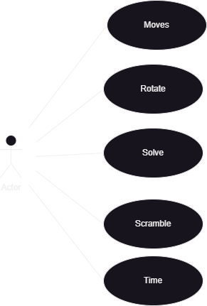
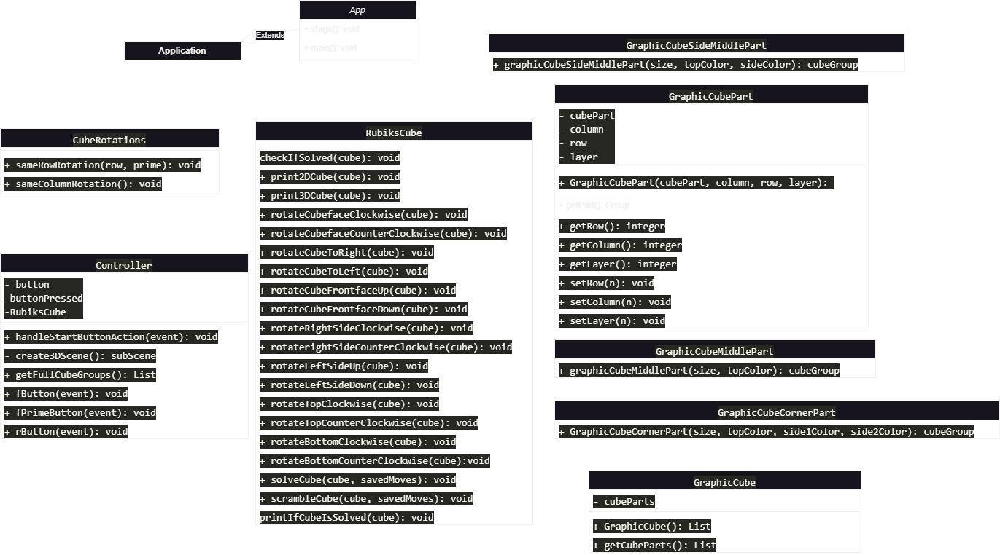

# A02 Project

## Getting started

To make it easy for you to get started with GitLab, here's a list of recommended next steps.

Already a pro? Just edit this README.md and make it your own. Want to make it easy? [Use the template at the bottom](#editing-this-readme)!

## Add your files

- [ ] [Create](https://docs.gitlab.com/ee/user/project/repository/web_editor.html#create-a-file) or [upload](https://docs.gitlab.com/ee/user/project/repository/web_editor.html#upload-a-file) files
- [ ] [Add files using the command line](https://docs.gitlab.com/ee/gitlab-basics/add-file.html#add-a-file-using-the-command-line) or push an existing Git repository with the following command:

```
cd existing_repo
git remote add origin https://gitlab.lnu.se/1dt905/student/eu222dq-jw223rn/a02-project.git
git branch -M main
git push -uf origin main
```

## Integrate with your tools

- [ ] [Set up project integrations](https://gitlab.lnu.se/1dt905/student/eu222dq-jw223rn/a02-project/-/settings/integrations)

## Collaborate with your team

- [ ] [Invite team members and collaborators](https://docs.gitlab.com/ee/user/project/members/)
- [ ] [Create a new merge request](https://docs.gitlab.com/ee/user/project/merge_requests/creating_merge_requests.html)
- [ ] [Automatically close issues from merge requests](https://docs.gitlab.com/ee/user/project/issues/managing_issues.html#closing-issues-automatically)
- [ ] [Enable merge request approvals](https://docs.gitlab.com/ee/user/project/merge_requests/approvals/)
- [ ] [Set auto-merge](https://docs.gitlab.com/ee/user/project/merge_requests/merge_when_pipeline_succeeds.html)

## Test and Deploy

Use the built-in continuous integration in GitLab.

- [ ] [Get started with GitLab CI/CD](https://docs.gitlab.com/ee/ci/quick_start/index.html)
- [ ] [Analyze your code for known vulnerabilities with Static Application Security Testing(SAST)](https://docs.gitlab.com/ee/user/application_security/sast/)
- [ ] [Deploy to Kubernetes, Amazon EC2, or Amazon ECS using Auto Deploy](https://docs.gitlab.com/ee/topics/autodevops/requirements.html)
- [ ] [Use pull-based deployments for improved Kubernetes management](https://docs.gitlab.com/ee/user/clusters/agent/)
- [ ] [Set up protected environments](https://docs.gitlab.com/ee/ci/environments/protected_environments.html)

***

# Editing this README

When you're ready to make this README your own, just edit this file and use the handy template below (or feel free to structure it however you want - this is just a starting point!). Thank you to [makeareadme.com](https://www.makeareadme.com/) for this template.

## Suggestions for a good README
Every project is different, so consider which of these sections apply to yours. The sections used in the template are suggestions for most open source projects. Also keep in mind that while a README can be too long and detailed, too long is better than too short. If you think your README is too long, consider utilizing another form of documentation rather than cutting out information.

## Name
Choose a self-explaining name for your project.

## Description
Let people know what your project can do specifically. Provide context and add a link to any reference visitors might be unfamiliar with. A list of Features or a Background subsection can also be added here. If there are alternatives to your project, this is a good place to list differentiating factors.

## Badges
On some READMEs, you may see small images that convey metadata, such as whether or not all the tests are passing for the project. You can use Shields to add some to your README. Many services also have instructions for adding a badge.

## Visuals
Depending on what you are making, it can be a good idea to include screenshots or even a video (you'll frequently see GIFs rather than actual videos). Tools like ttygif can help, but check out Asciinema for a more sophisticated method.

## Installation
Within a particular ecosystem, there may be a common way of installing things, such as using Yarn, NuGet, or Homebrew. However, consider the possibility that whoever is reading your README is a novice and would like more guidance. Listing specific steps helps remove ambiguity and gets people to using your project as quickly as possible. If it only runs in a specific context like a particular programming language version or operating system or has dependencies that have to be installed manually, also add a Requirements subsection.

## Usage
Use examples liberally, and show the expected output if you can. It's helpful to have inline the smallest example of usage that you can demonstrate, while providing links to more sophisticated examples if they are too long to reasonably include in the README.

## Support
Tell people where they can go to for help. It can be any combination of an issue tracker, a chat room, an email address, etc.

## Roadmap
If you have ideas for releases in the future, it is a good idea to list them in the README.

## Contributing
State if you are open to contributions and what your requirements are for accepting them.

For people who want to make changes to your project, it's helpful to have some documentation on how to get started. Perhaps there is a script that they should run or some environment variables that they need to set. Make these steps explicit. These instructions could also be useful to your future self.

You can also document commands to lint the code or run tests. These steps help to ensure high code quality and reduce the likelihood that the changes inadvertently break something. Having instructions for running tests is especially helpful if it requires external setup, such as starting a Selenium server for testing in a browser.

## Authors and acknowledgment
Show your appreciation to those who have contributed to the project.

## License
For open source projects, say how it is licensed.

## Project status
If you have run out of energy or time for your project, put a note at the top of the README saying that development has slowed down or stopped completely. Someone may choose to fork your project or volunteer to step in as a maintainer or owner, allowing your project to keep going. You can also make an explicit request for maintainers.


# What to do!!

What classes should be used and what should they do?

Create a UML diagram of how we intend to have our klasses structuerd and how they should implement eachother.

Create a gui that shows an item as a start, extend later on with cube.

Describe the system.

Create use cases.

Optional is sonarcube.

Disised on a design.

document all libraries, tools and techniques used in the project.

Test using junit5 testing

Written report

Can have the order changed depending on what we deam relevant.

# a02-Project

## 2d and 3d represenation of a rubik's cube

### Emil Ulvagården & jesper Wingren

#### <eu222dq@student.lnu.se> & <jw223rn@student.lnu.se>

## abstract

- [Introduction](#introduction)
- [2_Analasis](#2_analasis)
- [2_1_Description](#2_1_description)
- [2_2_Use_cases](#2_2_use_cases)
- [2_3_UML_diagrams](#2_3_uml_diagrams)
- [2_4_Other](#2_4_other)
- [3_Design](#3_design)
- [3_1_Uppdated_UML](#3_1_uppdated_uml)
- [4_Tools_and_Techniques](#4_tools_and_techniques)
- [5_Implementation](#5_implementation)
- [6_Test_and_Coverage](#6_test_and_coverage)
- [7_System-or_Application](#7_system_or_application)
- [8_Summary_or_Conclution](#8_summary_or_conclution)
- [8_1_TIL](#8_1_til)
- [9_Reference](#9_reference)
- [A_Apendix](#a_apendix)

## Introduction

This project covers some of the part from the course objectorientated programing in java. In the raport we go through the different stages of a project such as planing and problemsolving. Going through the different problems that occured and if they were fixed aswell as what we learnd from them. The project consists of a backend 2D cube that keeps track of all move aswell as a 3D cube that the user interacts with.

Git repo [länk](https://gitlab.lnu.se/1dt905/student/eu222dq-jw223rn/a02-project)

## 2_Analasis

The project started with us making the backend with the 2D cube as a way of keeping track of what moves where made and in what order. We then started working with the 3D representatiom of the cube by using javafx.

### 2_1_Description

The system should be a 3D and a 2D rubik's cube. We are currently makeing the cube be shown as a 3D representation where the user interacts and makes the different moves or choices. The 2D cube is ment as a backend that keeps track of the users moves aswell as the cubes different states. The user will be able to scramble, solve and play around with the cube to there liking.

### 2_2_Use_cases



### 2_3_UML_diagrams

Input a diagram describing how we first wanted the program to look.

### 2_4_Other

## 3_Design

When desiding on how the different cubes should look we started by doing the 2D cube in the terminal using letters to simulate what colors where placed where. We then moved over to using ANSI and unicode to get a representation of a colord cube in the terminal where orange is changed out for purple to easier see the difference between orange and yellow. When makeing the 3D application we first started with a starting menu where the user can close the program or go to the window were the cube is shown. The cube is then on the upper half of the window and on the lower half we have the different choices that the user can choose between.

Input picture of the program below in the different stages:

### 3_1_Uppdated_UML



## 4_Tools_and_Techniques

To make the UML diagrams aswell as use case diagrams we used draw.io.

We have decided to use javafx as our gui and therefor the javafx librarie is used. The librarie is used to show the user the cube in 3D and to implement the event that the user chooses to preform. We have also used the java labrarie to implement different list, arrays and scanners. The cube is structered with gradle and tested by wisual comparison by the developers.

## 5_Implementation

gradle, JUnit testning, javadoc

## 6_Test_and_Coverage

## 7_System_or_Application

## 8_Summary_or_Conclution

### 8_1_TIL

## 9_Reference

[1] Wikipedia (2023-10-20) ANSI escape code [Online] (visited 2023-10-23)
Available here: [https://en.wikipedia.org/wiki/ANSI_escape_code](https://en.wikipedia.org/wiki/ANSI_escape_code)

[2] Wikipedia (2023-10-15) List of Unicode characters [Online] (visited 2023-10-23)
Available here: [https://en.wikipedia.org/wiki/List_of_Unicode_characters](https://en.wikipedia.org/wiki/List_of_Unicode_characters)

[3] ruwix (Missing date) Rubik's Cube Notation [Online] (visited 2023-10-23)
Available here: [https://ruwix.com/the-rubiks-cube/notation/](https://ruwix.com/the-rubiks-cube/notation/)

## A_Apendix
