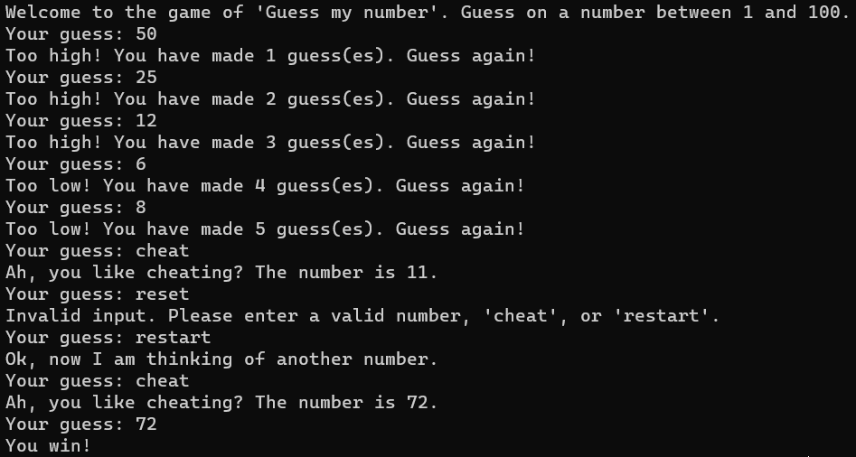
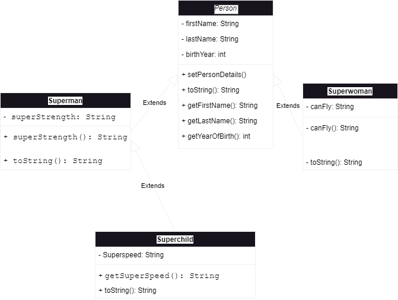
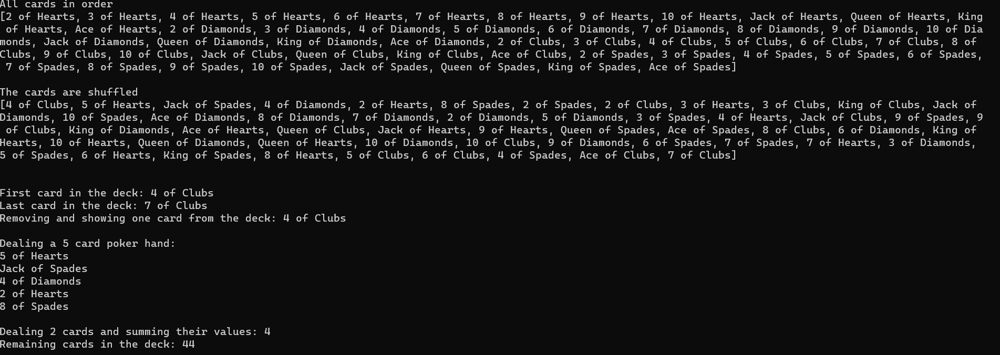
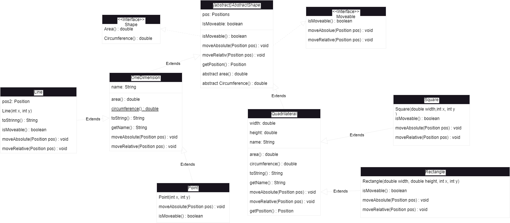
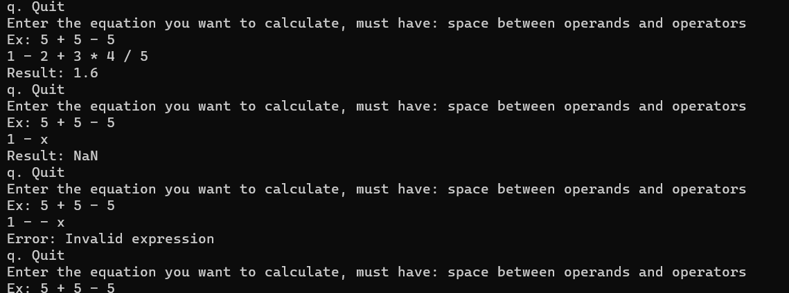
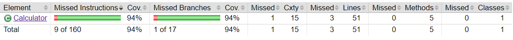
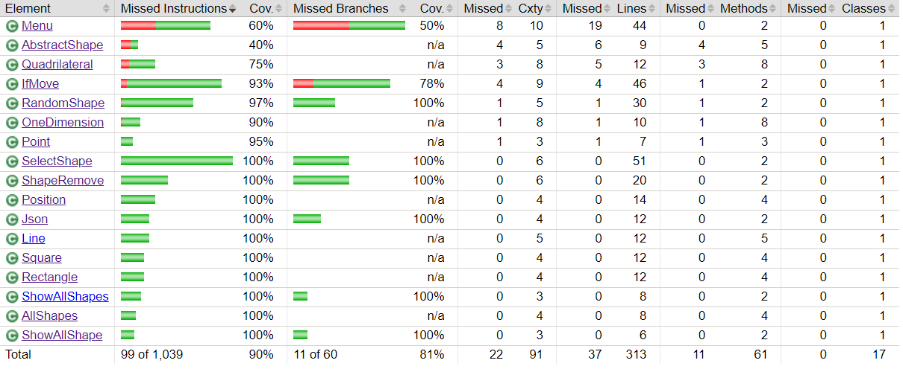
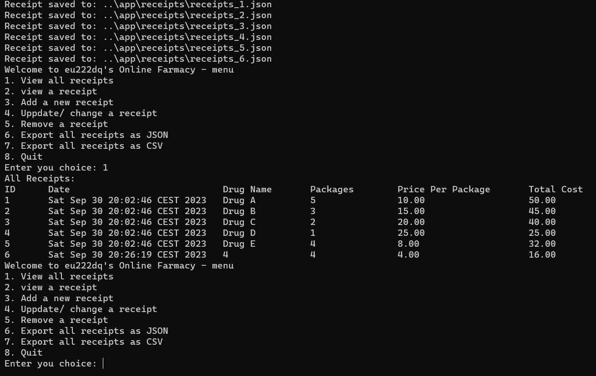

# 1dt905

## Lab raport

### Emil Ulvagården

#### <eu222dq@student.lnu.se>

## Table of content

- [Introduction] (#Introduction)
- [Lab1](#lab1)
- [Lab2](#lab2)
- [Lab3](#lab3)
- [Lab4](#lab4)
- [lab5](#lab5)

## Introduction

Denna readme består av information om de fem olika labbar jag blivit tilldelad av min lärare i kursen Objektorienterad programmering. Labbarnas fokus ligger i att bli bekväm med programmerings språket java. De olika labbarna är lab1, lab2, lab3, lab4 och lab5 som alla ligger i samma repository som readme filen.

Koden ligger i följande gitlab [länk](https://gitlab.lnu.se/1dt905/student/eu222dq/a01-labs)

Programmet i lab5 är gjorda för windows. Gäller hur filer hanteras.

I de uppgifter som gradle används i behöver build.gradle modifieras med följande kod.

```java
run {
    standardInput = System.in
}
```

I lab 3 behöver build.gradle filen modiferas med följande kod för att kunna skriva ut formerna i json-format.

```java
dependencies {
    // https://mvnrepository.com/artifact/com.google.code.gson/gson
    implementation 'com.google.code.gson:gson:2.9.1'
}
```

I lab 4 används JUnit5 testning för koden och då behöver build.gradle modifieras med följande kod.

```java

plugins {
    id 'jacoco'
}

dependencies {
    // https://mvnrepository.com/artifact/com.google.code.gson/gson
    implementation 'com.google.code.gson:gson:2.9.1'
}

test {
    useJUnitPlatform()

    // report is always generated after tests run
    finalizedBy jacocoTestReport

}

testing {
    suites {
        // Configure the built-in test suite
        test {
            // Use JUnit Jupiter test framework
            useJUnitJupiter('5.9.3')
        }
    }
}


jacocoTestReport {
    // tests are required to run before generating the report
    dependsOn test
}
```

### lab1

Task 1: Skapa ett meny drivet program där användaren kan välja bland tre olika alternativ.
Dessa är:
1: Slumpa tal mellan 1 - 100 där användaren väljer antalet tal som slumpas.
2: Summera tal som användaren ger programet.
3: Avslutar programet.

Task 2: Skapa en class där information om en person sparas. Utveckla menyn från task 1 genom att lägga till två extra val. Dessa val är:
p1: Fråga om information om personen av användaren.
p2: Visa personen/personenrnas information.

Task 3 (Valfri): Skapa en gissnings lek, där datorn sitter på ett nummer och användaren ska gissa vilket nummer det är.

#### Frågor att besvara till lab1

Beskriv din tanke process när du skapade och testade koden för lab1.

- Tankarna gick kring hur koden skulle struktureras upp samt vad som skulle kunna behövas för att programmet ska fungera. Under testningen blev det med att försöka köra koden, gick det inte så var det att hitta felet.

Var UML diagramen hjälpsamma eller hindrade de dig från att lösa lab1?

- UML diagrammet fick en att tänka lite kring hur man ska ha det strukturerat i sin kod och vad som skulle vara med. Så det hjälpte processen lite kring hur java ska vara uppbyggt.

Beskriv några svårigheter med att lära sig ett nytt språk och skriva ens första program. Vilka problem framkommer?

- De största svårigheterna kring att lära sig ett nytt språk är stukturen och alla metoder som behöver användas för att koden ska fungera.

Gjorde du den valfria delen, isånnafall hur löste du den?

- Jag gjorde den valfria delen. Jag löste den genom att skapa ett random nummer mellan 1-100 och sen be användaren om en gissning. Är gissningen cheat får användaren nummret. Är gissningen restart bildas ett nytt random nummer. Gissar användaren på ett nummer får den reda på om nummret är större, mindre eller rätt. Om antalet gissningar blir 6 förlorar användaren automatiskt.

När programmet körs ser det ut enligt följande bild:



Vad är din idag lärde jag mig?

- Idag lärde jag mig det absolut grundligaste i java så som varför klasser används sammt hur man använder dem.

### lab2

Task 1: Förstora person klassen in i tre andra klasser där en meny ber användaren om information kring de olika personerna.

Task 2: Expandera menyn till att innehålla ett team där de olika klasserna kan läggas till och tas bort ifrån. Teamet kan även skrivas ut.

Task 3(Valfri): Skapa klasser för att hantera en kortlek. Skapa leken i ordning och blanda, visa de första och sista kortet i leken, ta bort ett kort. Ge ut en pokerhand på 5 kort och ta bort korten från leken. Summera värdena från två kort.

#### Frågor att besvara till lab2

Utveckla om Java Collection Framework och beskriv class diagram av olika collections. Varför är det uppdelat i interface, abstarct klass och klass?

- Java är uppdelat i olika collections för kunna manipulera flera eller objekt vid samma tillfälle eller välja ett objekt att manipulera. Interface representerar olika typer av samlingar så som set och list. Abstracta klasser är delvis implementerade delar av samlingen som tillåter anpassade implementationer. Klasser Tillåter anpassade ändringar och implementationer av abstrakta klasser.

Beskriv den extra Person klassen som lades till. varför är den en extend och hur är den anorlunda.

- Den extra person klassen som lades till extendar superman för att kunna komma åt supermans kraft samt ha sin egna kraft. Det som är annorlunad är kraften som den extra person klassen besitter och att den overrider en toString med en kraft i sig med sin egna kraft så den får två krafter.

Klasserna ärver från varandra enligt följande bild:



Hur nöjd är du med koden och dina lösningar. ser du några förbättringar?

- Jag är nöjd med koden även om den nu i efterhand skulle kunna göras snyggare och mer uppdelad.

Gjorde du den valfria delen, isåfall hur löste du den?

- Jag gjorde den valfria delen och löste det genom att skapa tre olika klasser. Den första klassen "CardDeckApp" används för att visa alla kort och att det som uppgiften frågar efter sker. Klass två är "Card" som håller koll på vilket kort den är samt dess värde. Besitter även funktioner för att få ut information om kortet som implementeras av de andra klasserna. Sista klassen är "Deck" som Skapar en lista med alla kort i och räknar ut kortens värden. Denna klass har hand om att blanda, dela ut flera men även ett kort. Klassen kan ge ut det första och sista kortet ur leken. Delar även ut en pokerhand på fem kort. Summerar två korts värden samt att klassen tar fram storleken på kortleken.

När programmet körs kan anvädaren interagera med programmet som i bilden nedan:



Vad är din idag lärde jag mig?

- Dela upp kod i olika filer med java och implementera klasser från paket för att lösa min uppgift.

### lab3

Task 1: Installera gradle strukturen för koden.

Task 2: Skapa ett meny drivet program där olika former kan hanteras i ett koordinatsystem. Menyn har följande prompts:

1. Select a shape and create it with a position and size
2. Insert a random shape with a random position and size
3. Move a shape (if it supports it)
4. Remove a shape
5. Print all shapes with its type, position and size
6. Print all details on all shapes, including the area and circumference
7. Print all details on the shapes in a JSON format
q. Quit

Task 3(Valfri): Med kod från task 3 lab2 skapa ett kortspel där användaren tävlar mot datorn i antingen black jack eller 21.

#### Frågor att besvara till lab3

Vilken av shape eller robot löste du och varför.

- Jag löste shape var för att jag kände att de skulle vara en roligare uppgift att lösa.

Beskriv din tanke process när du löste strukturen för applicationen, fanns det några utmaningar?

- Börja med att skapa en meny för att sedan ta reda på vad kan behövas ha med och implementera de olika klasserna efter hand där de behövs.

De olika klasserna ärver från varandra enligt följande UML-diagram:



Är du nöjd med din kod eller ser du områden för förbättring?

- Är i stora hela nöjd med koden men det finns områden där den kan förbättras eller renskrivas.

Hur var svårighets nivån på laborationen. Vad var det svåraste och varför?

- Svårighets graden på laborationen var bra för detta stadiet, Det svåraste var att se till så att allt höll ihop och så att koden inte tappade någon figur på vägen.

Gjorde du den valfria delen, isåfall hur löste du den?

- Har ej gjort extra uppgiften.

Vad är din idag lärde jag mig?

- Hur man kan få många klasser att sammarbeta så att de inte ersätter varandra samt hur olika klasser kan kopplas samman i ett större program.

### lab4

Task 1: Se till att kunna köra ./gradlew test samt få fram en rapport kring testets resultat.

Task 2: Skapa en miniräknare som arbetar med ekvationen från vänster till höger, Skapa sedan JUnit5 test för miniräknaren.

Task 3: Ta koden från lab3 och skapa Junit5 testning för koden.

Task 4(Valfri): Valfri: 95% godkänd miniräknare, 90% godkänd kod för lab3.

#### Frågor att besvara till lab4

Vad är dina tankar kring enhetstestning, kommer det hjälpa dig bli en bättre programmerare?

- Jag tycker att enhetstestning är hjälpsamt då man kan se hur koden arbetar tillsammans med andra delar och vad programmet kommer åt. Det kan defenitivt göra mig till en bättre programmerare.

Vad tycker du om test driven utveckling, verkar det användbart?

- Test driven utveckling är bra och jag tycker att det är användbart även om det är lite jobbigt att får testningen att fungera som man tänkt.

Hur nöjd är du med din application och dina testfall, ser du något område där koden kan bli mer testbar?

- Jag är nöjd med min application och mina testfall. Koden kan bli mer testbar i menu där det för tillfället endast går att köra kod testning med en input av "q\n". Annan input ger felmedelanden i "menu.menuLoop()" som jag inte lyckats lösa genomm att föröska skriva om koden.

Gjorde du den valfria delen, isåfall hur löste du den?

-Jag har gjort delar av den valfria. Jag löste 90% på shape genom att gå testa de olika klasserna en i taget och försöka få så hög procent som möjligt på varje innan jag gick vidare till nästa. Har fått 60% på menu klassen som enligt de tester jag gjort endast kan ta en input vilket skulle vara inputen för quit. Detta är orimligt för om den enda inputen som skulle vara accepterad var för quit skulle programmet inte kunna köras. Därav räknar jag bort menu klassen från de klasserna som behövde uppnå 90% för den valfria delen. Har fått 94% på miniräknaren. När testet körs kallar testet de raderna som inte testas men ett resultat kan inte bildas. Därav kan jag inte får mer än 94% på miniräknaren.

Miniräknaren kan se ut genom följande bild när den körs:



Miniräknarens testresultat ser ut enligt följande bild:



Shapes testresultat ser ut enligt följande bild:



Vad är din idag lärde jag mig?

- Hur man testar kod och varför det används.

### lab5

Task 1: Skapa gradle strukturen för koden.

Task 2: Skapa ett meny drivet program där olika läkemedelsrecept sparas i csv samt json format. Menyn har följande prompts:

1. View all receipts
2. view a receipt
3. Add a new receipt
4. Uppdate/ change a receipt
5. Remove a receipt
6. Export all receipts as JSON
7. Export all receipts as CSV
8. Quit

Task 3 (Valfri): Junit testa koden och få över 50%.

Task 4 (Valfri): Använd sonarCube och analysera koden.

#### Frågor att besvara till lab5

Vad lärde du dig med att arbeta med filer och streams i java?

- Jag har lärt mig hantera inläsning från json filer samt hur man skapar nya filer och expoterar data till dem.

Menyn ser ut enligt följande bild när programmet körs och användaren vill se vilka recept som finns tillgängliga



Hur nöjd är du med applicationen, ser du några förbättringar?

- Jag är nöjd med applicationen även om det finns förbättringar så som att läsa in datan från csv filen istället för endast json.

Gjorde du den valfria delen, isåfall hur löste du den?

- Nej, jag gjorde inte den valfria delen.

Vad är din idag lärde jag mig?

- Jag lärde mig hantera inläsning av json filer samt exportering av data till json och csv filer.

## Grading

lab1: 5 + 5 + 2 = 12        (points)

lab2: 5 + 5 + 2 = 12        (points)

lab3: 1 + 9 = 10            (points)

lab4: 5 + 5 + 2 = 12        (points)

lab5: 1 + 9 = 10            (points)

sum = 12 + 12 + 10 + 12 + 10 = 56 D/C

## Summary

Jag har lärt mig att hantera java som ett programmeringsspråk på en grundlig nivå för att skapa simplare applicationer. Därbland hantering av konstuktorer samt klasser. Klasser hade jag en förkunskap på sedan en tidigare kurs i Python men under laborationernas gång har jag fått en större förståelse kring hur klasser konstrueras och används. Jag har även lärt mig hur man hanterar import från scv och json filer. Därbland hur man hanterar en konfigurationsfil för att sedan kunna förflytta sig i filsystemet för att placera filer där de ska vara.

Vad tycker du om java som programmeringsspråk?

- Jag tycker att java är ett roligt språk att använda även om det ibland är lite komplicerat.

Jämför java med andra språk du känner till.

- Java i det stora hela är fungerar på liknande sätt som python även om det är stora skillnader i vad man behöver skriva för att något ska ske. Som till exemple när man ska printa något i konsollen så är det bara att skriva print("") i python men i java måste man skriva System.out.print("").

Vad är din övergrippande idag lärde jag mig medan du arbetade med uppgiften?

- Man kan säga att jag lärt mig grunderna för hur java fungerar och hur man skriver kod både för att lösa specifika uppgifter men även testning av koden.
