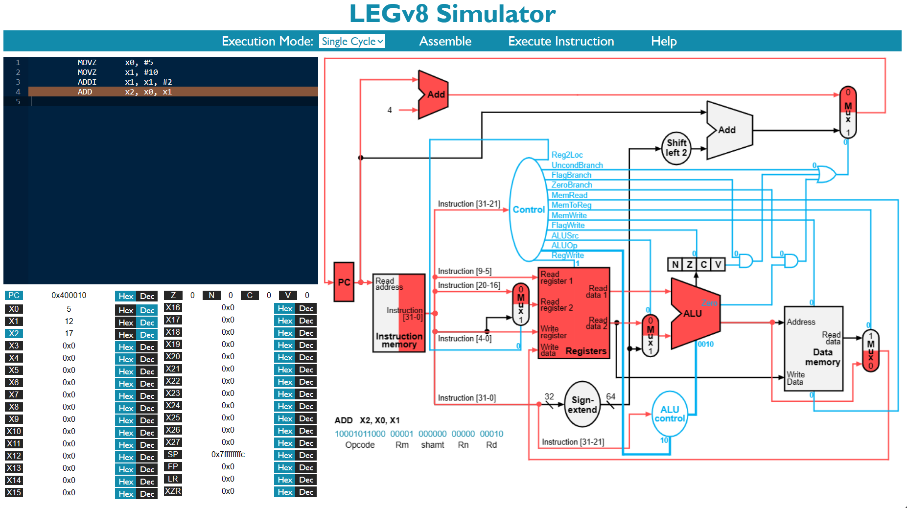

# Lab 1

## Emil Ulvagården

### Tasks

#### Task 1

```assembly

MOVZ x0, #5
MOVZ x1, #10
ADDI x1, x1, #2
ADD x2, x0, x1

```

The stored value in x2 is 17



#### Task 2

``` assambly

11010010100000000001000000000010
11010010100 0000000010000000 00010
MOVZ x2, #128 or MOVZ x2, #0x0080

11010010100000000001110011100100 
11010010100 0000000011100111 00100
MOVZ x4, #231 or MOVZ x4, #0x00E7

11001011000000100000000010000101
11001011000 00010 000000 00100 00101
SUB x5, x4, x2

D360 0CA5
11010011011000000000110010100101
11010011011 00000 000011 00101 00101
LSL x5, x5, #3

```

#### Task 3

4 * 5 + 16 * 11 + 25 = 221

```assembly

MOVZ x1, #4
MOVZ x2, #5
MOVZ x3, #16
MOVZ x4, #11
MOVZ x5, #25

loop1: ADD x6, x6, x2
SUBI x1, x1, #1
CBNZ x1, loop1

loop2: ADD x7, x7, x3
SUBI x4, x4, #1
CBNZ x4, loop2

ADD x0, x5, x6

ADD x0, x0, x7

```

#### Task 4

1 893 423 + 443 924 = 2 337 347

0x1CE42F + 0x6C614 = 0x23AA43

```assembly

movz x0, #0x1c, lsl #16
movk x0, #0xe42f

MOVZ x1, #0x6, LSL #16
MOVK x1, #0xc614

ADD x2, x0, x1

```

#### Task 5

```assembly

MOVZ x1, #0
MOVZ x2, #1
MOVZ x3, #99

loop:
ADD x1, x1, x2

CMP x2, x3
B.EQ end
ADDI x2, x2, #2
B loop
end:

```

#### Task 6

```assembly

MOVZ x7, #0x1000, LSL #16

MOVZ x1, #15
STUR x1, [x7, #0]
MOVZ x1, #25
STUR x1, [x7, #8]

LDUR x1, [x7, #0]
LDUR x2, [x7, #8]

```

##### Part 1

- MOVZ: PC, Instrction memory, Instruction Control, Registers, ALU, ALU Control, Pad.

- STUR: PC, Instruction memory, Instruction Control, Registers, ALU, ALU control, Signextend, Data memory.

- LDUR: PC, Instruction memory, Instruction Control, Registers, ALU, ALU control, Signextend, Data memory.

##### Part 2

The PC or Process counter is a pointer that keeps track of the next instruction. The instruction memort has the code instructions stored. The Registers is a smaller temporary memory where the data can be stored quickly. The Alu or the arithmetic logic unit gets data from the registers or the data memory and preforms arithmetic or logical operations on the data. The Data memory is where the information from the registers could be stored with a larger size but its slower to access.

#### Task 7

```assembly

MOVZ x7, #0x1000, LSL #16
MOVZ x6, #0
MOVZ x5, #40

MOVZ x1, #1
STUR x1, [x7, #0]
MOVZ x1, #4
STUR x1, [x7, #8]
MOVZ x1, #1
STUR x1, [x7, #16]
MOVZ x1, #5
STUR x1, [x7, #24]
MOVZ x1, #9
STUR x1, [x7, #32]
MOVZ x1, #2
STUR x1, [x7, #40]

loop:
LDUR x2, [x7]
ADD x0, x0, x2
CMP x6, x5
B.EQ end
ADDI x7, x7, #8
ADDI x6, x6, #8
B loop
end:

```

Gives 22 as the stored x0 value
