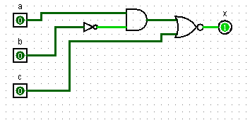
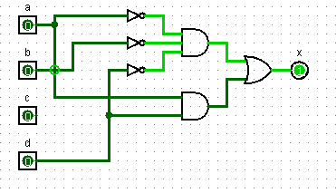
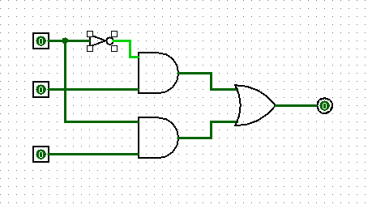
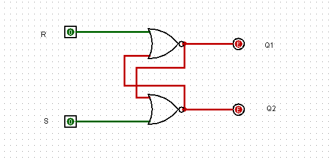

# Lab 1

## Emil Ulvagården

### Tasks

#### Task 1

a.

|a|b|c|x|
|-|-|-|-|
|0|0|0|1|
|0|0|1|1|
|0|1|0|1|
|0|1|1|1|
|1|0|0|1|
|1|0|1|0|
|1|1|0|0|
|1|1|1|0|

b.

```

~(a(b+c))

```

c.

#### Task 2

a.

|a|b|c|x|
|-|-|-|-|
|0|0|0|1|
|0|0|1|0|
|0|1|0|1|
|0|1|1|0|
|1|0|0|0|
|1|0|1|0|
|1|1|0|1|
|1|1|1|0|

b.



#### Task 3

a.

```

(~a)(~b) + ac

```

b.

|a\bc|00  |01  |11  |10  |
|----|----|----|----|----|
|0   |1   |1   |0   |0   |
|1   |0   |1   |1   |0   |
#### Tast 4

a.

|ab\cd|00  |01  |11  |10  |
|-----|----|----|----|----|
|00   |1   |0   |0   |1   |
|01   |0   |0   |0   |0   |
|11   |0   |1   |1   |0   |
|10   |0   |1   |1   |0   |

b.

```

(~a)(~b)(~d) + ad

```

c.



#### Task 5

a.

b.

|A|B|C|X|
|-|-|-|-|
|0|0|0|0|
|0|0|1|0|
|0|1|0|1|
|0|1|1|1|
|1|0|0|0|
|1|0|1|1|
|1|1|0|0|
|1|1|1|1|

c.



d.

#### Task 6

a.

|A1|A0|B1|B0|Cin|S1|S0|Cout|
|--|--|--|--|---|--|--|----|
| 0| 0| 0| 0|  0| 0| 0| 0  |
| 0| 0| 0| 1|  0| 0| 1| 0  |
| 0| 0| 1| 0|  0| 0| 1| 0  |
| 0| 0| 1| 1|  0| 1| 0| 0  |
| 0| 1| 0| 0|  0| 0| 1| 0  |
| 0| 1| 0| 1|  0| 1| 0| 0  |
| 0| 1| 1| 0|  0| 1| 1| 0  |
| 0| 1| 1| 1|  0| 1| 0| 1  |
| 1| 0| 0| 0|  0| 0| 1| 0  |
| 1| 0| 0| 1|  0| 1| 0| 0  |
| 1| 0| 1| 0|  0| 1| 1| 0  |
| 1| 0| 1| 1|  0| 1| 0| 1  |
| 1| 1| 0| 0|  0| 1| 0| 0  |
| 1| 1| 0| 1|  0| 1| 1| 0  |
| 1| 1| 1| 0|  0| 1| 0| 1  |
| 1| 1| 1| 1|  0| 1| 1| 1  |

b.

c.

#### Task 7



a.

b.

c.

d.
