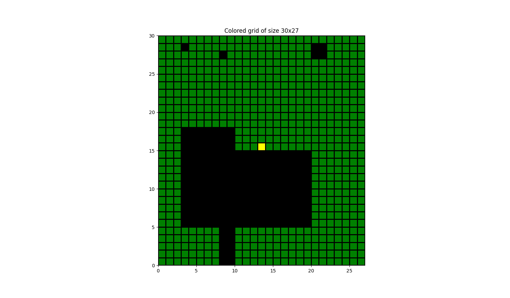
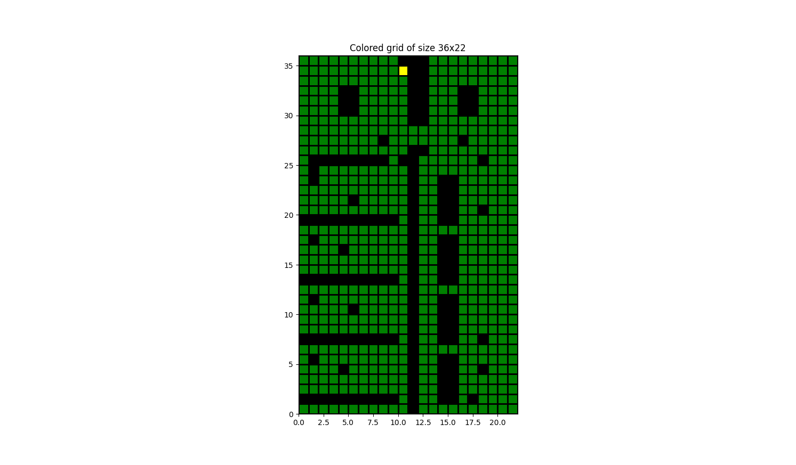
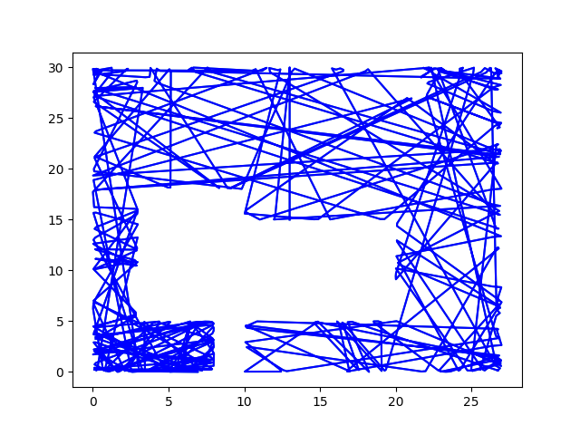
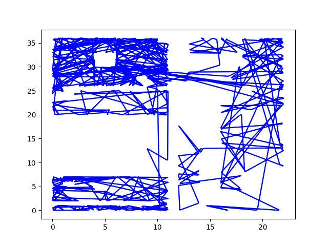
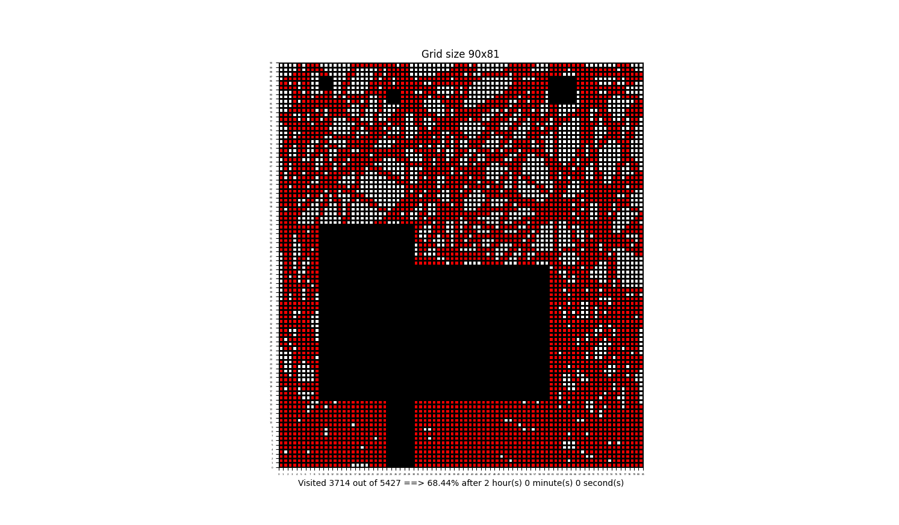
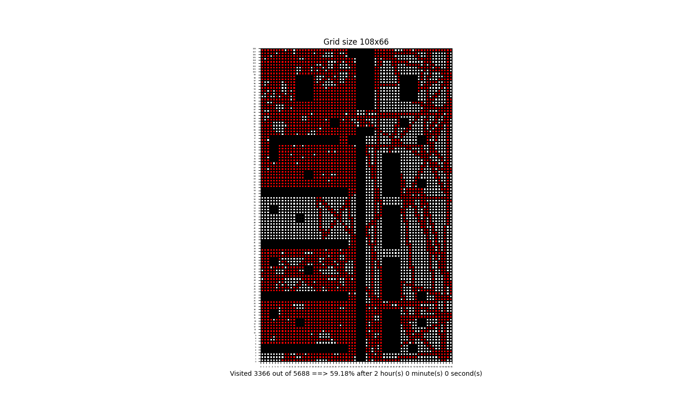
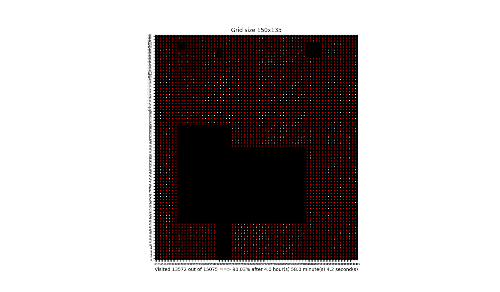
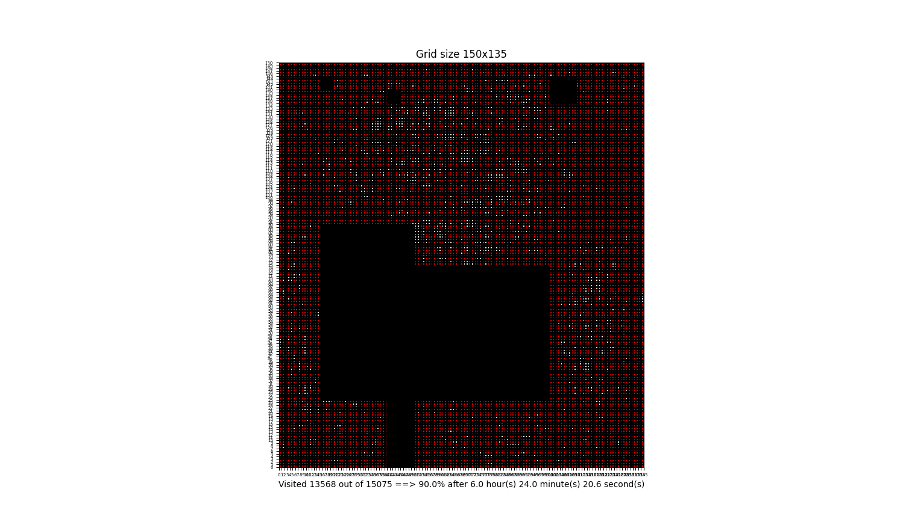

# Robotic Lawnmower Project Report 
Members: Jakob Nyström and William Schröder\
Program: Master of Science in Engineering:
Software Engineering  
Course: 1DT901  
Date of submission: 2023-11-02

### Introduction
In the course 1DT901 an assignment to simulate a lawn mower was given. The lawnmower drives over a lawn to simulate cutting grass. It runs until it hits a wall, where it simulates a new angle to drive until it hits the next wall. A trace of the lawnmowers positions is created to visualize the path it took aswell as a visualization of the current lawn. In this report the functions used to run the lawn mower, aswell as improvements made and problems encountered will be discussed.
### 1. Ground maps

In this project, ground maps were used. These ground maps describe where grass, obstacles and the start point are. A visualized ground map which was given with the project is shown below.


*Pixel map of small*

In this project an own ground map called my_map was created. The scenario which my_map is based of is a festival were all the obstacles are either tent, trees or food shops. 

*Pixel map of my_map*

### 2. Coordinate map
We computed the coordinate map by first reading the data from the csv-file, then we created N lists in a bigger array using the code below.
```python
with open(file, "r") as file:
    lines = file.readlines()

data = []
for i in range(len(lines[0].strip().split(","))):
    data.append(list())
```
Each individual list will be given values between 0 - 2 depending on if the current element is: L(0), S(1) or O(2). The reason for this is that integers computes faster than strings does. In the coordinate map, each list corresponds to a column in the csv-file (value of x), while each element in the list corresponds to a row in the csv-file (value of y).

To help determine whether the lawnmower's position is outside the map, a list of all the boundaries was created. 
```python
for i in range(len(lst) + 2):
        boundaries.append([i-1, -1])
        boundaries.append([i-1, len(lst[0])])
    for i in range(len(lst[0]) + 2):
        boundaries.append([len(lst), i-1])
        boundaries.append([-1, i-1])
    for lists in range(len(lst)):
        for elements in range(len(lst[0])):
            if (lst[lists][elements] == 2):
                boundaries.append([lists, elements])
    return boundaries
```

To check if the lawnmower should turn, the program checks whether it's position is in the boundary list.

```python
if [int(cordinate[0]), int(cordinate[1])] in boundaries:
```


### 3. Trace map

In this project, a trace of the lawn mower was required. This trace should visualize the path of the lawn mower. 
When this was first implemented it used every position the lawn mower had visited. This however, was deemed unnecessary, which lead to the algorithm being changed to only draw the trace between turning points of the lawn mower. This provides the same information and is faster.

To determine these turning points, a function was used which drove the lawnmower until it hit a wall, where it took a step back. After this, the current position is stored in a list. Another function is then called which chooses a new angle for the lawn mower to drive. This loops until the desired time has gone.



*Image: small trace map.*



*Image my_map trace map.*

Pictures above shows the trace on two different maps after 2 hours.


### 4. Coverage map
The coverage for small.csv was 68.44%, while the coverage for my_map.csv were 59.18% both. Both of the maps were ran for the same amount of time, which was two hours.


*Image: coverage map of small*


*Image: Coverage map of my_map*

From the tests that have been done N (upscale multiplier) affects the coverage greatly. The higher N is, the lower the coverage becomes. This is due to that there are more squares to cover when the lawn gets scaled up higher. In real life this corresponds to the lawnmower's width getting lower which would make it cut less grass. 
∆t also affects the results, but not as much as N. Lower ∆t makes the lawnmower more precise since it takes more but shorter steps. This leads to the lawnmower counting more grass squares, since it otherwise sometimes would drive past one square before changing it's value to cut.


A reasonable workload for the lawnmower per day would be around 3 hours. This would maintain a nicely cut lawn.


### 5. Multiple simulations
The base algorithm ran for 2 hours for 10 runs on both of the maps below is the result of those 10 runs. 

| Base algorithm | small.csv | my_map |
|:----------:|:-------------:|:------------------:|
| Standard deviation | 2.93 | 6.30 |
| Average percentage | 58.59% | 45.70% |

*Ten runs of base algorithm calculating the coverage on small.csv and my_map.csv*

Running the base algorithm 10 times for 90% coverage on both maps the result is as follows:

| Coverage 90% | small.csv | my_map |
|:----------:|:-----------:|:------:|
| Standard deviation | 741.08 | 10226.4 | 
| Average time taken | 18684.95 seconds | 31949.45 seconds |

*Ten runs of base algorithm calculating the time on small.csv and my_map.csv*

We computed the required lawnmower time by the following code for base algorithm:
```python
actual_time += delta_t/multiplier
```
By dividing ∆t by multiplier than adding it actual_time together the result is the time gone by. Doing this for the whole program the end result is the computed time.


### 6. Improved simulation


In this project an improved algorithm was created. The standard algorithm turned using randomly generated angles, which seemed unreliable and inconsistent. This was the reason a better algorithm was created. The improved algorithm chose an angle using the following three steps: Firstly it created a list of every square of grass not cut, ordered by distance from the lawnmower. 
```python
for lists in range(len(lst)):
        for elements in range(len(lst[0])):
            if lst[lists][elements] == 0:
                cordinate2 = [int(cordinate[0]), int(cordinate[1])]
                new_distance = ((cordinate2[0] - lists)* (cordinate2[0] - lists)) + ((cordinate2[1] - elements)* (cordinate2[1] - elements))
                if distance is None:
                    distance = float(new_distance)
                if (new_distance <= distance):
                    distance = float(new_distance)
                    pos_list.insert(0, [lists, elements])
                else:
                    pos_list.append([lists, elements])
```

Secondly it checked whether a square was possible to reach without running into a wall, starting with the closest square.
```python
while not found_direction:
    new_pos = calculate_new_position(new_pos, new_angle, direction)
    if [int(new_pos[0]), int(new_pos[1])] in boundaries:
        times_tried += 1
        break
    if lst[int(new_pos[0])][int(new_pos[1])] == 0:
        return new_angle, direction
```        

Lastly, if no square of grass was possible to reach without hitting a wall, it then randomly generated an angle.
```python
if times_tried == len(pos_list):
            new_angle = random.uniform(0, 2*math.pi)
            return new_angle, direction
```

This lead to the lawn mower being much more consistent and cutting more grass. 

Below are some examples of different runs of both the algorithms, all of the data have been simulated for 10 times each.

| small.csv | Base algorithm | Improved algorithm |
|:----------:|:-------------:|:------------------:|
| Standard deviation | 2.93 | 1.18 |
| Average percentage | 58.59% | 63.36% |

*Ten runs of both algorithms calculating the coverage on small.csv*

| my_map.csv | Base algorithm | Improved algorithm |
|:----------:|:-------------:|:------------------:|
| Standard deviation | 6.30 | 1.73 |
| Average percentage | 45.70% | 54.75% |

*Ten runs of both algorithms calculating the coverage on my_map.csv*

| my_map.csv | Base algorithm | Improved algorithm |
|:----------:|:--------------:|:------------------:|
| Standard deviation | 1510.19 | 1998.12 |
| Average elapsed time | 25926.1 seconds | 22523.0 seconds |

*Ten runs calculating the time needed to cover 95% of the grass squares on my_map.csv*


| tricky25x25.csv | Base algorithm | Improved algorithm |
|:---------------:|:---------------:|:-------------------:|
| Standard deviation | 9915.2 | 1891.3 |
| Average time | 40078.24 seconds | 25421.26 seconds |

*Ten runs calculating the time needed to cover 95% of the grass squares on tricky25x25.csv*

Coverage maps of both algorithms cutting 90% of small.csv can be seen below.


*Coverage of small.csv with A_algorithm*


*Coverage of small.csv with base_algorithm*

As seen in the picture, the A_algorithm cut 90% of the grass about 1.5 hours faster.


### Simulated Line

During this project, it was noticed that the time the program took to generate each step was high. To fix this problem, a new function was made. This function simulated a line from the lawn mower's position until the wall it would hit next.
```python
while not boundary:
        length += speed
        line = [current_pos[0] + math.cos(angle)*direction[0] * length,
                current_pos[1] + math.sin(angle)*direction[1] * length]
        pos_list.append([math.floor(line[0]), math.floor(line[1])])
        if ([math.floor(line[0]), math.floor(line[1])] in boundaries):
            boundary = True
        time += 1
``` 

It then counted all the squares of grass under the line as cut, and calculated the time it would have taken to drive normally. This greatly reduced the time needed to run the program. 

### Simple Trace

The project instructions required a trace representing the positions the lawn mower had visited. Since the lawn mower was usually instructed to drive for two hours, a lot of positions were sent to the trace function. This seemed unnecessary since the lawn mower drives in straight lines anyway, which was why a change felt needed. Using the line which was simulated mentioned above, it was possible to only add the last position of this line to the trace. The output was the same, but made more efficient and simple.

### Get Back?

When given this project, one problem stood out: How was the lawn mower going to get back to it's charging station? For this reason, another function was created. This function uses the positions of the trace mentioned above. Using these positions, it was possible to calculate the earliest position of the lawn mower accessible without hitting a wall. 
```python
new_pos = calculate_new_position(new_pos, new_angle, direction)
    if [int(new_pos[0]), int(new_pos[1])] in boundaries:
        times_tried += 1
        break
    if [int(new_pos[0]), int(new_pos[1])] == start_cordinate:
        trace_list.append(start_cordinate)
        break_other = True
        distance = (cordinate[0] - start_cordinate[0])**2
        + (cordinate[1] - start_cordinate[1])**2
        time_gone += ((math.sqrt(distance))/multiplier)/0.3
```

The lawn mower drives to this position, and then runs the same function, until it reaches the first position, the charging station.
```python
if (times_tried == 0):
    print("Time to get back:", time_gone)
    print("Trace list here: ", trace_list)
    break
else:
    get_back(start_cordinate, boundaries, time_gone,
                movement_history, multiplier)
    break
```

The trace map below shows how the lawn mower goes back to start from the last position it cut. The stretched red line shows the that it takes to go back to start.


*Trace map showing get back function*

## Project conclusions and lessons learned
### Technical issues
The main technical issues were the improved algorithm and the conversion from a NxN matrix to the original size of the ground map. The improved algorithm came with multiple issues due to its complexity compared to the rest of the program. The complexity made troubleshooting a lot more difficult. The troubles of converting from the original matrix to the NxN matrix was the downscaling which came with plotting the maps in different sizes.

## Project issues
We split the project into two main parts which were: The lawn mower algorithm itself and the other part was the visualization of the lawn mowers path and both ground maps. But as issues arose we helped each other on these issues.

Most of the project issues happened early in the project due to merge collisions. The merge collisions happened when both members worked in the same program. This was fixed by creating one folder each with duplicates of the files. 

The communication between us two was about daily other then some weekends which we communicated if a bigger issue had been found.

### Individual team member

#### Jakob Nyström
##### Main contributor
- Bouncing mechanism
- Get back
- Simulate Line
- Boundary simulation
- Main function

##### Co-contributor
- Report
- Reading data

#### William Schröder
##### Main contributor
- Visualization
- Reading data
- Multiple simulations

##### Co-contributor
- Boundary simulation
- Get back
- Main function
- Report

If we were do the same project again, we would have done more work together and used a more strict planning. This is due to that often one of us wrote some code that was not optimized for the other code. Example of this would be on the coverage map, were we calculated the percentages differently. We would also start with one folder.
