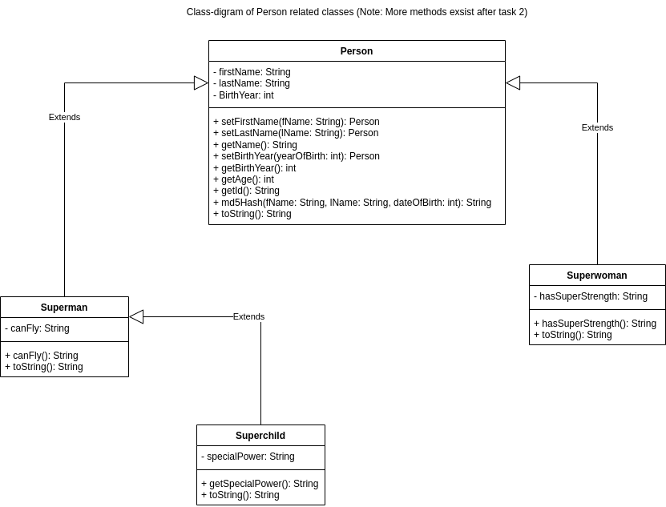
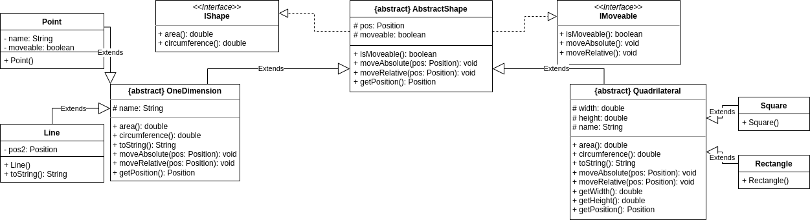

# 1DT905

## Lab report

### Samuel Berg

#### <sb224sc@student.lnu.se>

## Table of content

- [Introduction](#introduction)
- [Lab 1](#lab-1)
- [Lab 2](#lab-2)
- [Lab 3](#lab-3)
- [Lab 4](#lab-4)
- [Lab 5](#lab-5)
- [Grading](#grading)
- [Summary](#summary)

## Introduction

The five labs in this report cover the fundamentals of Java programming, including objects, file structure, inheritance, and the collection framework. They also explore the use of Gradle, interfaces and implements versus extends in modern software development. Unit testing is introduced using JaCoCo and JUnit Jupiter, while abstract classes are introduced for a more structured class hierarchy. The final lab, CRUD Operations, static code analysis, and software metrics, focuses on evaluating the quality and maintainability of the codebase. The report reflects the experiences, challenges, and insights gained from each lab, highlighting the growth of Java developers. Here is the [link to the gitlab repository](https://gitlab.lnu.se/1dt905/student/sb224sc/a01-labs/-/tree/master).

## Lab 1

- Describe your thought process while developing and testing the code for the tasks.

My thought process while programming/solving any type of theoretical problem is always to solve the inherent problem first and then adjust and improve. This is how I always approach these types of problems. This was done in this lab by making the functions for the different menu options and making sure they worked. After that, I made the menu and connected each option to its corresponding function.

- Did you find the UML class diagrams helpful or restricting when solving the tasks?

The provided UML diagram was a nice touch in the sense that for someone not knowing what/how to do it but for someone like me who has a decent bit of experience they were more of a nuisance. This is due to it making me feel like I was restricted in what was allowed to do compared to how I would like to do it.

- Elaborate on some of the difficulties learning a new language and writing the first programs. What were the challenges coding the tasks while learning Java at the same time?

I have programmed in Java before so it is not really that new to me, though I did need a bit of a refresher on how things like to be structured and work in Java due to not having worked in it for quite some time. For me, it was very easy to get back up to speed and remember how everything worked due to my experience.

- Did you do the optional part, if so, elaborate on how you solved it.

I did the optional task, how I solved it was to first solve the problem in a single file and afterwards split it up into appropriate classes, methods and interfaces. Here is a picture of the optional tasks game running.


*Image: Picture of the optional task running and completing the game.*

- What is your TIL? (TIL is an acronym for "Today I Learned")

I got a bit of a refresher on Java programming and structure.

## Lab 2

- Elaborate on the Java Collection Framework and describe and explain the class diagram of the different collections. Why is it divided into interface, abstract class and class?

The Java Collection Framework is organized around interfaces that define contracts, abstract classes that provide common functionality and concrete classes that provide full implementations. This enables code reuse and allows us to work with collections consistently.

- Describe the additional Person class you added. What does it extend and how does it differ from the existing classes?

The `Person` class is a basic representation of a person that comprises basic information such as first and last name and birth year. It holds methods for "setting" and "getting" these parameters, as well as determining the individual's age and generating an MD5 hash of their data. This is a stand-alone class that is used to model individual persons or types of people. Task 1 required us to make a UML diagram for the `Person` class and the classes that extended it.


*Image: This image is the UML diagram representing the person class and relations to Superman, Superwoman and Superchild for task 1.*

- How satisfied are you with the code and your solution, do you see any improvement areas?

I am satisfied with the code I wrote, simple improvements one could have made are adding an interface and figuring out a way to a `memberCreation()` method for all the different types of people. Doing so would make it so that the same code didn't have to be repeated several times in different files and a lot cleaner code in general as well as function calls.

- Did you do the optional part, if so, elaborate on how you solved it.

I did the optional task in lab 2 as well. My solution is a pretty straightforward one I would say I made the "main" program file "Game.java" with its classes in a folder "game" with the path "./com/sb224sc/game/" in that folder the classes "Card.java" and "Deck.java" where placed. If we start with the smaller of the two classes we have the "Card.java" one which inherently just creates, holds and gets information about each card that is placed in the upcoming deck.
In "Deck.java" I have methods for generating a deck of cards in the order "Spades-Hearts-Clubs-Diamonds", shuffling, printing top and bottom cards, drawing a card, dealing a poker hand depending on the foretold amount of cards and one for drawing two cards and returning the sum of them. Here is a picture of how it would look after creating a deck, shuffling it and dealing a 5-card poker hand.


*Image: Picture of the code of the optional task running.*

- What is your TIL?

Got a bit of a refresher on what OOP can be used/useful for, and how OOP works in Java.

## Lab 3

- Which task did you solve, shape or robot, and why?

I solved the shape task but also have a half-done version of the robot due to starting out doing the robot program only to get stuck at the fact that Gradle did not let me give input via the terminal. This made me switch and start over on the shapes task where I got nearly to the finish before trying to give the program any input but got stuck with the same problem again. The solution for this was to add the following code snippet in the `build.gradle` file.

```java
run {
    standardInput = System.in
}
```

Which was given to me by our TA.

- Describe your thought process while solving the structure of the application, was any part extra challenging?

For the shapes task, I started by creating two interfaces one for a general shape and one for the shapes I decided to be movable in the application. After doing so I created three abstract classes, one general one for any type of dimensional shape and then one each for one-dimensional shapes and quadrilateral shapes. After this I created the different shapes I wanted to have in my application, these shapes were point, line, rectangle and square. When having done so I just started working down the list of the different menu options from top to bottom. However in this case I got the menu done early on due to wanting to be able to test each option before progressing further down the menu options.


*Image: This image is the UML diagram representing the relations in task 2.1.*

- Are you satisfied with your code or do you see improvement areas for it?

I feel very satisfied with my code and I can at least not think of any inherent improvements, there probably are some that I can think of at the time.

- Reason on the level of overall difficulty in this lab, what was most challenging and why was that?

The difficult part about this lab was due to us starting to work in gradle not due to gradle itself but due to it not taking input without the code that needed to be implemented in the `build.gradle` file. Outside of that the lab was very easy for me and there were no real hiccups along the way.

- Did you do the optional part, if so, elaborate on how you solved it.

I solved it by pushing the object orientation to its limit which I think made it more of a challenge for me due to me coming from `C` as my first programming language where there are no objects. Outside of this, it was very straightforward, after all the objects were created I made the menu and then started working on the functions/implementations of each menu option one by one.

- What is your TIL?

How to work with extends and implements as well as structuring a larger project with several files in Java.

## Lab 4

- What are your thoughts on unit testing, will it help you become a better programmer?

I feel like for me unit testing can be very useful on some of the projects that I am working on in my spare time, most likely it will also be useful for me during my studies going forward to test methods here and there throughout my code. Reasons it will or might be useful is that it can be very effective in making sure certain functions that you might not usually access while using your application to make sure they work or making sure critical features for the application to function as intended and/or safety features.

- What do you think of test-driven development, does it seem useful?

I refer you to my answer to the previous question, for they are the same.


*Image: This image shows the testing coverage of the calculator class.*


*Image: This image shows the testing coverage of the Shapes application class.*

- How satisfied are you with the application code and your test suite, do you see any improvement areas to make it more testable?

I am very satisfied with my code and my test suite. I don't see any more improvements after all of the ones I made during the process of making sure I got good code coverage. Examples of improvements I made during that process are removing unreachable code, and making sure my tests reached all the code possible, to do this I kind of mocked the scanner to be able to test the menu properly.

- Did you do any of the optional parts, if so, elaborate on how you solved it.

Yes, I did the optional part. I managed to reach the required percentage of code coverage in the way mentioned in the previous question.

- What is your TIL?

I learned a lot more about unit testing as well as use cases for tests and how tests should more properly be structured.

## Lab 5

- What are your learnings from working with files and streams in Java?

That it is very much like doing so in some of the C-languages which makes it very familiar and easy for me. I wouldn't say I learned much but I am more of improving my capabilities handling files in Java.

- How satisfied are you with the application code (and your test suite), do you see any improvement areas to make improvements?

I feel satisfied with my application code and the test suite. This task/lab was very easy in the sense of creating the application itself due to it being so straightforward I would say, in how it can work compared to how it was specified to work. That was due to those being very similar I might say but it could also have been due to experience with these types of programs there was just one type of solution that came to my head which made it very easy for me to solve.

- Did you do any of the optional parts, if so, elaborate on how you solved it.

Yes, I did both of them the tests I solved more or less by thinking about what inputs could and should be given and the result of giving said inputs. Sonarqube I don't really know how to explain but due to working with the sonarlint from the start of lab the only problem I am still running into is code smells for `System.out` or `System.err` and I can't seem to find an appropriate solution for this. I later decided to ignore that rule due to feedback from the TA and teacher. Below are pictures of the progression while working in SonarQube. First is an image of the technical debt in the application when it was finished.


*Image: This image is the of the final versions Measures Graph from SonarQube.*

Next is a picture of the activity graph which sadly has not tracked everything throughout the project due to as soon as I reached the threshold of 80% code coverage it removed all the previous data, but this image shows the activity after first having reached 80% code coverage.


*Image: This image is of the Activity Graph from SonarQube.*

The last picture shows an earlier version of the technical debt graph where I still had some work left to do on the application.


*Image: This image is of an earlier version of the Measures Graph from SonarQube.*

- What is your TIL?

Sonarqube is something that can be very useful in bigger projects/groups if you set the rules and coding conventions that everybody needs to follow. I think that SonarQube is less useful when it comes to smaller offline applications or school projects where it at least in my experience would be applicable due to the program not being "made public" in that sense, though to learn how it works it was a nice touch to use on a smaller application.

## Grading

Lab 1: 5 + 5 + 2 = 12p

Lab 2: 5 + 5 + 2 = 12p

Lab 3: 1 + 9 + 2 = 12p

Lab 4: 5 + 5 + 2 = 12p

Lab 5: 1 + 9 + 2 + 2 = 14p

All added toghter = 62p

I would be aiming for an A.

## Summary

I would say that I have learned more in-depth ways of using things such as JavaDoc, Unit tests and SonarQube. I would also say that I have gotten more experience with Java and given a better grasp of the fundamentals even though I had a decent amount of knowledge from previous programming and projects.

- What are your thoughts on the Java programming language this far?

It is a good language but of course, it has its downsides as any language does and its fair share of problems but it seems to get better with every major update of the language. What I am referring to is when the new Java 23 releases it will probably fix a lot of the problems I currently think Java has.

- Compare the Java language with any other programming language(s) you know.

If I compare it to the C# for instance I would say that what the other one lacks the other one fixes at least when looking at the big picture of both of those languages. If I compare it to Python I would say that it is more engaging and fun to work with and much more of a "clear" structure in my opinion. I could go on but those are the two easy comparisons I feel like mentioning.

- What is your overall TIL while working on this assignment?

I have learned and gotten more used to using JavaDocs, Unit tests and SonarQube. And their separate use cases which can vary depending on your project/goal.
