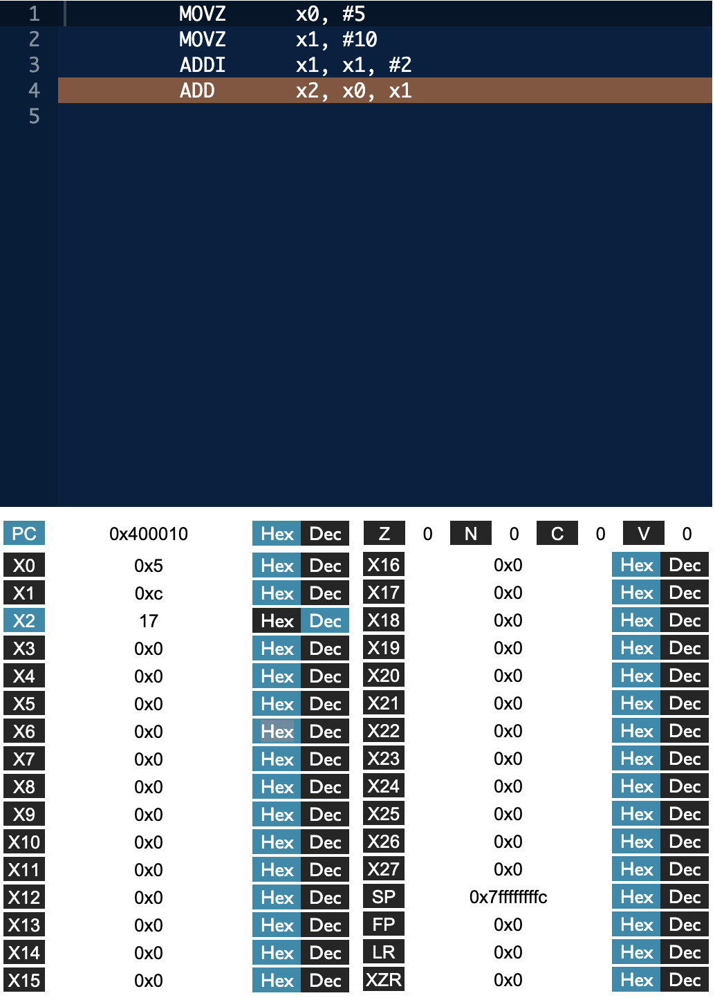

# 2DT901 : Lab 1

## Group 1 : Samuel Berg & Jesper Wingren

### Task 1

```LEGv8
movz x0, #5
movz x1, #10
addi x1, x1, #2
add x2, x0, x1
```

Value in `x2`:



<!--  -->

### Task 2

```Binary || Hex : LEGv8
11010010100 0000000010000000 00010 : movz x2, #0x80
11010010100 0000000011100111 00100 : movz x4, #0xe7
11001011000 00010 000000 00100 00101 : sub x5, x4, x2
D360 0CA5 : 11010011011 00000 000011 00101 00101 : lsl x5, x5, 3
```

Resulting in following assembly code:

```LEGv8
movz x2, #0x80
movz x4, #0xe7
sub x5, x4, x2
lsl x5, x5, 3
```

### Task 3

`x1 * x2 + x3 * x4 + x5` -> `x0`

`4 * 5 + 16 * 11 + 25` -> `221`

```LEGv8
movz x0, #0

movz x1, #4
movz x2, #5

movz x3, #16
movz x4, #11

movz x5, #25

loop1:
    cbz x1, loop2
    add x0, x0, x2
    subi x1, x1, #1
    cbnz x1, loop1

loop2:
    cbz x3, end
    add x0, x0, x4
    subi x3, x3, #1
    cbnz x3, loop2

end:
    add x0, x0, x5
```

### Task 4

`1893423 + 443924` == `1CE42F + 6C614` -> `2337347` == `23AA43`

```LEGv8
movz x1, #0x001c, lsl 16
movk x1, #0xe42f

movz x2, #0x0006, lsl 16
movk x2, #0xc614

add x0, x1, x2
```

### Task 5

`some linear sum` -> `x1`

`1 + 3 + ... + 99` -> `2500`

```LEGv8
movz x1, #0
movz x2, #99

loop:
    b.le end
    add x1, x1, x2
    subis x2, x2, #2
    cbnz x2, loop

end:
    addi x1, x1, #0
```

### Task 6

Given code:

```LEGv8
//Set up base memory address
MOVZ x7, #0x1000, LSL #16

//Store the numbers 15 and 25 in data memory
MOVZ x1, #15
STUR x1, [x7, #0]

MOVZ x1, #25
STUR x1, [x7, #8]

//Load the stored from memory
LDUR X1, [X7, #0]
LDUR X2, [X7, #8]
```

1. Which parts of the CPU are involved when ... is executed?

    - movz: Instruction memory(Instruction), Registers, ALU, Pad, PC, Control, ALU Control

    - stur: Instruction memory(Instruction), Registers(Read data), ALU, Data memory(Address, Write Data), Signextend, PC, Control, ALU Control

    - ldur: Instruction memory(Instruction), Registers, ALU, Data memory(Read data), Signextend, PC, Control, ALU Control

    - Explaination of involved parts:

        **Instruction memory**: Is where the CPU stores instructions that it needs to execute. Instructions are fetched from memory and then decoded and executed by the CPU. In some arcitechtures this is part of the data memory.

        **Registers**: Registers are small, fast storage locations within the CPU used to store data temporarily during processing. They are very fast compared to accessing data from memory. Some common types of registers include the program counter (PC), which keeps track of the memory address of the next instruction to be fetched, and general-purpose registers, which hold data that is being manipulated by the CPU.

        **ALU (Arithmetic Logic Unit)**: The ALU is responsible for performing arithmetic and logic operations on data within the CPU. Arithmetic operations include addition, subtraction, multiplication, and division, while logic operations include AND, OR, NOT, and XOR operations.

        **Data memory**: This is the main memory (RAM) where data is stored. Unlike registers, which are located inside the CPU and are very fast but limited in size, data memory is larger but slower to access. For example `stur` stores data in the data memory while `ldur` reads data.

        **Sign Extended/Pad**: Sign extension is a technique used to extend the sign bit of a binary number to fill a larger bit-width. It ensures that the signedness of a number is preserved when it's widened or extended. Padding refers to adding extra bits to the data to fit into a larger register or memory space.

        **PC (Program Counter)**: The program counter is a special register that holds the memory address of the next instruction to be fetched and executed by the CPU.

        **Control**: This part of the CPU is responsible for controlling the operation of the other parts. It fetches instructions from the instruction memory, decodes them, and coordinates the execution of the appropriate operations in the ALU and other parts of the CPU.

        **ALU Control**: This is a component of the control unit that determines which operation the ALU should perform based on the instruction being executed. It generates control signals that tell the ALU what operation to perform (addition, subtraction, logic operation or other) and how to interpret the operands.

2. Explain why these parts are involved.

    Control units, PC(Process counter) och instruction memory must be included for a computer to function. The `movz` command uses the register to store an imidiate value with a possible left-shift, `stur` and `ldur` commands reads from the register to store in data memory. Data memory refers to RAM(Random Access Memory) or the cache-memory and stores it with more longevity then just in the register. The ALU is also used during these operations to do locigal operations and computations.

### Task 7

```LEGv8 -> x0
// Input data

MOVZ x7, #0x1000, LSL #16

MOVZ x1, #1
STUR x1, [x7, #0]

MOVZ x1, #4
STUR x1, [x7, #8]

MOVZ x1, #1
STUR x1, [x7, #16]

MOVZ x1, #5
STUR x1, [x7, #24]

MOVZ x1, #9
STUR x1, [x7, #32]

MOVZ x1, #2
STUR x1, [x7, #40]

// Solution code

movz x0, #0
movz x2, #6

loop:
    cbz x2, end
    ldur x1, [x7]
    add x0, x0, x1
    subi x2, x2, #1
    addi x7, x7, #8
    cbnz x2, loop

end:
    addi x0, x0, #0
```
