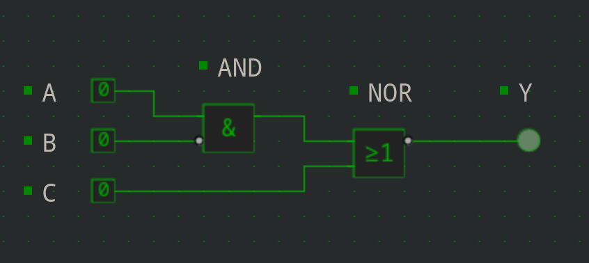
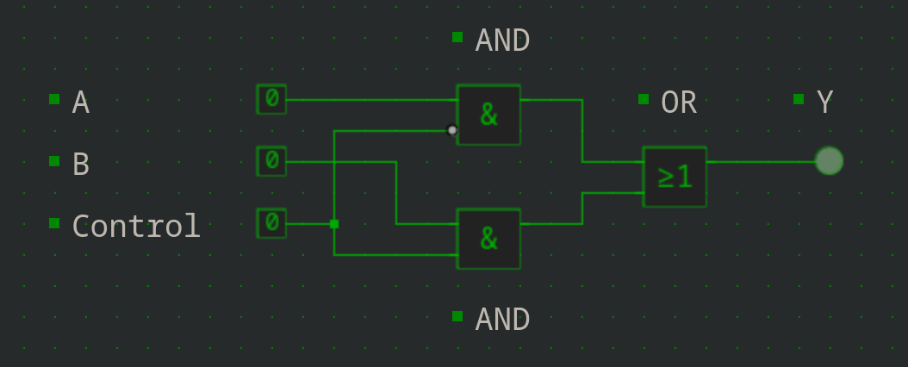
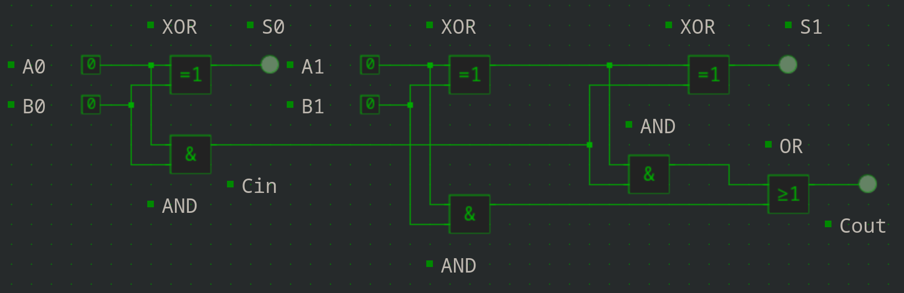

# 2DT901 : Lab 2

## Group 1 : Samuel Berg & Jesper Wingren

### Task 1

#### 1a

| A | B | C | OUT |
|---|---|---|-----|
| 0 | 0 | 0 | 1 |
| 0 | 0 | 1 | 1 |
| 0 | 1 | 0 | 1 |
| 0 | 1 | 1 | 1 |
| 1 | 0 | 0 | 1 |
| 1 | 0 | 1 | 0 |
| 1 | 1 | 0 | 0 |
| 1 | 1 | 1 | 0 |

#### 1b

`(A * (B + C))'` or `~(A * (B + C))`

#### 1c : Practical 1

[**Build Guide**](https://simulator.io/board/9PfZpeBoZD/2)

<!--  -->

**Note**: 1 NAND, 1 OR, 3 in, 1 out

### Task 2

#### 2a

| A | B | C | OUT |
|---|---|---|-----|
| 0 | 0 | 0 | 1 |
| 0 | 0 | 1 | 0 |
| 0 | 1 | 0 | 1 |
| 0 | 1 | 1 | 0 |
| 1 | 0 | 0 | 0 |
| 1 | 0 | 1 | 0 |
| 1 | 1 | 0 | 1 |
| 1 | 1 | 1 | 0 |

#### 2b

### Task 3

#### 3a

`A' * B' + A * C` or `~A * ~B + A * C`

#### 3b

| A\B,C | 00 | 01 | 11 | 10 |
|-------|----|----|----|----|
| 0 | 1 | 1 | 0 | 0 |
| 1 | 0 | 1 | 1 | 0 |

### Task 4

#### 4a

| A,B\C,D | 00 | 01 | 11 | 10 |
|---------|----|----|----|----|
| 00 | 1 | 0 | 0 | 1 |
| 01 | 0 | 0 | 0 | 0 |
| 11 | 0 | 1 | 1 | 0 |
| 10 | 0 | 1 | 1 | 0 |

#### 4b

`A' * B' * D' + A * D` or `~A * ~B * ~D + A * D`

#### 4c

### Task 5

#### 5a

A multiplexer or "mux" for short, is a fundamental digital component used in electronic circuits. It is used to select one of several input signals and route it to a single output. It functions like a switchboard, where multiple input lines are connected to a single output line. The selection of which input to transmit to the output is controlled by a set of control signals. Multiplexers are crucial in digital systems for data routing, signal switching, and data transmission.

#### 5b

| A | B | Control | OUT |
|---|---|---------|-----|
| 0 | 0 | 0 | 0 |
| 0 | 1 | 0 | 0 |
| 1 | 0 | 0 | 1 |
| 1 | 1 | 0 | 1 |
| 0 | 0 | 1 | 0 |
| 0 | 1 | 1 | 1 |
| 1 | 0 | 1 | 0 |
| 1 | 1 | 1 | 1 |

#### 5c

#### 5d

One application of a multiplexer is in telecommunications systems, specifically in digital telephony. In a telephone network, multiple voice signals from different callers need to be transmitted over a limited number of transmission lines. A multiplexer is used to combine these voice signals into a single stream of data, which can then be transmitted over the network more efficiently.

For example, a multiplexer is required to route voice signals from various phone lines to a shared transmission line leading to the central office. Without a multiplexer, each phone line would require its dedicated transmission line, which would be highly inefficient and impractical in terms of both cost and resource utilization. By using a multiplexer, multiple voice signals can be multiplexed onto a single transmission line, maximizing the utilization of the communication infrastructure.

### Task 6

#### 6a

| A1 | A0 | B1 | B0 | Cin | S1 | S0 | Cout |
|----|----|----|----|-----|----|----|------|
| 0 | 0 | 0 | 0 | 0 | 0 | 0 | 0 |
| 0 | 0 | 0 | 1 | 0 | 0 | 1 | 0 |
| 0 | 0 | 1 | 0 | 0 | 1 | 0 | 0 |
| 0 | 0 | 1 | 1 | 0 | 1 | 1 | 0 |
| 0 | 1 | 0 | 0 | 0 | 0 | 1 | 0 |
| 0 | 1 | 0 | 1 | 1 | 1 | 0 | 0 |
| 0 | 1 | 1 | 0 | 0 | 1 | 1 | 0 |
| 0 | 1 | 1 | 1 | 1 | 0 | 0 | 1 |
| 1 | 0 | 0 | 0 | 0 | 1 | 0 | 0 |
| 1 | 0 | 0 | 1 | 0 | 1 | 1 | 0 |
| 1 | 0 | 1 | 0 | 0 | 0 | 0 | 1 |
| 1 | 0 | 1 | 1 | 0 | 0 | 1 | 1 |
| 1 | 1 | 0 | 0 | 0 | 1 | 1 | 0 |
| 1 | 1 | 0 | 1 | 1 | 0 | 0 | 1 |
| 1 | 1 | 1 | 0 | 0 | 0 | 1 | 1 |
| 1 | 1 | 1 | 1 | 1 | 1 | 0 | 1 |

#### 6b

#### 6c : Practical 2

[**Showcase**](https://simulator.io/board/xREt7NarnS/2)

### Task 7 : Practical 3

#### 7a

[**Build Guide**](https://simulator.io/board/gSHKYM6Hyq/2)

<!--  -->

**Note**: 2 NOR gates, 2 in, 2 out

#### 7b

Q lit

Q' not lit

#### 7c

Q lit

Q' not lit

#### 7d

Q not lit

Q' lit

