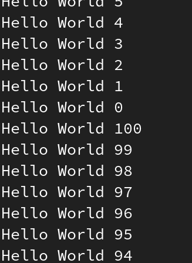

# 2DT901 : Lab 3

## Group 1 : Samuel Berg & Jesper Wingren

### Task 1

Code:

```armv6m
.thumb_func
.global main

main:
    MOV R7, #100
    BL stdio_init_all
loop:
    LDR R0, =str
    MOV R1, R7
    BL printf
    SUB R7, #1
    CMP R7, #0
    BGE loop
    MOV R7, #100
    B loop
reset:
    MOV R7, #100

.data
    .align  4
str: .asciz   "Hello World %d\n"
```

Output:



### Task 2

Code:

```armv6m
    .EQU LED_R, 0
    .EQU LED_Y, 1
    .EQU LED_G, 2
    .EQU GPIO_OUT, 1
    .EQU sleep1, 1000
    .EQU sleep2, 10000

.thumb_func
.global main

main:
    MOV R0, #LED_R
    BL gpio_init
    MOV R0, #LED_R
    MOV R1, #GPIO_OUT
    BL link_gpio_set_dir

    MOV R0, #LED_Y
    BL gpio_init
    MOV R0, #LED_Y
    MOV R1, #GPIO_OUT
    BL link_gpio_set_dir

    MOV R0, #LED_G
    BL gpio_init
    MOV R0, #LED_G
    MOV R1, #GPIO_OUT
    BL link_gpio_set_dir
loop:
    MOV R0, #LED_R
    MOV R1, #1
    BL link_gpio_put
    LDR R0, =sleep2
    BL sleep_ms

    MOV R0, #LED_Y
    MOV R1, #1
    BL link_gpio_put
    LDR R0, =sleep1
    BL sleep_ms
    MOV R0, #LED_Y
    MOV R1, #0
    BL link_gpio_put
    MOV R0, #LED_R
    MOV R1, #0
    BL link_gpio_put

    MOV R0, #LED_G
    MOV R1, #1
    BL link_gpio_put
    LDR R0, =sleep2
    BL sleep_ms
    MOV R0, #LED_G
    MOV R1, #0
    BL link_gpio_put

    MOV R0, #LED_Y
    MOV R1, #1
    BL link_gpio_put
    LDR R0, =sleep1
    BL sleep_ms
    MOV R0, #LED_Y
    MOV R1, #0
    BL link_gpio_put

    B loop
```

Video:

[Task2](https://youtube.com/shorts/hh8u3g2B48k?feature=share)

### Task 3

Code:

```armv6m
    .EQU G, 0
    .EQU F, 1
    .EQU E, 2
    .EQU D, 3
    .EQU C, 4
    .EQU B, 5
    .EQU A, 6
    .EQU LED, 25
    .EQU GPIO_OUT, 1
    .EQU sleep_time, 1000
    .EQU sleep_reset, 200

.thumb_func
.global main

main:
    BL setup

    B start
setup:
    @ G setup
    MOV R0, #G
    BL gpio_init
    MOV R0, #G
    MOV R1, #GPIO_OUT
    BL link_gpio_set_dir

    @ F setup
    MOV R0, #F
    BL gpio_init
    MOV R0, #F
    MOV R1, #GPIO_OUT
    BL link_gpio_set_dir

    @ E setup
    MOV R0, #E
    BL gpio_init
    MOV R0, #E
    MOV R1, #GPIO_OUT
    BL link_gpio_set_dir

    @ D setup
    MOV R0, #D
    BL gpio_init
    MOV R0, #D
    MOV R1, #GPIO_OUT
    BL link_gpio_set_dir

    @ C setup
    MOV R0, #C
    BL gpio_init
    MOV R0, #C
    MOV R1, #GPIO_OUT
    BL link_gpio_set_dir

    @ B setup
    MOV R0, #B
    BL gpio_init
    MOV R0, #B
    MOV R1, #GPIO_OUT
    BL link_gpio_set_dir

    @ A setup
    MOV R0, #A
    BL gpio_init
    MOV R0, #A
    MOV R1, #GPIO_OUT
    BL link_gpio_set_dir
start:
    BL zero
loop:
    @ BL zero
    BL one
    BL two
    BL three
    BL four
    BL five
    BL six
    BL seven
    BL eight
    BL nine

    @ BL nine
    BL eight
    BL seven
    BL six
    BL five
    BL four
    BL three
    BL two
    BL one
    BL zero

    B loop
zero:
    @ Store address to loop
    PUSH {lr}

    @ Zero
    MOV R0, #F
    MOV R1, #1
    BL link_gpio_put
    MOV R0, #E
    MOV R1, #1
    BL link_gpio_put
    MOV R0, #D
    MOV R1, #1
    BL link_gpio_put
    MOV R0, #C
    MOV R1, #1
    BL link_gpio_put
    MOV R0, #B
    MOV R1, #1
    BL link_gpio_put
    MOV R0, #A
    MOV R1, #1
    BL link_gpio_put
    LDR R0, =sleep_time
    BL sleep_ms

    BL reset

    @ Fetch address to loop
    POP {pc}

    BX lr
one:
    @ Store address to loop
    PUSH {lr}

    @ One
    MOV R0, #C
    MOV R1, #1
    BL link_gpio_put
    MOV R0, #B
    MOV R1, #1
    BL link_gpio_put
    LDR R0, =sleep_time
    BL sleep_ms

    BL reset

    @ Fetch address to loop
    POP {pc}

    BX lr
two:
    @ Store address to loop
    PUSH {lr}

    @ Two
    MOV R0, #G
    MOV R1, #1
    BL link_gpio_put
    MOV R0, #E
    MOV R1, #1
    BL link_gpio_put
    MOV R0, #D
    MOV R1, #1
    BL link_gpio_put
    MOV R0, #B
    MOV R1, #1
    BL link_gpio_put
    MOV R0, #A
    MOV R1, #1
    BL link_gpio_put
    LDR R0, =sleep_time
    BL sleep_ms

    BL reset

    @ Fetch address to loop
    POP {pc}

    BX lr
three:
    @ Store address to loop
    PUSH {lr}

    @ Three
    MOV R0, #G
    MOV R1, #1
    BL link_gpio_put
    MOV R0, #D
    MOV R1, #1
    BL link_gpio_put
    MOV R0, #C
    MOV R1, #1
    BL link_gpio_put
    MOV R0, #B
    MOV R1, #1
    BL link_gpio_put
    MOV R0, #A
    MOV R1, #1
    BL link_gpio_put
    LDR R0, =sleep_time
    BL sleep_ms

    BL reset

    @ Fetch address to loop
    POP {pc}

    BX lr
four:
    @ Store address to loop
    PUSH {lr}

    @ Four
    MOV R0, #G
    MOV R1, #1
    BL link_gpio_put
    MOV R0, #F
    MOV R1, #1
    BL link_gpio_put
    MOV R0, #C
    MOV R1, #1
    BL link_gpio_put
    MOV R0, #B
    MOV R1, #1
    BL link_gpio_put
    LDR R0, =sleep_time
    BL sleep_ms

    BL reset

    @ Fetch address to loop
    POP {pc}

    BX lr
five:
    @ Store address to loop
    PUSH {lr}

    @ Five
    MOV R0, #G
    MOV R1, #1
    BL link_gpio_put
    MOV R0, #F
    MOV R1, #1
    BL link_gpio_put
    MOV R0, #D
    MOV R1, #1
    BL link_gpio_put
    MOV R0, #C
    MOV R1, #1
    BL link_gpio_put
    MOV R0, #A
    MOV R1, #1
    BL link_gpio_put
    LDR R0, =sleep_time
    BL sleep_ms

    BL reset

    @ Fetch address to loop
    POP {pc}

    BX lr
six:
    @ Store address to loop
    PUSH {lr}

    @ Six
    MOV R0, #G
    MOV R1, #1
    BL link_gpio_put
    MOV R0, #F
    MOV R1, #1
    BL link_gpio_put
    MOV R0, #E
    MOV R1, #1
    BL link_gpio_put
    MOV R0, #D
    MOV R1, #1
    BL link_gpio_put
    MOV R0, #C
    MOV R1, #1
    BL link_gpio_put
    MOV R0, #A
    MOV R1, #1
    BL link_gpio_put
    LDR R0, =sleep_time
    BL sleep_ms

    BL reset

    @ Fetch address to loop
    POP {pc}

    BX lr
seven:
    @ Store address to loop
    PUSH {lr}

    @ Seven
    MOV R0, #C
    MOV R1, #1
    BL link_gpio_put
    MOV R0, #B
    MOV R1, #1
    BL link_gpio_put
    MOV R0, #A
    MOV R1, #1
    BL link_gpio_put
    LDR R0, =sleep_time
    BL sleep_ms

    BL reset

    @ Fetch address to loop
    POP {pc}

    BX lr
eight:
    @ Store address to loop
    PUSH {lr}

    @ Eight
    MOV R0, #G
    MOV R1, #1
    BL link_gpio_put
    MOV R0, #F
    MOV R1, #1
    BL link_gpio_put
    MOV R0, #E
    MOV R1, #1
    BL link_gpio_put
    MOV R0, #D
    MOV R1, #1
    BL link_gpio_put
    MOV R0, #C
    MOV R1, #1
    BL link_gpio_put
    MOV R0, #B
    MOV R1, #1
    BL link_gpio_put
    MOV R0, #A
    MOV R1, #1
    BL link_gpio_put
    LDR R0, =sleep_time
    BL sleep_ms

    BL reset

    @ Fetch address to loop
    POP {pc}

    BX lr
nine:
    @ Store address to loop
    PUSH {lr}

    @ Nine
    MOV R0, #G
    MOV R1, #1
    BL link_gpio_put
    MOV R0, #F
    MOV R1, #1
    BL link_gpio_put
    MOV R0, #D
    MOV R1, #1
    BL link_gpio_put
    MOV R0, #C
    MOV R1, #1
    BL link_gpio_put
    MOV R0, #B
    MOV R1, #1
    BL link_gpio_put
    MOV R0, #A
    MOV R1, #1
    BL link_gpio_put
    LDR R0, =sleep_time
    BL sleep_ms

    BL reset

    @ Fetch address to loop
    POP {pc}

    BX lr
reset:
    @ Store address to loop
    PUSH {lr}

    @ Blank
    MOV R0, #G
    MOV R1, #0
    BL link_gpio_put
    MOV R0, #F
    MOV R1, #0
    BL link_gpio_put
    MOV R0, #E
    MOV R1, #0
    BL link_gpio_put
    MOV R0, #D
    MOV R1, #0
    BL link_gpio_put
    MOV R0, #C
    MOV R1, #0
    BL link_gpio_put
    MOV R0, #B
    MOV R1, #0
    BL link_gpio_put
    MOV R0, #A
    MOV R1, #0
    BL link_gpio_put

    @ Fetch address to loop
    POP {pc}

    BX lr
```

Video:

[Task3](https://youtube.com/shorts/IYsOw_ePM2s?feature=share)

### Task 4

Code:

```armv6m
    .EQU LED_R, 0
    .EQU ON, 1
    .EQU OFF, 2
    .EQU GPIO_OUT, 1
    .EQU GPIO_IN, 0

.thumb_func
.global main

main:
    MOV R0, #LED_R
    BL gpio_init
    MOV R0, #LED_R
    MOV R1, #GPIO_OUT
    BL link_gpio_set_dir

    MOV R0, #ON
    BL gpio_init
    MOV R0, #ON
    MOV R1, #GPIO_IN
    BL link_gpio_set_dir

    MOV R0, #OFF
    BL gpio_init
    MOV R0, #OFF
    MOV R1, #GPIO_IN
    BL link_gpio_set_dir
loop:
    MOV R0, #ON
    BL link_gpio_get
    BNE on

    MOV R0, #OFF
    BL link_gpio_get
    BNE off

    B loop
on:
    MOV R0, #LED_R
    MOV R1, #1
    BL link_gpio_put

    B loop
off:
    MOV R0, #LED_R
    MOV R1, #0
    BL link_gpio_put

    B loop
```

Video:

[Task4](https://youtube.com/shorts/BMYhARJl8_M?feature=share)

### Task 5

Code:

```armv6m
#include "hardware/regs/addressmap.h"
#include "hardware/regs/sio.h"
#include "hardware/regs/io_bank0.h"
#include "hardware/regs/pads_bank0.h"

    .EQU SIO_BASE_ADR, 0xd0000000
    .EQU LED, 0
    .EQU ON, 1
    .EQU OFF, 2

.thumb_func
.global main
.align 4

main:
    MOV R0, #LED
    BL gpio_init

    MOV R0, #ON
    BL gpio_init

    MOV R0, #OFF
    BL gpio_init

    B loop
loop:
    MOV R0, #ON
    BL gpio_read
    BNE on

    MOV R0, #OFF
    BL gpio_read
    BNE off

    B loop
on:
    MOV R0, #LED
    BL gpio_on

    B loop
off:
    MOV R0, #LED
    BL gpio_off

    B loop
gpio_init:
    @ Initialize the GPIO
    MOV R3, #1
    LSL R3, R0              @ shift over to pin position
    LDR R2, gpiobase        @ address we want
    STR R3, [R2, #SIO_GPIO_OE_SET_OFFSET]
    STR R3, [R2, #SIO_GPIO_OUT_CLR_OFFSET]

    @ Enable input and output for the pin
    LDR R2, padsbank0
    LSL R3, R0, #2          @ pin * 4 for register address
    ADD R2, R3              @ Actual set of registers for pin
    MOV R1, #PADS_BANK0_GPIO0_IE_BITS
    LDR R4, setoffset
    ORR R2, R4
    STR R1, [R2, #PADS_BANK0_GPIO0_OFFSET]

    @ Set the function number to SIO
    LSL R0, #3              @ each GPIO has 8 bytes of registers
    LDR R2, iobank0         @ address we want
    ADD R2, R0              @ add the offset for the pin number
    MOV R1, #IO_BANK0_GPIO3_CTRL_FUNCSEL_VALUE_SIO_3
    STR R1, [R2, #IO_BANK0_GPIO0_CTRL_OFFSET]

    BX LR
gpio_on:
    @ Turn on a GPIO pin
    MOV R3, #1
    LSL R3, R0              @ shift over to pin position
    LDR R2, gpiobase        @ address we want
    STR R3, [R2, #SIO_GPIO_OUT_SET_OFFSET]

    BX LR
gpio_off:
    @ Turn off a GPIO pin
    MOV R3, #1
    LSL R3, R0              @ shift over to pin position
    LDR R2, gpiobase        @ address we want
    STR R3, [R2, #SIO_GPIO_OUT_CLR_OFFSET]

    BX LR
gpio_read:
    MOV R3, #1
    LSL R3, R0
    LDR R2, gpiobase
    LDR R3, [R2, #SIO_GPIO_IN_OFFSET]
    MOV R4, #1
    LSL R4, R0
    AND R4, R4, R3

    BX LR

.align 4
gpiobase: .word SIO_BASE        @ base of the GPIO registers
iobank0:  .word IO_BANK0_BASE   @ base of io config registers
padsbank0: .word PADS_BANK0_BASE
setoffset: .word REG_ALIAS_SET_BITS
```

Video:

[Task5](https://youtube.com/shorts/e9bCrPQqrPw?feature=share)
