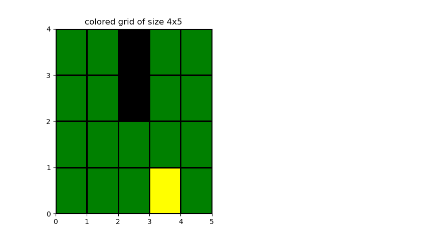
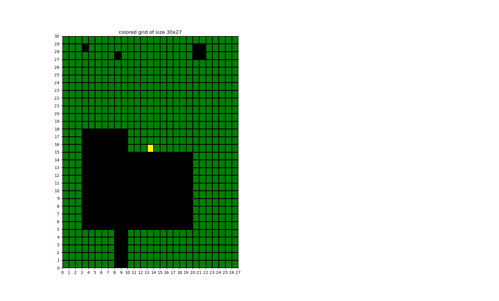
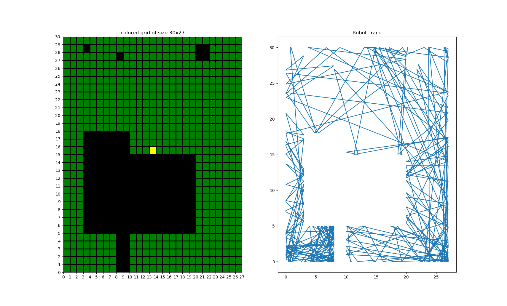
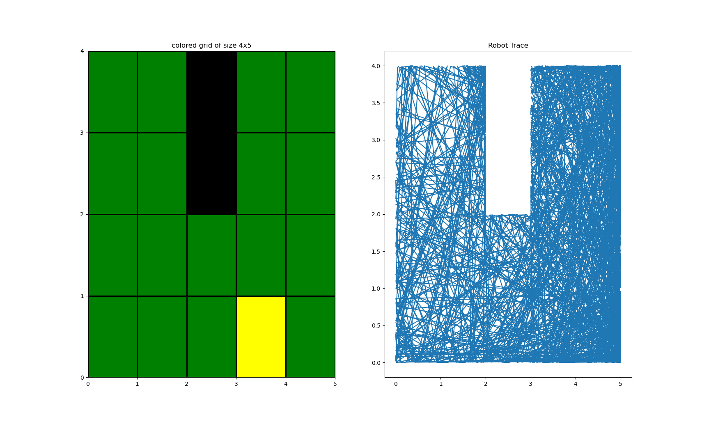

# Robotic Lawnmower Project Report 
Members: Filip Helgesson  
Program: Civilingenjör i mjukvaruteknik  
Course: 1DT901  
Date of submission: 2023-11-03

### Introduction  
Som en del utav kursen introduction to programming (1DT901) så har vi fått i uppgift att skapa en simulering utav en robotgräsklippares rörelse.
Vi hade vissa parametrar förbestämda tillexempel att hastigheten skulle 0.3m/s för våran robotgräsklippare. 
När vi behövde få fram en ny riktning för vår robot så gjordes detta genom att generera en ny hastighet.
Uppgiften innehöll även ett moment där vi med hjälp av matplotlib skulle visualisera våra kartor och rörelsemönstret för robotgräsklipparen på kartorna.


### 1. Present Ground Maps
Kartan som jag började arbeta med är Simple.csv. Den är inte så komplicerad eller stor vilket gjorde den tacksam att börja med.
Arean på denna karta är endast 20kvm varav 2kvm är hinder


Som andra karta använde jag mig av heter small.csv och är på 810kvm med mer komplicerade hinder på 207kvm.



### 2. Coordinate Map
För att skapa koordinaterna som innehåller informationen om den rutan är hinder,gräsmatta eller startpositionen för roboten så började jag med att läsa in csv filen som innehåller informationen med L = gräsmatta, O = hinder och S = startposition.
jag använde mig av säker filöppning och läste in rad för rad till en string. Med hjälp av is.alpha() så kollade jag om tecknet på tur var bokstav eller inte. På så sätt så tog jag bort alla semicolon som fanns i csv filen.
```python
with open(path, "r") as file:
    ft = ""  # String to save line for line in csv file and modify
    index_sec = 0  # second index
    index_fir = 0  # first index
    for line in file:  # read line for line
        ft += line  # Add line to string ft
        csv_list.append([ch for ch in line if ch.isalpha()]) 
```
Nu när vi har en string med vår information så gick jag igenom hela listan för att ändra värdena på bokstäverna till siffror. L blev 0, O blev 1 och startpositionen blev 2. Detta är viktigt för att kunna visuallisera kartan senare och även kunna avgöra om vårt nästa steg innehåller hinder senare.
```python
    while index_fir < len(csv_list):  # go through all rows
        while index_sec <= len(csv_list[0]):  # go through all collumns
            if index_sec >= len(csv_list[0]):  # go to next row
                index_fir += 1
                index_sec = 0
                break
            elif csv_list[index_fir][index_sec] == "L":  # L = 0
                csv_list[index_fir][index_sec] = 0
            elif csv_list[index_fir][index_sec] == "O":  # O = 1
                csv_list[index_fir][index_sec] = 1
            else:
                csv_list[index_fir][index_sec] = 2  # S = 2
            index_sec += 1
```
Sedan avslutar vi med att använda reverse() så att listan får origo på rätt ställe
```python
csv_list.reverse()
```

För att avgöra om vi är på kartan eller inte så skapade jag en funktion då detta kommer behöva göras inför varje steg.
Funktionen tar ett x och y värde som i vårt fall kommer vara nästa stegs koordinater och kollar om dessa koordinater innehåller ett hinder eller är utanför. Isåfall kommer vi att generera en ny hastighet som skapar ett annat koordinatpar och kollar dessa. 
Är x och/eller y utanför på x-axeln eller y-axeln så kommer vi retunera True som då betyder att vi är utanför kartan.
Är koordinaten på en ruta som är ett hinder så kommer indexeringen nedan leda till == 1 som då betyder att vi har ett hinder där retunerar True även här då vi är utanför det tillåtna området.
```python
def is_outside(x, y):
    if x > x_max or x < x_min:  # outside on x axis
        return True
    elif y > y_max or y < y_min:  # outside on y axis
        return True
    elif csv_list[int(y)][int(x)] == 1:  # if true obstacle in the way
        return True
    return False  # inside and no obstacle
```


### 3. Trace (Grade E requirement)
The text should include:
Nedan har vi min funktion för att ta ett steg. den börjar med variabler som jag satt till global då jag vill ändra dessa i hela programmet.
Sedan så kommer vi till biten där vi tar fram nästa koordinatpar.
Innan vi tar steget så vill vi veta om vi är hamnar på ett otillåtetområde och därför använder vi oss av funktionen is_outside() som vi skapade tidigare.
visar det sig att vi är utanför så kommer vi att generera ett nytt koordinatpar med hjälp av new_velocity() tills de är på tillåtetområde igen.
När vi har bekräftat att vårt nästa steg är okej att ta så kommer vi att lägga till det koordinatparet i en lista vid namn path som innehåller alla steg vi har tagit för att kunna visualisera detta senare.
sedan sätter vi våra nuvarande koordinater som i detta fall kallas start_x och start_y till nästa stegs koordinatpar och ändrar steps_taken med 1.
Det är viktigt här att hålla koll på antal steg då det är detta som kommer avgöra när vi är färdiga med vårt program.
```python
def take_step(vx, vy):
    global steps_taken
    global path
    global start_x
    global start_y
    next_x = start_x + (vx * (1 / t))  # next x coordinate
    next_y = start_y + (vy * (1 / t))  # next y coordinate
    while is_outside(next_x, next_y):  # as long as we are outside, new pos
        vx, vy = new_velocity()  # new vx and vy
        next_x = start_x + (vx * (1 / t))  # next x coordinate
        next_y = start_y + (vy * (1 / t))  # next y coordinate
    path.append([next_x, next_y])  # add the coodrinate to trace list
    start_x = next_x  # take step
    start_y = next_y  # take step
    steps_taken += 1  # add 1 step taken
    return vx, vy, start_x, start_y
```

De två följande bilderna är våra två kartor efter två timmars körande




## Project conclusions and lessons learned
Jag har inte upplevt några större problem förutom när jag använde .reverse() på csv listan då detta gjort att x och y indexeringen blev omvänd men jag jobbade runt det när jag upptäckte det. Nästa gång skulle jag istället ha gjort vändandet mer manuelt för att göra koden lite lättare att följa.

### Technical issues 
Det som tog längst tid för mig skulle jag säga var matplotlib hanterandet då jag ej använt det förut så fick jag kolla instruktionerna en del för att på så sätt lära mig hur jag skulle strukturera koden för att det skulle fungera som jag ville.

Det jag tar med mig från detta och vad jag skulle göra annorlunda är att göra en nogrannare plan på förhand. 

Hade jag haft mer tid till uppgiften så hade jag hunnit med Coverage (C) och försökt mig på A delen med men en annan kurs uppgifter ställde till det lite så därför hann jag ej med mer än betyg E tyvärr

### Project issues
Eftersom jag valde att göra detta projektet själv så började jag med att planera hur jag skulle lägga upp koden i små bitar och jobbade bit för bit.
Jag spenderade ungefär två-tre dagar och ca 3timmar per dag på detta projekt 


