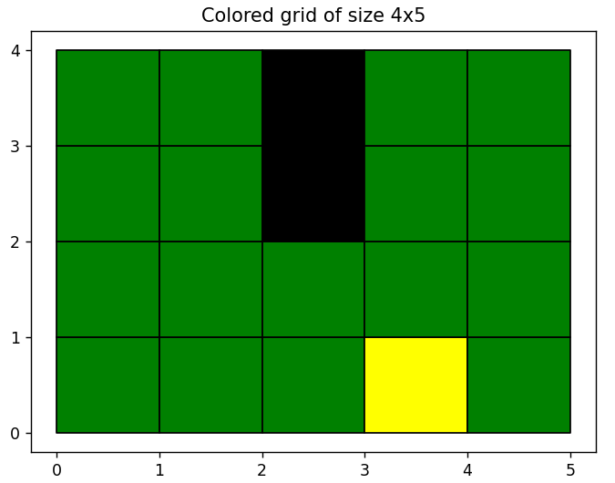
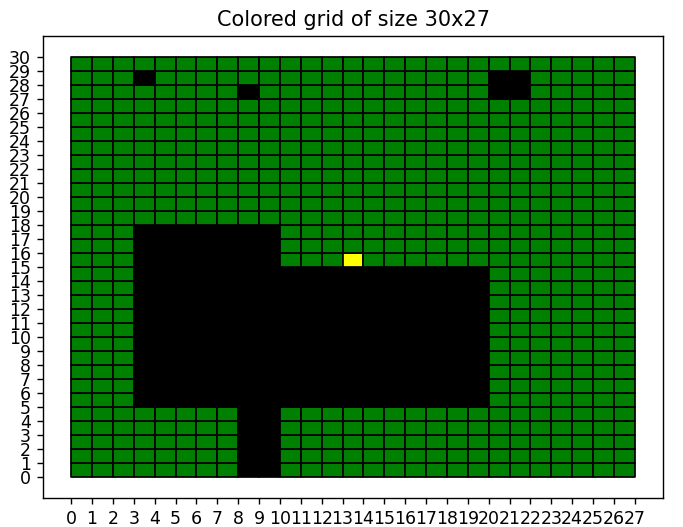
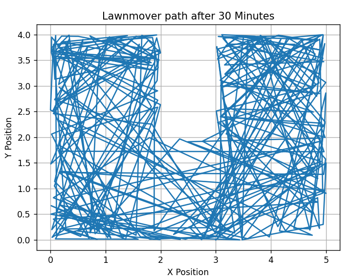
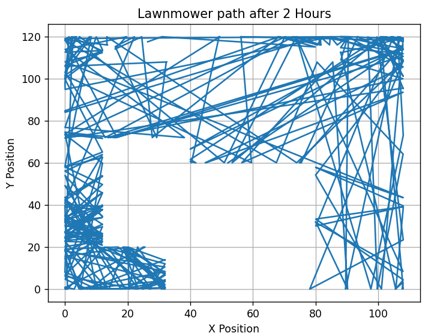
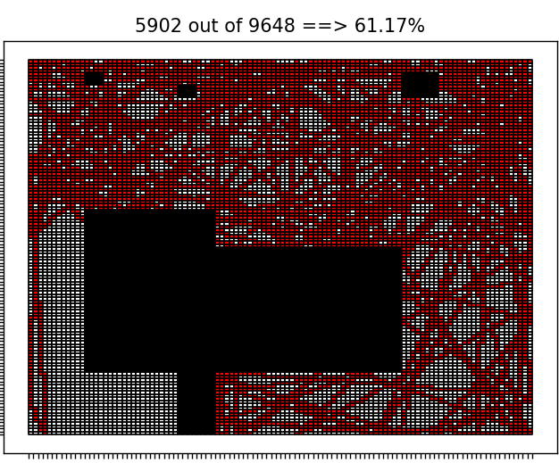

# Robotic Lawnmower Project Report 
Members: Thanapat Pornram (tp222ka)
Program: Master of Science in Software Engineering (CIDMV)
Course: 1DT901
Date of submission: 2023-11-04

### Introduction  
In this project, we're applying what we've learned in course 1DT901. This includes essential concepts like working with files, using variables, handling lists, and creating functions. Our main focus is on simulating a lawnmower's path in a grid-like environment. This environment features lawns and obstacles, and our main aim is to create visual representations of the lawn map and the lawnmower's journey.


### 1. Present Ground Maps
In the map bellow, the green color represents the lawn, yellow represents the starting point, and black is used for obstacles.

For "simple.csv":

- The map contains a total area of 20 square meters, with 18 square meters as lawn and 2 square meters as obstacles.
- 90% of the total area is covered by lawn.


For "small.csv":

- The map contains a total area of 810 square meters, with 600 square meters as lawn and 210 square meters as obstacles.
- Approximately 74% of the total area is covered by the lawn.

### 2. Coordinate Map
To determine the type of ground (Obstacle, Lawn, Start), I iterate through the ground map and check each coordinate to see if it's (Obstacle, Lawn, Start), using the code snippet below:
```python
def find_position(lst):
    start_pos = None
    obstacle_pos = []
    lawn_pos = []
    for y in range(len(lst)):
        for x in range(len(lst[y])):
            cell = lst[y][x]
            if cell == 'S':
                start_pos = (x, y)
            elif cell == 'O':
                obstacle_pos.append((x, y))
            elif cell == 'L':
                lawn_pos.append((x, y))
    return start_pos, obstacle_pos, lawn_pos
```

To determine if a Trace Position (x, y) is outside the lawn, I check if the coordinates (x, y) are within the grid defined by rows and cols as the maximum lengths. It's considered outside if:
- (x, y) is less than zero.
- The coordinates (x, y) are in the list of obstacles.
Here's the code snippet for this:
```python 
def is_outside(x, y):
    global obstacle_pos
    outside = False
    rows = len(ground_map)
    cols = len(ground_map[0])
    obstacles = (int(x), int(y)) in obstacle_pos
    if x < 0 or x > cols or y < 0 or y > rows or obstacles:
        outside = True
    return outside
```

### 3. Trace (Grade E requirement)

* The trace is a sequence of steps x, y. This is how I go from one step to another:

- The robot moves to a new position by checking if the new coordinates (x, y) are within the grid.
- If the robot's position hits an obstacle or goes outside the grid, I use a while loop to find a new position with a random alpha within the lawn area. This ensures the robot navigates around obstacles and stays within the lawn.
- Here's the code snippet for the one_step function:
```python 
def one_step(x, y, vx, vy):
    # Calculate position acording to xi+1 = xi + vx∆t (1) yi+1 = yi + vy∆t
    xu = x + vx * delta_t
    yu = y + vy * delta_t

    # If outside or obstacle
    while is_outside(xu, yu):
        # Generate a new random velocity
        alpha = random.uniform(0, 2 * math.pi)
        vx = v * math.cos(alpha)
        vy = v * math.sin(alpha)
        # New positions
        xu = x + vx * delta_t
        yu = y + vy * delta_t
    return xu, yu, vx, vy
```

- Robot path trace after 30 min from simple.csv

- Robot path trace after 2 hours from small.csv


### 4. Coverage (Grade C requirement)
To compute the coverage we divide each square meter into a smaller ``N x N`` grid.

- Coverage after 2 hours from the small.csv where N = 4, delta_t = 0.1, v = 0.3 said the Instructer from the oral presentation. 
- image below


Below follows a few questions. Motivate your answers and your assumptions.

+ How do the two parameters ∆t and N influence the coverage?
-∆t is the time between each step the robot takes. If ∆t is small, it means that the robot takes many tiny steps. This leads to the robot can get closer obstacles and cut grass more accurately. So, a small ∆t makes the robot's coverage more precise, especially near obstacles.
- N is about how detailed the map is divided. If N is large, it means the map is divided into many small pieces. This leads to the robot can see small details and cover more area. So, a larger N leads to more detailed coverage and can capture finer details. If N is smaller, the map is divided into fewer grid, larger pieces. This makes it easier for the robot to work, but it can miss some details.
+ What can you say about the effective cutting witdh? What parameters influence it?
- The effective cutting width is influenced by N, as mentioned earlier.
- A larger N results in a narrower effective cutting width, which means the robot covers a more detailed but narrower path.
- A smaller N results in a wider effective cutting width, where the robot's path is wider but less detailed.
+ What is a reasonable workload (hours of work per day) for the robot to handle ground map ``small.csv``? 
- Based on my testing with different times, I found that 2.5 hours is a good stopping point.
- In real-life scenarios, it depends on the robot's battery life and other practical considerations. The 2.5-hour limit is suitable for simulations but may vary in real-world applications.


## Project conclusions and lessons learned
- This project deepened my understanding of working with files in Python. I learned how to efficiently read and process data from other files.

- I gained experience using libraries like Matplotlib

- The most important skills from this project was working with lists. Understanding how to manipulate them. This project show the versatility and power of lists, showing me how they can be used to store, organize, and manipulate data efficiently.

- Throughout this project, it required problem-solving and logical thinking. How the lawn mowing simulation to handling obstacles and ensuring accurate coverage.


### Technical issues 
+ What were the major technical challanges as you see it? What parts were the hardest and most time consuming?

-The major part was the how to work with the list to make it cordinate, origin in the bottom-left corner. That to the most time.
+ What lessons have you learned? What should you have done differently if you now were facing a similar problem.
- I learn alot how to debug, its not always how i think the code work but the code run differently. I didnt have any hand on what was wrong in the code, Now i have a basis how to start debuging the code.
+ How could the results be improved if you were given a bit more time to complete the task.

- With more time i maybe could go for grade A, its just took a lots of time to put the pices together how each functon depends on each other or not, what value the functions take in/ return. 


### Project issues
-Describe how your team organized the work. How did you communicate? How often did you communicate?

- At the beginning, I had a teammate. Initially, we used Discord for communication while working on the code during the night. However, he didn't actively participate, and I ended up meeting him at the university in person. Unfortunately, he only attended the first day of the project. It was challenging to establish contact with him. I even inquired with classmates if they had seen him, but no one had any information. Consequently, I proceeded with the project on my own.
- Estimate hours spend each week (on average)
- Most of the time was dedicated to working behind the computer, primarily focused on problem-solving rather than actual coding. On average, I spent around 20-25 hours per week
 - What lessons have you learned? What should you have done differently if you now were facing a similar project.
-I learned that having a reliable teammate would significantly improve the collaboration experience. Additionally, starting the project earlier would provide more time for preparation and problem-solving. 

