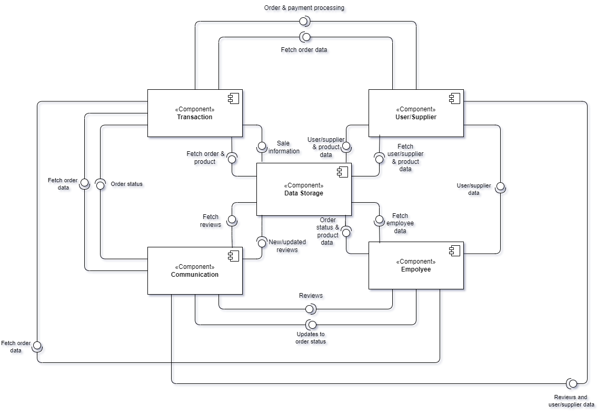
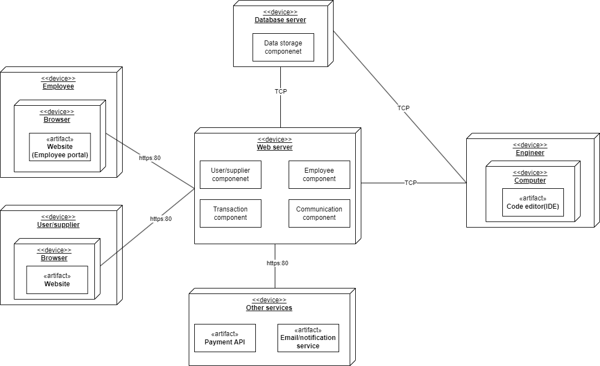

# 2DT902 : Assaignment 1 : [Samuel Berg](mailto:sb224sc@student.lnu.se)

## Uppgift 1.

**User/Supplier components**
- User Authentication & Registration
    * Account creation
    * Login
- Profile Management
    * Delivery Address
    * Payment Information/Option
    * Order Managment(including previous orders)
- Search & Products Management
    * Start page with popular/recommended products
    * Search feature

**Employee components**
- Product management
    * Manage availability of products
    * Manage services
- Manage Customer accounts
    * View Delivery optins
- Manage Orders
    * Change order status
    * Cancel/Refund Orders
- Supplier Management
    * Manage Supplier Information
- Reporting
    * View Daily/Weekly/Monthly/Yearly reports

**Transaction components**
- Cart
    * Adding & Removing of products
- Delivery Options
    * Pick-up at store
    * Delivery Service
- Payment API
    * Third-party payment integration
- Reporting
    * Number of Sales
    * Value of Sales
    * Number of Sold Products(of each product)

**Communication components**
- Order status
    * Notified on updates on your order(recived, sent, delivered, ready for pick-up)
- Product reviews/feedback
    * Can leave reviews on products and services that they have ordered and recived
- Reporting
    * Collect Summary of Reviews

**Data storage component**
- Stores the data of all other components

The ***user/supplier component*** facilitate user and supplier interactions with the system. For users, they provide a way to manage personal information, browse products, and place orders. For suppliers, they ensure that product availability is updated and relevant.

The ***employee component*** are crucial for the operational management of the pet shop. They ensure that the inventory is up-to-date, customers receive the correct orders, and management has the necessary information for effective business decisions.

The ***transaction component*** are essential for the core transactional functions of the pet shop, enabling customers to purchase products and services while providing the business with detailed insights into the preformance of sales.

The ***communication component*** are important for maintaining a positive customer experience. They keep customers informed and engaged, and the feedback mechanism provides valuable insights into customer satisfaction and product quality.

The ***data storage component*** is the backbone of the system, ensuring that all information is securely stored, accessible, and retrievable for various functionalities across the system. It supports all operations and reporting needs by providing a central repository for all data.

## Uppgift 2. 
Analysera beroenden mellan komponenter. Vilka funktioner som andra
komponenter ansvarar för behöver en komponent för att fullfölja sitt ansvar avseende
den funktionalitet som den fått allokerat?
Svara i text och identifiera funktionalitet som andra komponenter behöver. Beskriv
dem som ”provides” interface för komponenten. På samma sätt dokumenterar du
funktionalitet en komponent behöver i ”requires interface”.

## Uppgift 3.
Rita ett UML komponentdiagram med de komponenter du identifierat, koppla
samman komponenterna med interface, providesßà requires.

## Uppgift 4.
Fundera lite på den fysiska arkitekturen (systemarkitekturen). Vilka delar består
systemet av, vilka enheter ingår och vilken mjukvara installeras på respektive enhet?
Redovisa i textform.

## Uppgift 5.
Rita ett UML deploymentdiagram som illustrerar det du identifierat i uppgift 4.

