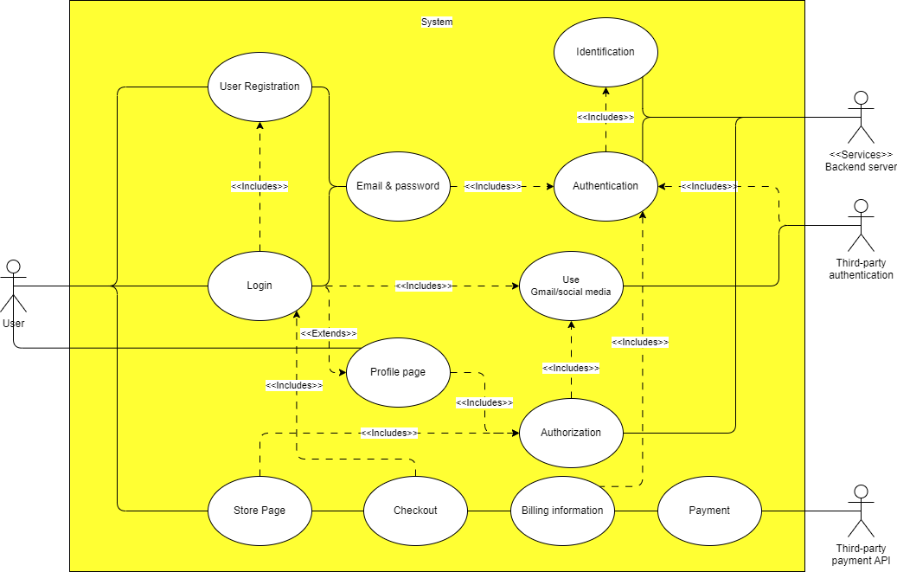
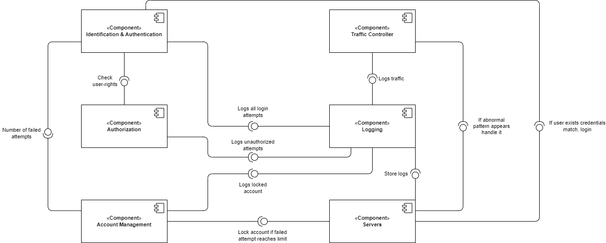
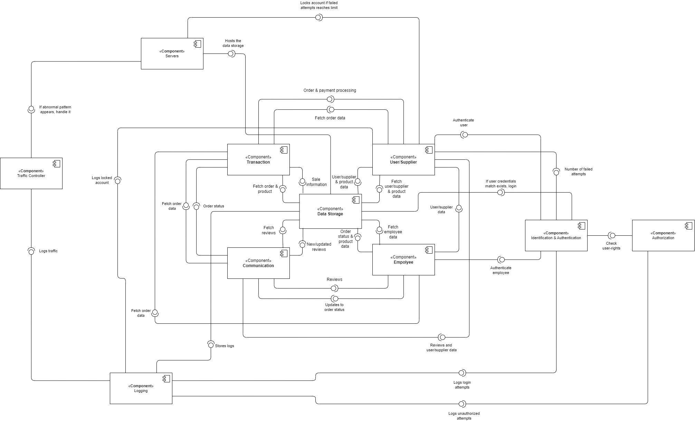

# 2DT902 : Assaignment 2 : [Samuel Berg(sb224sc)](mailto:sb224sc@student.lnu.se)

## Uppgift 1. (WIP!!)

## Uppgift 2.

### QAS 1

**Unauthorized Access Attempt**

* **Source**: Unidentified User.
* **Stimulus**: Attempts to access restricted resources, (employee dashboard).
* **Artifact**: Access control systems (Authentication & Authorization).
* **Environment**: The system is operational and user only has user-rights.
* **Response**: System detects user-rights, denies the request, logs the attempt for security monitoring.
* **Response Measure**: Unauthorized access is prevented 100% of the time, and an alert is sent to security with the IP-address of the attempt.

### QAS 2

**Multiple Failed Login Attempts**

* **Source**: Unidentified User.
* **Stimulus**: Multiple failed login attempts to an account.
* **Artifact**: Login System (Authentication & Identification).
* **Environment**: The system is operational and fuctioning normally.
* **Response**: After set amount of attempts blocks further login attempts, attempts are logged for security monitoring.
* **Response Measure**: Locks the account, sends security alert to user email to be able to unlock account. 

### QAS 3

**Denial of Service Protection**

* **Source**: Malicious actor(s).
* **Stimulus**: X amount of requests per second, overloading the system (X >= 1000).
* **Artifact**: Web server & network bandwidth.
* **Environment**: The system is operational but slow (under a (D)DoS attack).
* **Response**: System detects abnormal traffic pattern, limits requests, diverts the abnormal traffic to backup server.
* **Response Measure**: System maintains availablity for regular users by limiting the abnormal traffic to 5% of the systemsm resources, logs attack and notifies security and administrators immediately.

## Uppgift 3.
Rita ett UML komponentdiagram med de komponentabstraktioner, ansvar och relationer som behövs för den säkerhetsfunktionalitet som modellerats i uppgift 1 och 2.

## Uppgift 4.
Integrera komponenterna från uppgift 3 med den modell av systemets funktionalitet som du tog fram i inlämningsuppgift 1.

Diskutera eventuella anpassningar som behöver göras.
