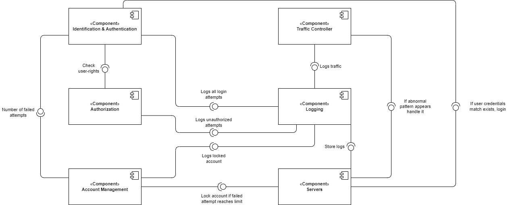

# 2DT902 : Assaignment 2 : [Samuel Berg(sb224sc)](mailto:sb224sc@student.lnu.se)

## Uppgift 1.

A user can login with diffrent methods, such as email&password, google account or diffrent types of social media accounts which extends from Identifying and Authentication since it is required from the user to be able to login. Logging in with google account or social media accounts realies on a Third-party to Identify and Authenticate the user. To view the profile page the user needs to be logged in, if user isn't logged in they will be prompted to do so when trying to go to profile page and if successful login then there will be an Authorization check. The store page is accessible to any user visiting the store without the need of being logged in, when the user proceeds to the checkout they will be promted to login or to create an account if they don't have one already, then the user will be asked to provide their billing information if they do not have any stored billing information from previous purcheses with authentication, lastly the payment is provided by a Third-party payment API that supports all the wanted payment methods.

## Uppgift 2.

### QAS 1

**Unauthorized Access Attempt**

* **Source**: Unidentified User / User.
* **Stimulus**: Attempts to access restricted resources, (employee dashboard).
* **Artifact**: Access control systems (Authentication & Authorization).
* **Environment**: The system is operational and user only has user-rights.
* **Response**: System detects user-rights, denies the request, logs the attempt for security monitoring.
* **Response Measure**: Unauthorized access is prevented 100% of the time, and an alert is sent to security with the IP-address of the attempt.

### QAS 2

**Multiple Failed Login Attempts**

* **Source**: Unidentified User.
* **Stimulus**: Multiple failed login attempts to an account.
* **Artifact**: Login System (Authentication & Identification).
* **Environment**: The system is operational and fuctioning normally.
* **Response**: After set amount of attempts blocks further login attempts, attempts are logged for security monitoring.
* **Response Measure**: Locks the account, sends security alert to user email to be able to unlock account. 

### QAS 3

**Denial of Service Protection**

* **Source**: Malicious actor(s).
* **Stimulus**: X amount of requests per second, overloading the system (X >= 1000).
* **Artifact**: Web server & network bandwidth.
* **Environment**: The system is operational but slow (under a (D)DoS attack).
* **Response**: System detects abnormal traffic pattern, limits requests, diverts the abnormal traffic to backup server.
* **Response Measure**: System maintains availablity for regular users by limiting the abnormal traffic to 5% of the systemsm resources, logs attack and notifies security and administrators immediately.

## Uppgift 3. (WiP!!)

When an unidentified user attempts to access restricted resources they require the unidentified user to login with employee/administrator privileged account if they fail todo so the attempt is logged, if a logged in user tries to access a restricted resource their user-rights would be checked to see if they have the rights to access the resource in question if not it will be logged. In both cases the administrators will be notified and the IP-addresses of the attempts will be logged for review. This will be handled by **Identification & Authentication**, **Authorization** and **Logging** components.

When an unidentified user tries to login to an account serveral times but fails it will be logged and the account will be locked till the user reviews the security email to restore their account has been handle correctly, the IP-address of the failed attempts will be logged for review and blocked till further review by administrators or user handles their security email correctly, saying that it was them attempting to login. This will be handled by the **Identification & Authentication**, **Account management**, **Servers** and **Logging** components.

## Uppgift 4.

### Discussion

Diskutera eventuella anpassningar som behöver göras.
