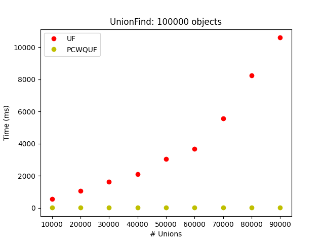
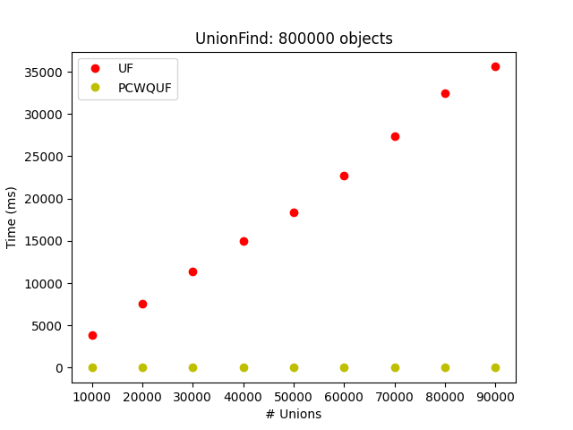
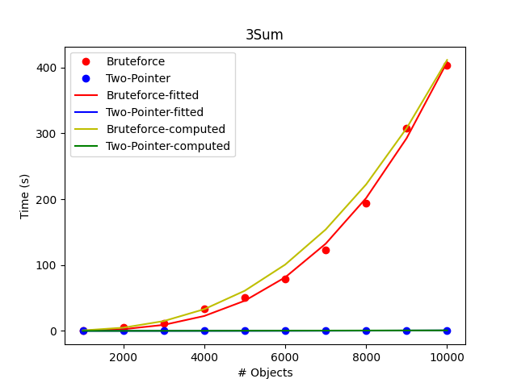
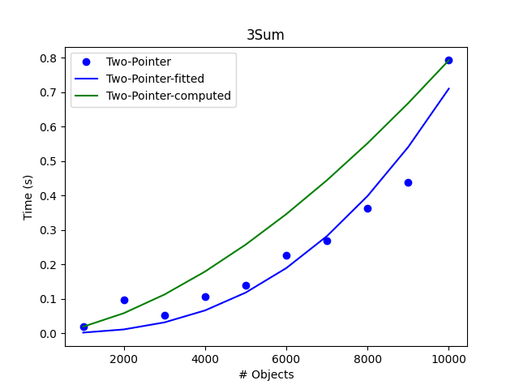

# Lab 1

Här kommer rapporten som tillhör lab 1 för 1DT907 kursen från [Samuel Berg](<sb224sc@student.lnu.se>)

## Hur man kör Main*.java programmen

Först och främst så tar vi och kör det följande kommandot i terminalen/consolen. Detta gör vi för att compile:a vår .java filer till filer så går att köra.

***Notera:*** Eftersom jag kör på linux så är jag ej helt säker om det är samma kommandon på windows, hoppas det ändå ska funka då jag skickar med .class filerna också.

```bash
javac *.java
```

För att köra något av *Main* programmen, skriv en av de följande kommandona in i din terminal/console. I ordning från topppen ner.

1. kör main programmet för `UnionFind` algorithmen

2. kör main programmet för `3Sum` algorithmen

3. kör main programmet för `Percolation` algorithmen. ***Notera:*** errsätt `n` med storleken för nxn matrisen man vill köra på och ersätt `exp` med antalet experiment/försök du vill köra för den matrisen.

```bash
java MainUF
java Main3Sum
java Main8 n exp
```

***Notera:*** Jag har gjort alla de olika algorithmerna vi har nämnt under våra föreläsningar som jag kommer ihåg, så när man kör ett av main programmen kommer resultaten från de algorithmer som ej är med igraferna också skrivas ut i terminalen/consolen.

## Problem 4

För problem 4 så mäter jag tiden för 2 olika UnionFind algorithmer som jag har kodat. Detta körs och testas genom en `MainUF.java` fil som tar och kör algorithmen för olika storlker av objekt samt olika mängder unions för varje storlek av objekt.



*Bild1: Hur grafen såg ut för få object.*

När man tar och tittar på den här grafen så ser det ut som om vår `UF` algorithm har mer av en `x²` funktion för dess tidskomplexitet medans vår `PCWQUF` verkar ha mer konstant avliknelse i tid tyvärr så är den inte konstant men från vad vi kan se med dessa grafer så ser den sådan ut.

```Text
Nu ska vi jämföra detta med bilden nedan när vi har fler objekt som skickas in till vår algorithm.
```



*Bild2: Hur grafen började se ut när man ökade antalet objekt.*

I denna bild så för man uppfatningen att vår `UF` algorithm har mer av en linjär tidskomplexitet vilket stämmer meröveräns med vad man förväntar sig när man tänker på hur koden för den algorithmen ser ut. Dock våran uppfattning av `PCWQUF` stannar den samma då vi inte kan se någon tydlig variation på denns tidskomplexitet.

```Text
För att sammanfatta:

Den vanliga UnionFind(`UF`) verkar gå mot en linjär tidskomplexitet medans vår
"Path-compression Weighted Quick UnionFind"(`PCWQUF`) verkar gå mot en konstant
tidskomplexitet. Att notera är ju att tidskomplexiteten ej är konstant för `PCWQUF`.
```

## Problem 7

För problem 4 så mäter jag tiden för 2 olika 3Sum algorithmer som jag har kodat. Den första vanliga 3Sum algorithmen är en brute-force variant som betsår av tre stycken `for` loopar för att lösa problemet. Den andra implementerade algorithmen är en Two-Pointer lösning på problemet som använder sig av en höger och en vänster pekare för att lösa problemt. Detta körs och testas genom en Main3Sum.java fil som tar och kör algorithmen för olika storlker av objekt vilket ger oss följande resultat.



*Bild3: Bild som visar tidskomplexiteten för den "vanliga" 3Sum algorithmen (Brute-force) och den förbättrade (Two-Pointer). Grafen inkluderar också en "fitted-curve" för både algorithmerna samt en "computed curve" för dom.*

För att kunna förklara lite vart värden jag kommer nämna här näst kommer ifrån kommer jag att redovisa formler som jag har använt för att få de olika funktionerna som kan ses i grafen ovan.

```Text
Vi har två stycken olika funktioner för f(x) den ena för fitted-curve den andra för computed curve.
För fitted-curve så andvände jag mig utav denna formel "a * x^b" för att få fram
kurvanför bägge algorithmerna medans för computed curve så använde jag mig utav
denna funktion istället "(x * 2^(aC / bC))^bC", vilket båda dessa funktioner gicks
igenom under våra föreläsningar.
```

Nu kommer vi då till hur vi fick fram värdena på `a` och `b` för dessa två funktioner. ***Notera:*** I funktionen för computed curve så har `a` och `b` ett stort `C` efter sig för att vara tydlig med att de är beräknad värden och inte givna från ett importerat biblioteks funktion.

För `fitted-curve` så får vi dessa värden genom att skicka in vår data till en funktion `curve_fit(func, x-values, y-values)` vilket tar tre stycken parametrar. `func` parametern är en definerad funktion i ditt egna program som du vill att den ska använda för att ge dig din `fitted-curve`. x- och y-values är dina x och y värden som jag har sparat i listor i mitt fall.

För `computed curve` så får vi fram våra `a` värden genom att använda följande formel `aC = log2(f(x)) - bC * log2(x)` som vi kan se så beror den på vad vårat `b` värde är vilket vi får fram på detta sätt `bC = (log2(f(x1)) - log2(f(x0))) / (log2(x1) - log2(x0))`.

Nu när vi har gått igenom hur vi kan få fram våra `a` och `b` värden så kan vi ta och gå in på vad vi faktiskt fick för värden för de oika algorithmerna.

```Text
Vi tar och börjar med vår brute-force algorithm

a värdena:

fitted => 9.620923278880196e-11

computed => -27.930453063895982

b värdena:

fitted => 3.156849570357424

computed => 2.7555222203420464
```

Som vi kan se ovan så får vi som förvänta att brute-force:en har en tidskomplexitet på ca `O(N³)` för funktionerna vi nämnde innan.

```Text
Nu tar vi värdena för vår Two-Pointer algorithm

a värdena:

fitted => 3.1106785891057227e-11

computed => -21.89939875613408

b värdena:

fitted => 2.589666968918421

computed => 1.622885880852076
```

När jag tar en titt på värdena för Two-Pointer:en så ser jag direkt att de skiljer lite mycket, detta kan beror på fler faktorer om vi tänker på hur vi fick fram våra `computed` värden för `a` och `b`. Men som vi kan se i `bild3` så kan vi ej se någon större skillnad på grund ut av att brute-force algorithmen stiger så mycker snabbare än Two-Pointer:en. Men om vi tar en närmare titt på Two-Pointer algorithmens kurvur endast så ser vi enligt bilden nedan att dess tidskomplexitet verkar gå mot `O(N²)` då det ej går att exakt urskilja med hjälp av data:n samt figuren.



*Bild4: En närmare titt på Two-Pointer lösningens kurva.*

## Problem 8

I problem 8 så skulle man kod:a upp en `Percolation` algorithm och ta hjälp av en av de UnionFind algorithmerna man skapade tidigare under labben. Detta enligt mig vart en av de enklaste algorithmerna att kod:a upp då man fick en känsla av att man redan hade gjort större del av problemet på grund ut av att man behövde använda sig av en tidigare gjord UnionFind algorithm.

När jag körde min algorithm med de nedan dokumenterade värdena så fick jag följande resultat.

```Text
Antal experiment: 100
Matris storleken n för nxn matris: 100

Ger de följande värdena:
Mean time taken: 3.3357 ms
Mean percolation threshold: 0.5924300000000001 ± 0.017041437910593284
Standard deviation: 0.017041437910593284

Vilket ger oss att threshold:et går mot ca 0.5924.
```
