# Robotic Lawnmower Project Report 

* Members: Zuheir Hani and Samir Abu Alolaa
* Program: Master of Science in Engineering: Software Engineering
* Course: 1DT901  
* Date of submission: 2023-11-25

### Introduction  

Denna studie presenterar projektet “Robotic Lawnmower”, en studie som handlar om en autonom robotgräsklipparens förmåga att effektivt klippa gräs. Projektet omfattar bland annat att ta fram robots rörelse över gräsmattan, konstruera en plot mapp som framställer med olika färger gräsområden, startpunkten och hinder. Dessutom spåras robots rörelsen över gräsmattan genom att ta fram x och y koordinaterna där roboten körs, samt en översikt mapp som visar de klippta områdena på gräsmattan. Denna studie behandlar kursens läroplan för programmering färdigheter, allt ifrån logiska strukturer till filhantering.

### Ground Maps

Mapparna befinner sig i csv-filer och består av matriser innehållande elementen L som betecknar gräs, S som betecknar startpositionen och O som betecknar hinder.

I Figur 1 är den totala arean av mappen 625m2, därmed är gräsytan 466m2 vilket motsvarar ~ 74.56% av den totala ytan. I Figur 2 är den totala arean av mappen 810m2, därmed är gräsytan 602m2 vilket motsvarar ~ 74.32% av den totala ytan.

I Figur 1 representerar det rektangulära fenomenet längst ner huset. I mitten finns en “L” -formad struktur, detta föreställer en poseidon staty som är ortogonalt mot mappen. De två svarta "plus"-symbolerna är två fontäner. Längst upp är det en mur som är anpassad för hundar, därför har den sneda kanter.

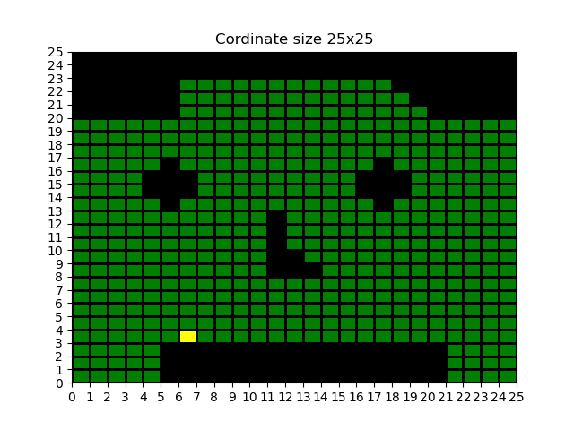
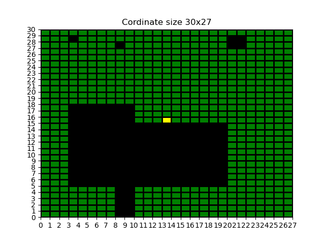

### Coordinate Map

Datan som är lagrad i csv-filerna bearbetas i en 2D-array-lista, vilket i sin tur kallas för en “mapp”. För att kunna detektera alla positioner i “mappen” används ett koordinatsystem med x och y axlarna. x-axeln framställs av len(mappen[0]) (Figur 3) för att omfatta de horisontella planen, medan y axeln framställs av len(mappen) (Figur 3) för att omfatta de vertikala planen. Därefter navigera hela “mappen” m.h.a x och y koordinaterna. För varje element i listan som innehåller “O byts tecknet till 0. För varje “L” byts tecknet till 1, För varje “S” byts tecknet till 2.

För att visualisera mappen används ListedColormap från biblioteket matplotlib. För varje värde position som sätts in i listan motsvarar det färg identifikationen. I Figur 4 illustreras 0 med svart färg, 1 med grönt färg och 2 med gult färg. 

Matriserna som framställs är från programmerings filer, vilket utgör att x och y axlarna är inverterade. Därav måste matriserna justeras om för att x och y axlarna hamnar på rätt plats när de ska användas i projektet. I funktionen is_outside (Figur 5) används den inverterade mappen för att undersöka om roboten är på gräsytan. Om robotgräsklipparen befinner sig i en negativ koordinat eller i en koordinat som överstiger den största angivna koordinat i “mappen” då är gräsklipparen utanför. Dessutom är robotgräsklipparen utanför mappen om den kör på ett hinder och inte gräs.

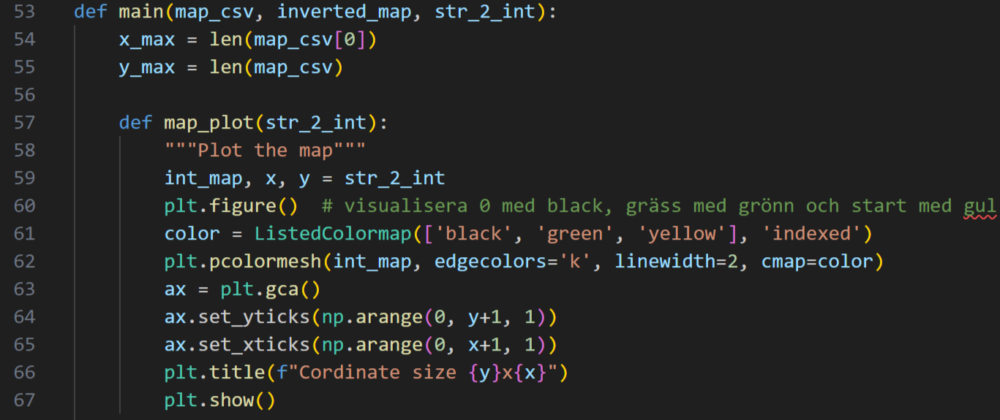
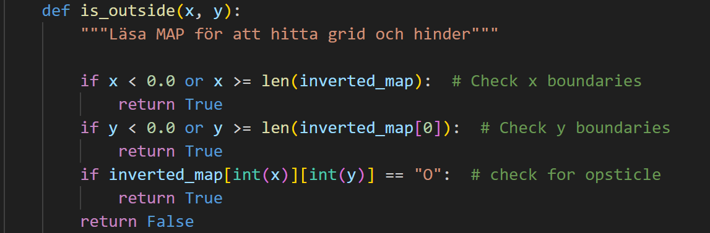

### 3. Trace

Robotgräsklipparen igångsätts alltid från startpositionen som är markerad med gul färg i plot mappen. Vid igångsättningen är robotens hastighet konstant 0.3m/s. Riktningen är en rak linje åt en slumpmässig sträckning. Om roboten inte hamnar utanför mappen, då lagras denna riktning i en lista som visas som en körning spår (Figur 6 & 7). Å andra sidan om roboten färdas utanför “mappen”, då studsar den och slumpmässigt ändrar sträckning. Listan lägger till alla riktningar tills roboten avslutar körningen. Faktumet som bestämmer hur länge roboten ska köras är användaren själv.  

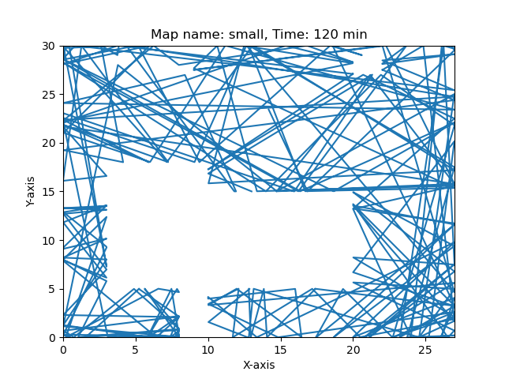
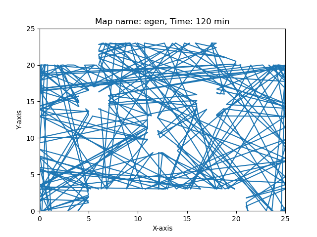

### 4. Coverage

Coverage för my_mapp.csv efter 2h med 5X5 grid är 65% (Figur 8).

Coverage för small.csv efter 2h med 5x5 grid är 55% (Figur 9).

∆ t representerar storleken på stegen som vår gräsklippare tar. När ∆ t är stort, innebär det att avståndet mellan första och andra positionen är större. Detta har två konsekvenser: För det första kommer vår gräsklippare att göra längre hopp innan den når kanten, och för det andra kommer vår kod att köras snabbare med färre steg per minut.

Å andra sidan, om ∆ t är litet, är avståndet mellan första och andra positionen mindre. Detta leder till två resultat: För det första kommer vår gräsklippare att göra kortare hopp innan den når kanten, och för det andra kommer vår kod att köras långsammare med fler steg per minut. Därför ger en mindre ∆ t oss en mer noggrann spårning.

N representerar dimensionen NxN av pixlar som kommer att finnas i varje block på vår ground map till coverage map. Ju större N är, desto fler pixlar delas in i kartan. Detta leder till att täckningsprocenten minskar jämfört med mindre N för samma spårning. N motsvarar diametern av vår klippblad.

En slutsats som kan dras från det tidigare sagt är att parametrarna som påverkar den effektiva skärvidden är ∆ t och N.

Det tar 360 minuter, alltså 6 timmar för att small.csv ska klippas 90% (Figur 11). 

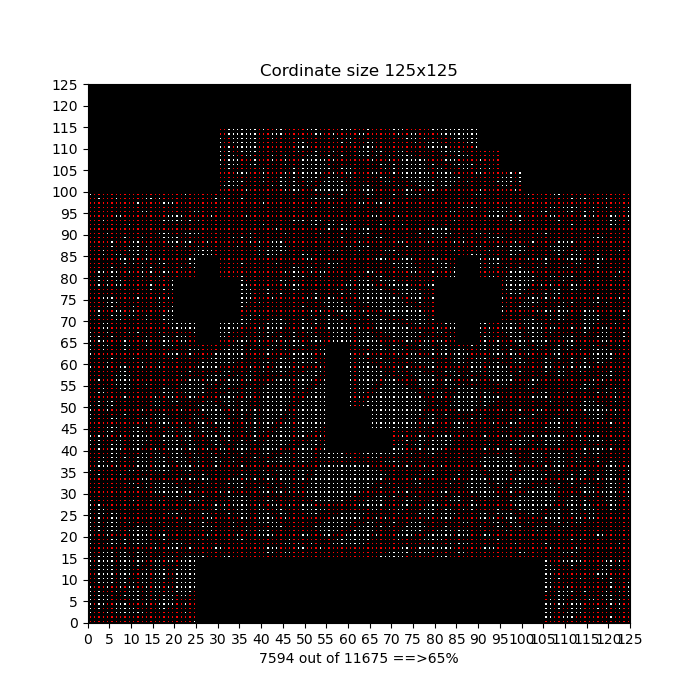
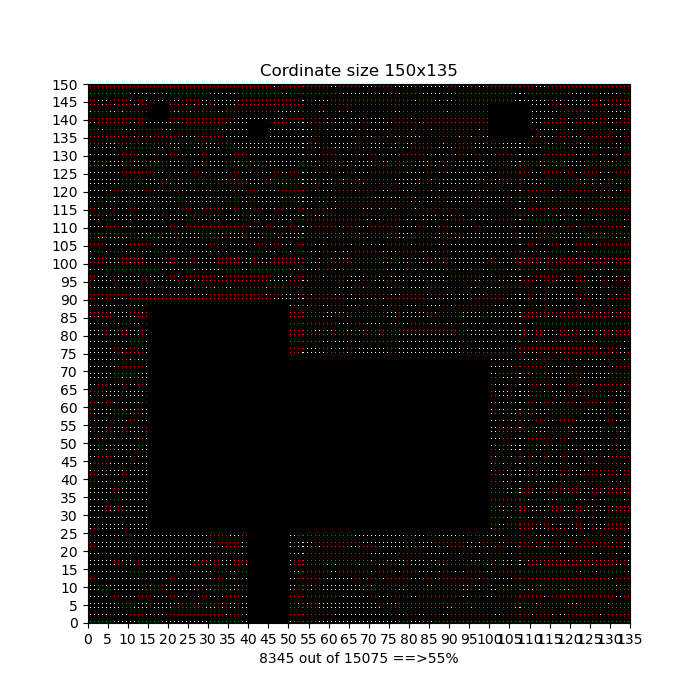
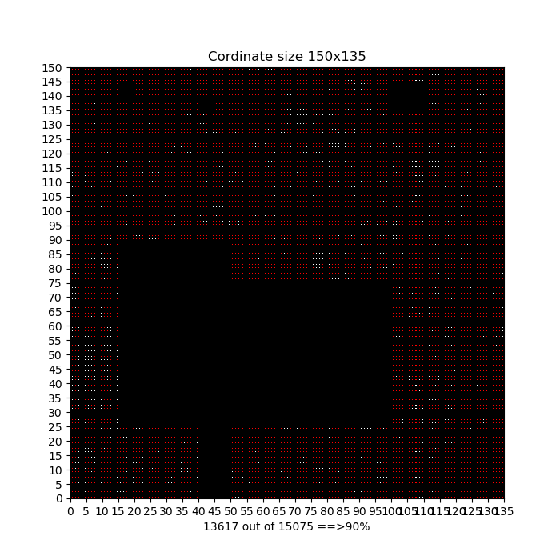

### 5. Multiple Simulations

I figur 10 visas genomsnittet och standardavvikelsen efter 10 simuleringar för coverage efter 2 timmar för ground maps "small.csv" och "my_map.csv".

För att uppnå 90% av klippningen, körde vi koden under flera timmar tills den nådde 4 procent från 90%. För att säkerställa kodens noggranhet, justerade vi tidsinställningen tills det nådde 90%. Figur 11 visar 90% klippning för "small.csv" och figur 12 visar 90% klippning för "egen.csv".

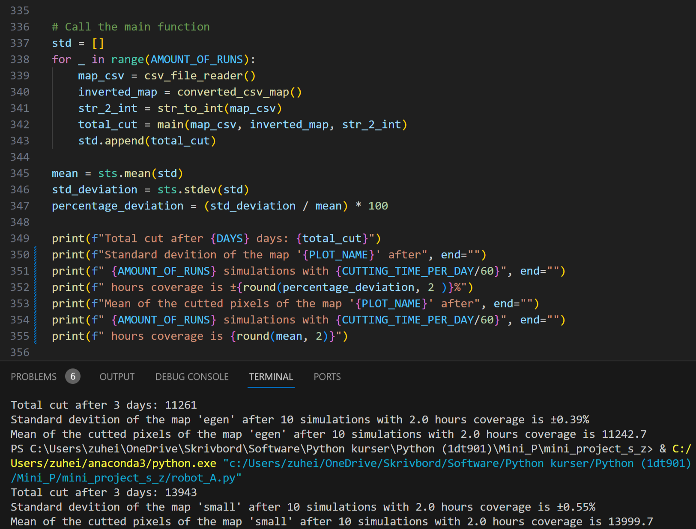

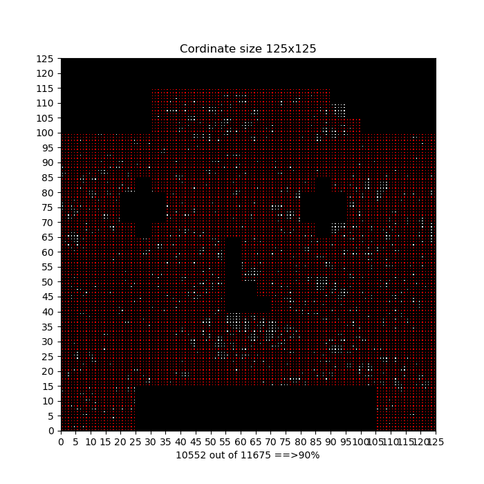

### 6. Improved Simulation

Förbättringen i projektet är att optimera robotens simulering genom att göra den mer realistisk. Den nya simuleringen ska låta roboten klippa gräset med ett bestämt intervall för att bibehålla gräsets längd konstant. Användaren ska ha möjlighet att själv välja antalet dagar som roboten ska köra samt den procentuella tillväxten av gräset per dag. Genom att använda dessa två faktorer skapas en miljö där gräset växer under natten och klipps på dagen. Vi har inget förbättrad algoritm och därför har vi valt att lägga upp matplotlibbilder som förklaring. Figur 13 visar den totala klippningen på coverage map efter 3 dagar för "small.csv" medan figur 14 visar på x-axel antalet dagar och på y-axel visar den procentet klippta. Figur 15 visar den totala klippningen på coverage map efter 3 dagar för "egen.csv" medan figur 16 på x-axel antalet dagar och på y-axel visar den procentet klippta. 

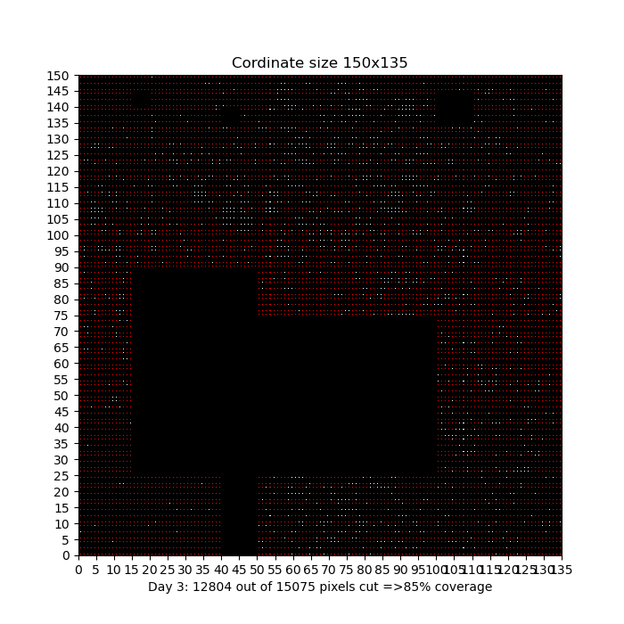
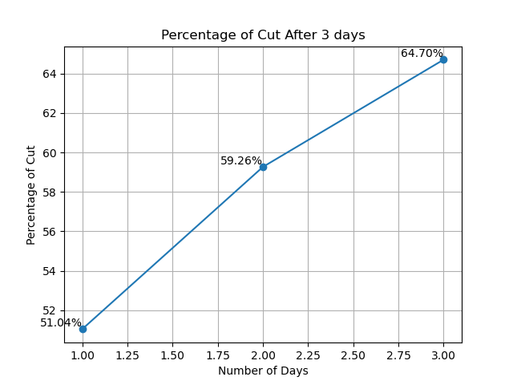

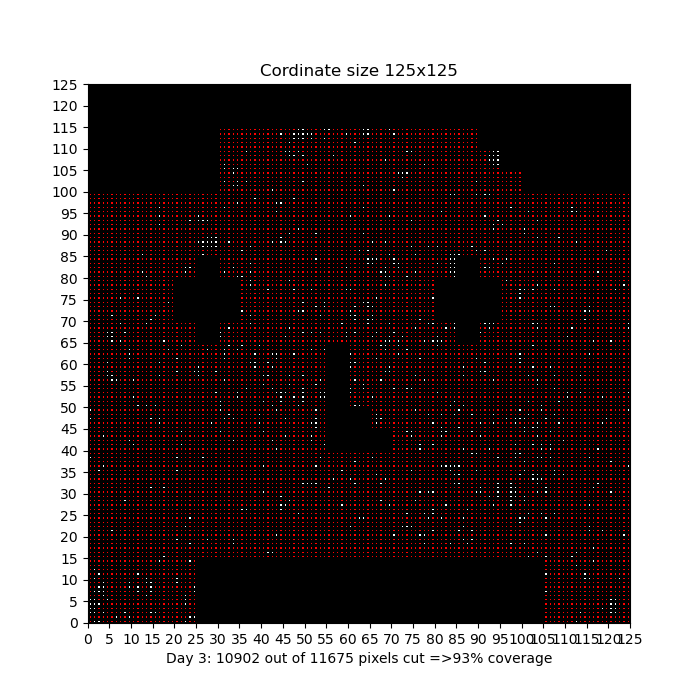
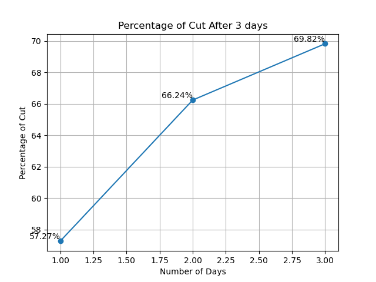

### Technical issues 

- Prblemen:

Konvertera y/x axel till rätt orientering.

Gräsklippare hade en funktion som hette random_boause utan anledning, vi fixad problemet genom att konstruktuera om koden från olika separata def till ett main med funktion.

En function var extra, argument eller anrop var fel. Därav kunde vi inte räkna new place correct.

Det var svårt och skapa en pixel_map som gick ihop med covrage_trace.

Det gick inte att byta värdet av en pixel i taget utan 3st byte värdet samtidigt. Vi försökte att göra om pixel_map flera gånger för att isolera en enda pixel, för att sedan använda den på covrage, men problemet löste sig inte. Lössningen vi kom till i slutet var att prata med en kamrat grupp och frågade om hur logiken fungerar i deras pixel_map. Därefter listade vi ut var vår fel lägger.

- Lesson:

För att undvika dessa problem i framtiden ska vi våga att fråga om hjälp. Vårt största misstag var att vi försökte lösa allting själva, men efterhand insåg vi att fler hjärnor är bättre. Dessutom var det svårt att jobba på separata grejer, efterhand fick vi reda på att man kan dela git till olika branschers och jobba separata för att sedan merga det.

- Tid:

Om vi fick mer tid hade vi förbättrat algoritmen.

### Project issues

- Team:

Eftersom vi är nära vänner så träffades vi dagligen och jobbade med projektet. Vi jobbade även hemifrån på discord.

- Subtasks:

Vi skrev koden ihop men Samir tog hand om strukturen i helhet medan Zuheir tog hand om delmomenten som ska inkluderas i koden.

- Tid:

Det varierade mycket från vecka till vecka men genomsnitt la vi ungefär 10 timmar om veckan.

- Lesson:

Vi stod inte på några problem i teamet.

### Användande teknik som kursen inte har gått igenom

* Zip: Tar två olika listor och sätter ihop de i form av tuplar där första elementet är från första listan och andra elementet är från andra listan

ex: 

lst1 = ["a", "b"]
lst2 = ["c", "d"]

zip(lst1, lst2)

output:

("a", "c") 
("b", "d")

* numpy.arange() från biblioteket numpy: Gör det möjligt att ha en range av decimal tal

ex:

import numpy as np

result_array = np.arange(0, 5, 0.5)

print(result_array)

output:

[0.  0.5 1.  1.5 2.  2.5 3.  3.5 4.  4.5]

* statistics.mean och statistics.stdev från biblioteket statistics: 

statistics.stdev: räknar standardavvikelse

statistics.mean: räknar räknar medelvärdet

### Källor 

zip: [python documentation](https://docs.python.org/3/library/functions.html?highlight=zip#zip)

numpy: [python documentation](https://docs.python.org/3/library/multiprocessing.shared_memory.html?highlight=numpy)

statistics: [python documentation](https://docs.python.org/3/library/statistics.html?highlight=statistics#module-statistics)

ChatGPT: [open ai](https://chat.openai.com/)
