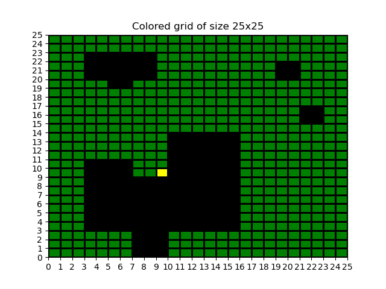
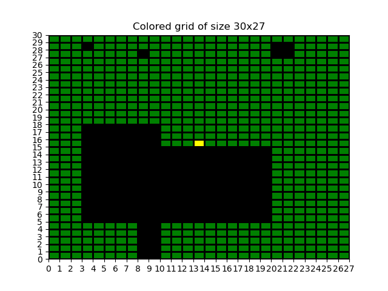
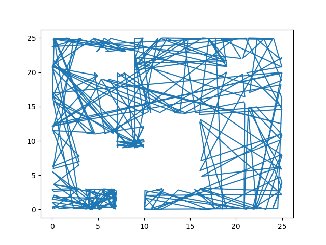
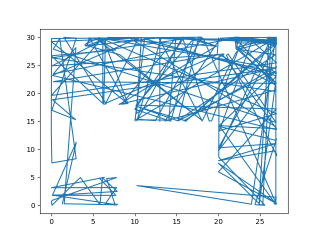

# Robotic Lawnmower Project Report

Members: Jakob Persson and Oliwer Brusberg
Program: Master of Software Engineering
Course: 1DT901
Date of submission: 2023-11-XX

### Introduction

Our task is to program an robotic lawnmower in Python.

### 1. Present Ground Maps

_My map: Area 25x25 square meters. A large house at the bottom with a gravel road leading up to it. On the top of the map there is a small playhouse. Then on the top right of the map there are two bushes._



_Small map: Area 30x27 square meters._



### 2. Coordinate map

```python
with open(path, "r") as file:
        lst = file.readlines()
        for symbol in lst:
            temp_list = []
            for char in symbol:
                if (char == "O"):
                    temp_list.append(0)
                elif (char == "L"):
                    temp_list.append(1)
                elif (char == "S"):
                    temp_list.append(2)
            plot_map.append(temp_list)
    lst = []
    for i in range(len(plot_map[0])):
        column = []
        for row in plot_map:
            column.append(row[i])
        lst.append(column[::-1])
```

We put the symbols in the map into a list, which we then for each "line" in the map made a list. We then replaced the symbols, O, L ,S with 0, 1, 2 in a new temporary list. After that we made the columns in the list into rows instead, and then did the exact same thing with the rows and changed them to columns. With this we fixed it so that the x and y values would be correct and not reversed.

```python
if x < 0 or x > cols:
        return True
    if y < 0 or y > rows:
        return True
    else:
        symbol = plot_map[int(x)][int(y)]
        if symbol == 0:
            return True
        else:
            return False
```

The start of the code decides whether the position is outside or inside the area of the map. The bottom part of the codes checks whether a position is an obstacle (a zero on the map) or not.

### 3. Trace

The one_step function work by firstly creating a variable can_move = True which the function later uses to know when the lawnmover is about to go outside of the map, which then starts the is_outside function. Our bounce function works by first generating a new random trajectory for the lawnmover when it hits an obstacle or wall.

_Trace map for my_map._



_Trace map for small_map._



## Project conclusions and lessons learned

### Technical issues

The most diffcult part was the one_step function. We understood the logic and what to do but we had issues on how to convert it into fucntion code. We learned some basics and the helpfullness of visualisation and plotting. If we had more time to learn then we could have gotten further with the projekt.

### Project issues

The teamwork worked great. We worked on the project together in school so we communicated that way. We also chose to not split up and do different parts of the code and instead focused on making one thing work at a time together. On average we probably spent about 2 - 3 hours per day on the project. If we had more time to learn both basics and more advanced coding we would have been able to split up and work on different parts, and that way also work more efficiently.
