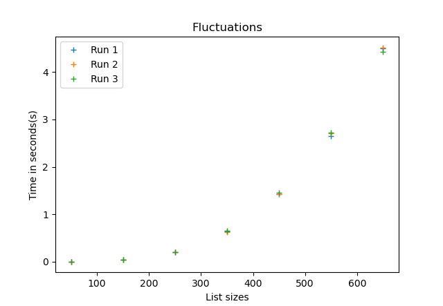
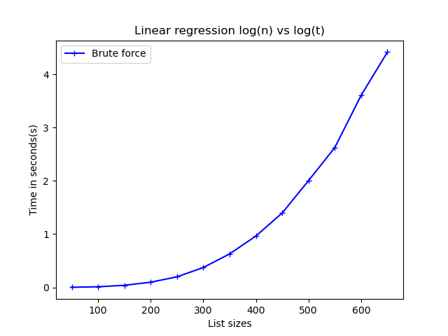

# The 3-sum problem
## William Schröder (ws222gx@student.lnu.se)

## I. Introduction
This report will detail what the 3-sum problem is, how the 3-sum problem can be solve using various of algorithms. Finally it will involve experiments showing how different algorithms are faster than others.

### A. Problem Formulation
The 3-sum problem works like this: given a N size list of integers find all the combinations of 3 pairs that sum up to a given target. Where each instance of triplet has to be unique meaning that (5, 3, 2) is the same triplet as (2, 3, 5) and (3, 5, 2).

### B. Experimental Setup
The experiments were conducted on a **Lenovo ideapad 5 pro** that has a AMD Ryzen 7 5000th series with 13gb of ram. When comparing the algorithms against each other the algorithms will have been ran on the same size list and with the same elements in that list. The target for each test started at 20 and increased by 10 each time the list size increase. The target could be in practice any value because all three algorithms in this report is based on going through the whole list to find the three values that sum to the target. 


### C. Brute Force
The brute force algorithm uses three for loops where the first loop starts from 0 and goes to n-2, than i+1 to n-1 and finally j+1 to n. This is to avoid counting the same element three times. 

```py
def brute_force(lst, target):
    unique_pairs = set()

    for i in range(len(lst)-2):
        for j in range(i+1, len(lst)-1):
            for k in range(j+1, len(lst)):
                v1, v2, v3 = lst[i], lst[j], lst[k]
                needed = (v1 + v2 + v3) - target
                if i == j or k == i or k == j:
                    continue
                if needed == 0:
                    unique_pairs.add((v1, v2, v3))

    return list(unique_pairs)
```

### Brute Force Experiments
Brute force was tested on list sizes ranging from 50 to 500 elements with each iteration of list increasing by 50 which yielded a time between 0.05 to 1.75 seconds.

To confirm that the algorithm works like how it got planned out, the code ran three different runs on the same list size. This is to get an approximation if the algorithm was consistent in the results. Below is the result of that experiment.


*Fluctuation experiment*

#### Time Complexity
The theoretical time complexity for brute force is O(n³) this was calculated by looking at the code of the algorithm. In order to confirm or deny this theory linear regression was used. Meaning if the k value of linear regression is close to 3, close meaning ±0.2.

This is done in three steps which are the following:
1. Calculate the average time to brute force each list.
2. Calculate log(n) vs log(t) where n is the size of the list and t the time.
3. Compare log(n) vs log(t) result to the linear regression.


*Brute force time average*


*Brute force linear regression log(n) vs log(t)*


## II. Faster Approaches
Understanding brute force is intuitive, but it is slow, the next three headlines will explain two faster methods these two approaches is less intuitive than brute force.

### A. The two-pointer approach

The two pointer approach works by first having the list sorted, and than having 3 pointers that move throughout the list. First there is a pointer that moves once per iteration, than the left most pointer that starts at the first pointers value + 1. Than there is the right most pointer that starts at the end of the list. Both the first and left pointer increases in value while the right pointer decreases in value. 

```py
def two_pointer(lst, target):
    unique_pairs = set()
    lst = sorted(lst)  # Two-pointer requires a sorted list

    # first pointer
    for fP in range(len(lst) - 2):  # Use `-2` for the three-pointer approach
        if fP > 0 and lst[fP] == lst[fP - 1]:
            continue

        left_p = fP + 1     # left to right pointer
        right_p = len(lst) - 1  # right to left pointer

        while left_p < right_p:
            needed = lst[fP] + lst[left_p] + lst[right_p] - target

            # if needed = 0 we have found 3 values for the target
            if needed == 0:
                unique_pairs.add((lst[fP], lst[left_p], lst[right_p]))

                # if left pointer and right pointer & also there is duplicates
                # increase or decrease the pointers
                while left_p < right_p and lst[left_p] == lst[left_p + 1]:
                    left_p += 1
                while left_p < right_p and lst[right_p] == lst[right_p - 1]:
                    right_p -= 1

                # take one step to the left or left
                left_p += 1
                right_p -= 1

            # when the needed is less then 0 we know we need a bigger value
            elif needed < 0:
                left_p += 1
            else:   # we need lower value
                right_p -= 1

    return unique_pairs

```


### B. 3-sum with caching
Caching works by looking for what is needed rather than adding or subtracting to find when the sum is at the target or 0. By adding values we already have seen to the caching set were we compare what we have to what is needed in the cash to add up to the target.

```py
def caching(lst, target):
    unique_pairs = set()
    for i in range(len(lst) - 2):
        cash = set()    # reset it to find unique combinations
        for j in range(i+1, len(lst)):
            needed_value = (target - lst[i]) - lst[j]
            if needed_value in cash:
                unique_pairs.add((lst[i], needed_value, lst[j]))

            cash.add(lst[j])
    return unique_pairs
```


### C. Experiments with faster algorithms
The experiments using two pointer and caching yield that they are similar in speed for a dataset that has a size that is lower than 30 000, this can be seen in the plot below. But when the list grows to a size of 50 000 than two poi

*Image: Two pointer vs Caching*

## III. Summary and conclusions
In conclusion the two pointer approach will being to be faster than caching at around N > 30 000 where N is the number of elements in a list. In my conclusion i would say if the problem is to find the targeted sum for a unknown size the better choice is two pointer. But if we know that the size is relative small than I would say caching is a better choice because it is easier to write the code for caching than two pointer.
