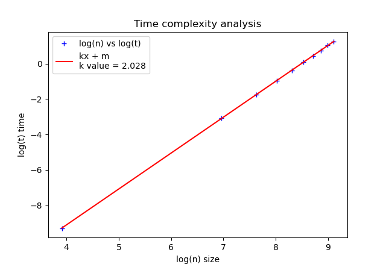

# The 3-sum problem
## William Schröder (ws222gx@student.lnu.se)


## Table of Contents
- [I. Introduction](#i-introduction)
    - [A. Problem Formulation](#a-problem-formulation)
    - [B. Experimental Setup](#b-experimental-setup)
    - [C. Brute Force](#c-brute-force)
- [II. Brute force experiments](#ii-brute-force-experiments)
    - [Time Complexity](#time-complexity)
- [III. Faster approaches](#iii-faster-approaches)
    - [A. 3-sum with caching](#a-3-sum-with-caching)
    - [B. The two-pointer approach](#b-the-two-pointer-approach)
    - [C. Experiments with faster algorithms](#c-experiments-with-faster-algorithms)
        - [Experiment explanation](#experiment-explanation)
        - [Comparing the algorithms](#comparing-the-algorithms)
- [IV. Summary and conclusions](#iv-summary-and-conclusions)


## I. Introduction
This report covers the 3-sum problem, outlining what the problem is and discussing a range of algorithms to solve it, from a simple approach as which is brute force to two more complex approaches, as in two pointer and caching. The report will also cover time complexity, and how every experiment have been set up.


### A. Problem Formulation

In the 3-sum problem, given a list of integers of size N, the task is to identify all unique combinations of three integers from the list that add up to a specified target value. Each triplet must be distinct, meaning (5, 3, 2) is the same as (2, 3, 5) and (3, 5, 2) and should only be counted once. This requirement makes the problem more complex, especially for larger lists, and challenges us to find efficient ways to solve it.

### B. Experimental Setup
The experiments were conducted on a **Lenovo ideapad 5 pro** that has a AMD Ryzen 7 5000th series with 13.5GiB of ram. When comparing the algorithms against each other the algorithms will have been ran on the same size list and with the same elements in that list. The operating system that was used was arch linux. The target for each test started at 20 and increased by 10 each time the list size increase. The target could in theory be any value because all three algorithms in this report is based on going through the whole list to find the three values that sum to the target. 

### C. Brute Force
The brute-force approach to the 3-sum problem is a intuitive approach were it uses 3 for loops and goes through the list n³ times
1. The first loop goes from the beginning of the list to the third-last element.
2. The second loop starts at the first loops element + 1, and ends at the second to last element.
3. The third loop starts the second loops element + 1, and ends at last element of the list.
By coding the loops this way, the algorithm avoids going over the same element multiple times.

```py
def brute_force(lst, target):
    unique_pairs = set()

    for i in range(len(lst)-2):
        for j in range(i+1, len(lst)-1):
            for k in range(j+1, len(lst)):
                v1, v2, v3 = lst[i], lst[j], lst[k]
                needed = (v1 + v2 + v3) - target
                if needed == 0:
                    unique_pairs.add((v1, v2, v3))

    return list(unique_pairs)
```

### III. Brute Force Experiments
Brute force was tested on list sizes ranging from 50 to 650 elements with each iteration of list increasing by 50 which yielded a time between 0.02 to 4.6 seconds.

To confirm that the algorithm works like how it got planned out, the code ran three different runs on the same list size. This is to get an approximation if the algorithm was consistent in the results. Below is the result of that experiment.


*<br>Fluctuation experiment*

#### Time Complexity
The theoretical time complexity for brute force is O(n³) this was calculated by looking at the code of the algorithm. In order to confirm or deny this theory linear regression was used. Meaning if the k value of linear regression is close to 3, close meaning ±0.2.

This is done in three steps which are the following:
1. Calculate the average time to brute force each list.
2. Calculate log(n) vs log(t) where n is the size of the list and t the time.
3. Compare log(n) vs log(t) result to the linear regression.


*<br>Brute force time average*


*<br>Brute force linear regression log(n) vs log(t)*


## III. Faster Approaches
Understanding brute force is a slow approach but a easy approach to code and also understand how it works. In the next three headlines will explain two faster methods to slow the 3-sum problem, they are faster but in they can be harder to understand how to code and also the theory behind them.

### A. 3-sum with caching
Caching works by looking for what is needed rather than adding or subtracting to find when the sum is at the target or 0. By adding values we already have seen to the caching set were we compare what we have to what is needed in the cash to add up to the target.

```py
def caching(lst, target):
    unique_pairs = set()
    for i in range(len(lst) - 2):
        cash = set()    # reset it to find unique combinations
        for j in range(i+1, len(lst)):
            needed_value = (target - lst[i]) - lst[j]
            if needed_value in cash:
                unique_pairs.add((lst[i], needed_value, lst[j]))

            cash.add(lst[j])
    return list(unique_pairs)
```

### B. The two-pointer approach

The two pointer approach works by first having the list sorted, and than having 3 pointers that move throughout the list. First there is a pointer that moves once per iteration, than the left most pointer that starts at the first pointers value + 1. Than there is the right most pointer that starts at the end of the list. Both the first and left pointer increases in value while the right pointer decreases in value. 

```py
def two_pointer(lst, target):
    unique_pairs = set()
    lst = sorted(lst)  # Two-pointer requires a sorted list

    # first pointer
    for fP in range(len(lst) - 2):  # Use `-2` for the three-pointer approach
        if fP > 0 and lst[fP] == lst[fP - 1]:
            continue

        left_p = fP + 1     # left to right pointer
        right_p = len(lst) - 1  # right to left pointer

        while left_p < right_p:
            needed = lst[fP] + lst[left_p] + lst[right_p] - target

            # if needed = 0 we have found 3 values for the target
            if needed == 0:
                unique_pairs.add((lst[fP], lst[left_p], lst[right_p]))

                # if left pointer and right pointer & also there is duplicates
                # increase or decrease the pointers
                while left_p < right_p and lst[left_p] == lst[left_p + 1]:
                    left_p += 1
                while left_p < right_p and lst[right_p] == lst[right_p - 1]:
                    right_p -= 1

                # take one step to the left or left
                left_p += 1
                right_p -= 1

            # when the needed is less then 0 we know we need a bigger value
            elif needed < 0:
                left_p += 1
            else:   # we need lower value
                right_p -= 1

    return list(unique_pairs)

```


### C. Experiments with faster algorithms
#### Experiment explanation
The experiment was conducted using exactly the same lists for both of the algorithms. Everything other than the algorithms themselves were the same, every application on the machine that was not needed was closed down. When taking the average time this is done on 5 trials on the exact same list also.


#### Comparing the algorithms
The experiments using two pointer and caching yield that they are similar in speed for a dataset that has a size that is lower than 30 000, this can be seen in the plot below. But when the list grows to a size of 50 000 than two poi
 
*<br>Two pointer vs Caching*

The methods to find the time complexity for these algorithms will be:
1. Theoretical time complexity meaning analyzing the code itself
2. Run linear regression on both of these algorithms

The theoretical time complexity for two pointer will be the following: O(n * log(n)) for the sorting part, for the loops the total will be O(n²) there the O(n²) is the dominant one. Thus the arithmetic k value is excepted around 2. Below is the graph for linear regression with the k value in it:


*<br>Linear regression for two pointer*

For caching the analys shows that it has to be O(n²) because there are two for loops, the caching is O(1) there for O(n²) is the theoretical result. The calculated k value is also expected to be at around k = 2. Below is the graph for linear regression but for caching and also shows the k value:


*<br>Linear regression for caching*


## IV. Summary and conclusions
In summary the report has shown three different algorithms for the 3-sum problem where each approach got faster not by much in the end but sufficient that it made a difference. The report also proved that brute force for 3-sum problem is a O(n³), this got done by at first looking at the code itself an analyzing each step of the code. But it also got computed by using linear regression.

When comparing caching and two pointer they were similar in speed at values lower than 30 000 as discussed above, in my opinion for a dataset which is unknown the two pointer algorithm is better for the reason that it is faster in the bigger datasets. But caching is a better choice if we know that the dataset is less than around the low sizes, because the caching algorithm is faster to implement than the two pointer algorithm and also easier maintain if the problem would change. While the two pointer approach is slower to implement and also harder to change for a new problem set. The surprising part of the experiment was that both algorithms are O(n²) but that there is one point were two pointer still becomes faster than caching. I believe this is because that caching uses a lot of memory and therefor at bigger sizes it takes a lot of memory to compute if the the needed value is in the cache. While two pointer only goes through the list itself and tries to find the target itself, which in turn leads to less memory use.
