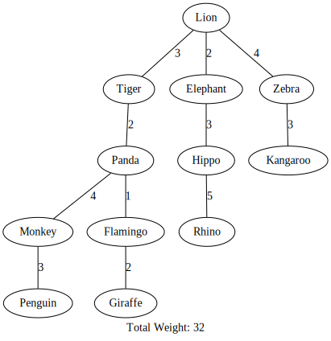
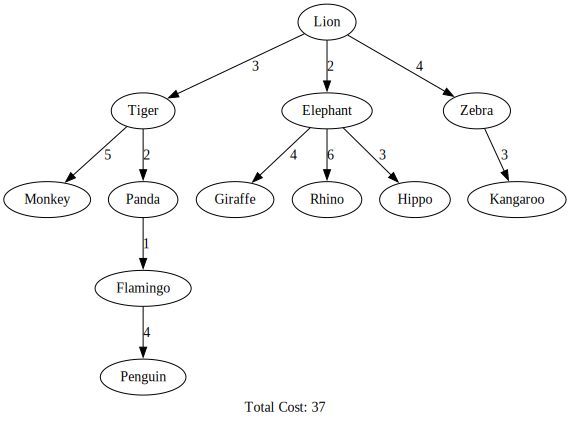

# Exploring Graph Algorithms in a Zoo Network!
## [William Schröder](mailto:ws222gx@student.lnu.se)

## Introduction
In the following report it will discussed which is better prims algorithm or dijkstra's algorithm to find the path between a vertex and a edge. It will also be discussed on how different data structures compare to each other


## Methods used:
To compare the two algorithms a method called print all paths were made and enabling comparing all of the paths from the root vertices to every edge, after this result a graphviz file was made and coded to enable a graph to be shown and thus making it easier to analyze the problem.

## MST vs Shortest path
The output from MST when the root is Lion is the following:
```sh
Lion -> Tiger
Lion -> Elephant
Lion -> Tiger -> Panda -> Flamingo -> Giraffe
Lion -> Zebra
Lion -> Tiger -> Panda -> Monkey
Lion -> Tiger -> Panda
Lion -> Zebra -> Kangaroo
Lion -> Tiger -> Panda -> Monkey -> Penguin
Lion -> Tiger -> Panda -> Flamingo
Lion -> Elephant -> Hippo -> Rhino
Lion -> Elephant -> Hippo
```

Output from shortest path is:

```sh
Lion -> Tiger : Cost: 3
Lion -> Elephant : Cost: 2
Lion -> Elephant -> Giraffe : Cost: 6
Lion -> Zebra : Cost: 4
Lion -> Tiger -> Monkey : Cost: 8
Lion -> Tiger -> Panda : Cost: 5
Lion -> Zebra -> Kangaroo : Cost: 7
Lion -> Tiger -> Panda -> Flamingo -> Penguin : Cost: 10
Lion -> Elephant -> Rhino : Cost: 8
Lion -> Elephant -> Hippo : Cost: 5

```
Given this if plotted in graphviz the following trees are shown:


*MST Tree*


*Shortest path tree*

The result shows that prims algorithm gives a lower total weight but, if we just look the paths we can see that dijkstra's takes a more optimal route as it does the following route for Lion - Penguin. Lion  -> (3) Tiger -> (2) Panda -> (1) Flamingo -> (4) Penguin. This in total is 10. While the minimum spanning tree does a route: Lion -> (3) Tiger -> (4) Panda -> 3 (Penguin). Which is a path length of 12. This means that even though the total weight of the tree is bigger for dijkstra's it takes a more optimal route, to find the shortest connection between the two animals.

However prims algorithm gives a less of a total weight which means that the path to one node to every other node combined is better compared to dijkstra's which focuses on quickest path between two nodes, not the whole diagram


## Data structures
In both prims and dijkstra's algorithm a adjacency-list was implemented due to the easier implementation. All though not the most optimal data structure it is easier to implement than min-heap. The time complexity for adjacency-list using a non priority queue approach is O(V² + E) while with min-heap it is O((V+E)log V)

## Improvements

If I would have improved this I would have changed the data structure to a min-heap, my reasoning for not doing this is that I have not had enough time to do this.

## Conclusion
To find the shortest path from vertex to a edge dijkstra's algorithm is better than prims algorithm, but if the case is to find smallest tree than prims algorithm is better on this.

For the choice of data structure we can see that all though a adjacency-list with a non priority queue approach works and is easier to implement it is much slower than a min-heap approach.


